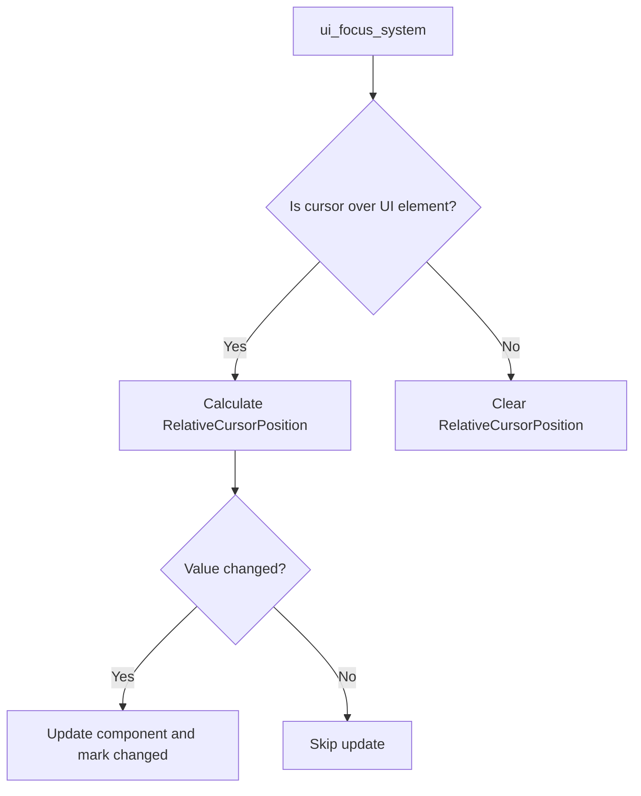

+++
title = "#20102 FIX - RelativeCursorPosition Changed<> query filter"
date = "2025-07-13T00:00:00"
draft = false
template = "pull_request_page.html"
in_search_index = true

[taxonomies]
list_display = ["show"]

[extra]
current_language = "en"
available_languages = {"en" = { name = "English", url = "/pull_request/bevy/2025-07/pr-20102-en-20250713" }, "zh-cn" = { name = "中文", url = "/pull_request/bevy/2025-07/pr-20102-zh-cn-20250713" }}
labels = ["A-UI", "D-Straightforward", "A-Picking"]
+++

# Analysis of PR #20102: Fix for Unnecessary Change Detection Triggering in RelativeCursorPosition

## Basic Information
- **Title**: FIX - RelativeCursorPosition Changed<> query filter
- **PR Link**: https://github.com/bevyengine/bevy/pull/20102
- **Author**: chamaloriz
- **Status**: MERGED
- **Labels**: A-UI, S-Ready-For-Final-Review, D-Straightforward, A-Picking
- **Created**: 2025-07-12T15:13:17Z
- **Merged**: 2025-07-13T20:03:46Z
- **Merged By**: mockersf

## Description Translation
## Problem

This pseudocode was triggering constantly, even with the Changed<> query filter.

```rust
pub fn check_mouse_movement_system(
    relative_cursor_positions: Query< &RelativeCursorPosition, (Changed<RelativeCursorPosition>, With<Button>)>,
) {}
```

## Solution

- Added a check to prevent updating the value if it hasn't changed.

## The Story of This Pull Request

### The Problem and Context
The issue occurred in Bevy's UI system where the `ui_focus_system` updates `RelativeCursorPosition` components each frame. The original implementation unconditionally updated these components, even when the cursor position relative to a UI element hadn't changed. This caused the `Changed<RelativeCursorPosition>` query filter to trigger every frame, regardless of actual value changes. 

This behavior violated the expected semantics of Bevy's change detection system. Developers using `Changed<>` filters expected systems to only run when values actually changed, not on every frame. This unnecessary triggering could cause:
- Wasted CPU cycles in systems reacting to cursor position changes
- Unexpected behavior in systems relying on precise change detection
- Performance degradation in UI-heavy applications

### The Solution Approach
The solution modifies the update logic to use Bevy's `set_if_neq` method instead of direct assignment. This method checks for value equality before updating the component and marking it as changed. The approach maintains the existing system architecture while making a targeted optimization where the value is updated.

Key engineering decisions:
1. **Minimal impact**: Changed only the assignment logic without restructuring surrounding code
2. **Use of built-in APIs**: Leveraged Bevy's existing `DetectChangesMut` trait through `set_if_neq`
3. **Performance-conscious**: Added equality check only where needed, avoiding unnecessary computations

### The Implementation
The change occurs in the cursor position update section of `ui_focus_system`. Previously, the system directly assigned the new position value to the component:

```rust
*node_relative_cursor_position_component = relative_cursor_position_component;
```

This was replaced with:

```rust
node_relative_cursor_position_component
    .set_if_neq(relative_cursor_position_component);
```

The `set_if_neq` method (from Bevy's `DetectChangesMut` trait) checks if the new value differs from the current one before updating. If the values are equal, it avoids:
1. Writing the same value to memory
2. Marking the component as changed
3. Triggering change detection systems

### Technical Insights
The fix leverages Bevy's change detection API correctly:
- **Change Detection Mechanics**: Bevy tracks component changes through internal flags set during mutation
- **DetectChangesMut Trait**: Provides `set_if_neq` for conditional updates
- **Equality Check Cost**: The minor overhead of comparing `RelativeCursorPosition` values (two `Option<Vec2>`) is negligible compared to system execution costs

This approach maintains the system's correctness while optimizing for the common case where cursor positions remain stable between frames.

### The Impact
The change resolves the core issue:
1. `Changed<RelativeCursorPosition>` queries now trigger only when values actually change
2. Systems using these queries execute less frequently, improving performance
3. Expected change detection behavior is restored

The fix is localized to one system but affects all downstream systems using `RelativeCursorPosition` with change detection. It demonstrates proper use of Bevy's change detection API and shows how minor optimizations in core systems can have broad impact.

## Visual Representation



## Key Files Changed

### `crates/bevy_ui/src/focus.rs`
1. **Change description**: Modified the relative cursor position update to avoid unnecessary change detection triggers. Replaced direct assignment with `set_if_neq` to skip updates when values are unchanged.

2. **Code diff**:
```diff
@@ -267,7 +267,9 @@ pub fn ui_focus_system(
             // Save the relative cursor position to the correct component
             if let Some(mut node_relative_cursor_position_component) = node.relative_cursor_position
             {
-                *node_relative_cursor_position_component = relative_cursor_position_component;
+                // Avoid triggering change detection when not necessary.
+                node_relative_cursor_position_component
+                    .set_if_neq(relative_cursor_position_component);
             }
 
             if contains_cursor {
```

3. **Relation to PR purpose**: This is the exact change that resolves the described issue by preventing unnecessary updates to `RelativeCursorPosition` components.

## Further Reading
1. [Bevy Change Detection Documentation](https://bevyengine.org/learn/book/features/ecs/change-detection/) - Official guide to Bevy's change detection system
2. [DetectChangesMut API Reference](https://docs.rs/bevy_ecs/latest/bevy_ecs/change_detection/trait.DetectChangesMut.html) - Details on `set_if_neq` and related methods
3. [Bevy UI System Architecture](https://github.com/bevyengine/bevy/tree/main/crates/bevy_ui) - Source code for Bevy's UI system