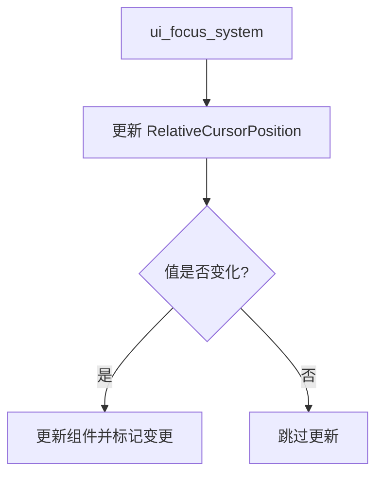

+++
title = "#20102 FIX - RelativeCursorPosition Changed<> query filter"
date = "2025-07-13T00:00:00"
draft = false
template = "pull_request_page.html"
in_search_index = false

[extra]
current_language = "zh-cn"
available_languages = {"en" = { name = "English", url = "/pull_request/bevy/2025-07/pr-20102-en-20250713" }, "zh-cn" = { name = "中文", url = "/pull_request/bevy/2025-07/pr-20102-zh-cn-20250713" }}
+++

## FIX - RelativeCursorPosition Changed<> query filter

### 基本信息
- **标题**: FIX - RelativeCursorPosition Changed<> query filter
- **PR链接**: https://github.com/bevyengine/bevy/pull/20102
- **作者**: chamaloriz
- **状态**: 已合并
- **标签**: A-UI, S-Ready-For-Final-Review, D-Straightforward, A-Picking
- **创建时间**: 2025-07-12T15:13:17Z
- **合并时间**: 2025-07-13T20:03:46Z
- **合并人**: mockersf

### 问题描述翻译
#### 问题  
以下伪代码即使使用了 `Changed<>` 查询过滤器，也会持续触发系统：

```rust
pub fn check_mouse_movement_system(
    relative_cursor_positions: Query< &RelativeCursorPosition, (Changed<RelativeCursorPosition>, With<Button>)>,
) {}
```

#### 解决方案  
- 添加检查逻辑，避免在值未变化时更新组件

---

### PR技术分析

#### 问题背景
在 Bevy 的 UI 系统中，`ui_focus_system` 负责处理光标与 UI 元素的交互逻辑。系统使用 `Changed<RelativeCursorPosition>` 查询过滤器来检测光标位置变化时执行特定操作。但现有实现存在缺陷：即使相对光标位置未实际改变，组件也会被更新，导致以下问题：
1. 不必要的变更检测触发，浪费 CPU 周期
2. 依赖 `Changed<>` 过滤器的系统被错误执行
3. 潜在的性能下降，尤其在复杂 UI 场景中

问题根源在于无条件赋值语句：
```rust
*node_relative_cursor_position_component = relative_cursor_position_component;
```
该操作总会标记组件为已修改，无论值是否实际变化。

#### 解决方案实现
核心修改采用 Bevy ECS 的最佳实践：使用 `set_if_neq()` 方法替代直接赋值。关键修改位于 `crates/bevy_ui/src/focus.rs`：

```diff
// Before:
*node_relative_cursor_position_component = relative_cursor_position_component;

// After:
node_relative_cursor_position_component
    .set_if_neq(relative_cursor_position_component);
```

`set_if_neq()` 的内部机制：
1. 比较新旧值是否相等
2. 仅当值实际变化时更新组件数据
3. 仅当数据变化时标记组件为已修改

#### 技术影响
1. **变更检测优化**：消除虚假的变更事件，确保 `Changed<>` 过滤器行为符合预期
2. **系统执行效率**：减少依赖 `RelativeCursorPosition` 变更的系统的无效执行
3. **数据一致性**：避免相同值的重复写入，符合 ECS 数据变更的最佳实践
4. **性能提升**：减少内存写入操作和变更检测开销，对高频更新的 UI 系统尤为重要

#### 设计考量
- 选择 `set_if_neq()` 而非手动比较，因其：
  1. 封装了值比较和条件设置逻辑
  2. 与 Bevy 的变更检测机制深度集成
  3. 提供标准化的模式供其他系统参考
- 未引入额外分支预测，因 `set_if_neq()` 内部实现已优化

### 组件关系


### 关键文件变更
#### `crates/bevy_ui/src/focus.rs`
**变更说明**：优化相对光标位置更新逻辑，避免触发不必要的变更检测

**代码差异**：
```diff
@@ -267,7 +267,9 @@ pub fn ui_focus_system(
             // Save the relative cursor position to the correct component
             if let Some(mut node_relative_cursor_position_component) = node.relative_cursor_position
             {
-                *node_relative_cursor_position_component = relative_cursor_position_component;
+                // Avoid triggering change detection when not necessary.
+                node_relative_cursor_position_component
+                    .set_if_neq(relative_cursor_position_component);
             }
 
             if contains_cursor {
```

**变更要点**：
1. 添加注释说明优化意图
2. 用 `set_if_neq()` 替代直接赋值
3. 保持原有逻辑结构不变，最小化改动范围

### 延伸阅读
1. [Bevy 变更检测文档](https://bevyengine.org/learn/book/development-practices/change-detection/)
2. [ECS 模式中的高效数据更新策略](https://github.com/SanderMertens/ecs-faq#how-do-i-update-components-efficiently)
3. [Bevy `DetectChanges` trait 源码](https://github.com/bevyengine/bevy/blob/main/crates/bevy_ecs/src/change_detection.rs)
4. [系统执行优化指南](https://bevyengine.org/learn/book/development-practices/performance-optimization/#system-execution-order)

### 完整代码变更
```diff
diff --git a/crates/bevy_ui/src/focus.rs b/crates/bevy_ui/src/focus.rs
index 32872f1447851..cfa4b818b0600 100644
--- a/crates/bevy_ui/src/focus.rs
+++ b/crates/bevy_ui/src/focus.rs
@@ -267,7 +267,9 @@ pub fn ui_focus_system(
             // Save the relative cursor position to the correct component
             if let Some(mut node_relative_cursor_position_component) = node.relative_cursor_position
             {
-                *node_relative_cursor_position_component = relative_cursor_position_component;
+                // Avoid triggering change detection when not necessary.
+                node_relative_cursor_position_component
+                    .set_if_neq(relative_cursor_position_component);
             }
 
             if contains_cursor {
```