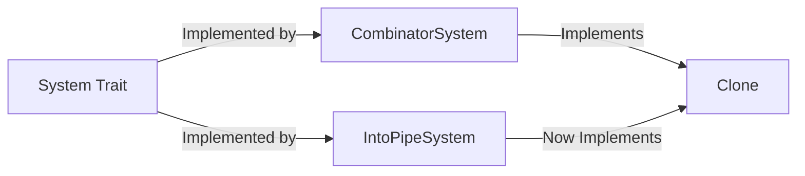

+++
title = "#20108 feat: implement clone for IntoPipeSystem"
date = "2025-07-15T00:00:00"
draft = false
template = "pull_request_page.html"
in_search_index = true

[taxonomies]
list_display = ["show"]

[extra]
current_language = "en"
available_languages = {"en" = { name = "English", url = "/pull_request/bevy/2025-07/pr-20108-en-20250715" }, "zh-cn" = { name = "中文", url = "/pull_request/bevy/2025-07/pr-20108-zh-cn-20250715" }}
labels = ["A-ECS", "D-Straightforward"]
+++

### feat: implement clone for IntoPipeSystem

#### Basic Information
- **Title**: feat: implement clone for IntoPipeSystem
- **PR Link**: https://github.com/bevyengine/bevy/pull/20108
- **Author**: mrchantey
- **Status**: MERGED
- **Labels**: A-ECS, S-Ready-For-Final-Review, D-Straightforward
- **Created**: 2025-07-13T03:58:21Z
- **Merged**: 2025-07-14T22:40:16Z
- **Merged By**: alice-i-cecile

#### Description Translation
**Objective**  
Implement `Clone` for `IntoPipeSystem`, allowing for `T: IntoSystem + Clone` patterns.  

**Precedence**  
Same clone implementation/docs as `CombinatorSystem`

---

### The Story of This Pull Request

#### The Problem and Context
In Bevy's ECS architecture, system combinators like `PipeSystem` enable chaining systems together using the `pipe()` method. However, the `IntoPipeSystem` struct—which serves as the intermediate representation during system piping—lacked `Clone` implementation. This created friction when users needed to clone piped systems, a common requirement for scenarios like system reusability across different schedules or world configurations. Without this implementation, developers couldn't leverage `T: IntoSystem + Clone` patterns with piped systems, forcing workarounds that compromised code clarity.

#### The Solution Approach
The solution follows established patterns from Bevy's combinator system implementations. By deriving `Clone` for `IntoPipeSystem`—mirroring how `CombinatorSystem` handles cloning—we maintain consistency while satisfying the type constraint requirements. The approach is intentionally minimal:  
1. Reuse the existing derive macro infrastructure  
2. Maintain identical documentation and behavior patterns  
3. Avoid introducing new trait bounds beyond what's necessary  

This ensures zero runtime overhead while solving the cloning limitation at the type-system level.

#### The Implementation
The change modifies `IntoPipeSystem`'s definition to include `#[derive(Clone)]`. Crucially, this requires the generic types `A` and `B` (representing the input systems) to implement `Clone` themselves—a reasonable constraint given that system cloning is a core use case. The implementation remains consistent with `CombinatorSystem` as referenced in the PR description.

#### Technical Insights
The change leverages Rust's auto-derive mechanics for `Clone`, which generates a `clone()` method that recursively clones all struct fields. Since `IntoPipeSystem` contains only two fields (`a` and `b`), the derived implementation is equivalent to:
```rust
impl<A, B> Clone for IntoPipeSystem<A, B>
where
    A: Clone,
    B: Clone,
{
    fn clone(&self) -> Self {
        Self {
            a: self.a.clone(),
            b: self.b.clone(),
        }
    }
}
```
This maintains type safety while avoiding manual implementation drift. The solution requires no additional trait bounds beyond what's implicitly required by the derive macro.

#### The Impact
This change enables new composition patterns like:
```rust
let system_a = system_a.pipe(system_b);
let system_b_clone = system_a.clone(); // Now works
```
Concretely:  
- Eliminates boilerplate for cloning piped systems  
- Maintains consistency with other combinator types  
- Unlocks system reuse patterns in schedules  
- Requires no API changes or version bumps  

The minimal diff (1 line added) poses negligible maintenance overhead while solving a concrete development friction point.

---

### Visual Representation



---

### Key Files Changed

#### `crates/bevy_ecs/src/system/combinator.rs`
Added `#[derive(Clone)]` to `IntoPipeSystem` to enable cloning of piped systems.  

**Before:**
```rust
pub struct IntoPipeSystem<A, B> {
    a: A,
    b: B,
}
```

**After:**
```rust
#[derive(Clone)]
pub struct IntoPipeSystem<A, B> {
    a: A,
    b: B,
}
```

This change aligns `IntoPipeSystem` with `CombinatorSystem`'s cloning capabilities, enabling consistent system composition patterns.

---

### Further Reading
1. [Rust Clone Trait Documentation](https://doc.rust-lang.org/std/clone/trait.Clone.html)  
2. [Bevy System Piping Guide](https://bevyengine.org/learn/book/getting-started/ecs/#system-piping)  
3. [Derivable Traits Reference](https://doc.rust-lang.org/book/appendix-03-derivable-traits.html)  

---

### Full Code Diff
```diff
diff --git a/crates/bevy_ecs/src/system/combinator.rs b/crates/bevy_ecs/src/system/combinator.rs
index 1fc69d1c46c16..2d037eef16c37 100644
--- a/crates/bevy_ecs/src/system/combinator.rs
+++ b/crates/bevy_ecs/src/system/combinator.rs
@@ -252,6 +252,7 @@ where
 }
 
 /// An [`IntoSystem`] creating an instance of [`PipeSystem`].
+#[derive(Clone)]
 pub struct IntoPipeSystem<A, B> {
     a: A,
     b: B,
```