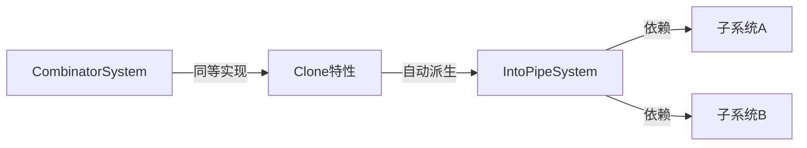

+++
title = "#20108 feat: implement clone for IntoPipeSystem"
date = "2025-07-15T00:00:00"
draft = false
template = "pull_request_page.html"
in_search_index = false

[extra]
current_language = "zh-cn"
available_languages = {"en" = { name = "English", url = "/pull_request/bevy/2025-07/pr-20108-en-20250715" }, "zh-cn" = { name = "中文", url = "/pull_request/bevy/2025-07/pr-20108-zh-cn-20250715" }}
+++

### 分析报告：feat: implement clone for IntoPipeSystem

#### 基本信息
- **标题**: feat: implement clone for IntoPipeSystem
- **PR链接**: https://github.com/bevyengine/bevy/pull/20108
- **作者**: mrchantey
- **状态**: 已合并
- **标签**: A-ECS, S-Ready-For-Final-Review, D-Straightforward
- **创建时间**: 2025-07-13T03:58:21Z
- **合并时间**: 2025-07-14T22:40:16Z
- **合并人**: alice-i-cecile

#### 描述翻译
实现 `IntoPipeSystem` 的 `Clone` 特性，支持 `T: IntoSystem + Clone` 模式。

**参考依据**  
采用与 `CombinatorSystem` 相同的克隆实现/文档。

---

### PR技术分析

#### 问题背景
在 Bevy ECS 中，`IntoPipeSystem` 是用于创建管道系统（pipe systems）的关键组件，它允许将多个系统串联执行。然而，该结构体原先未实现 `Clone` 特性，这导致开发者无法在需要克隆系统的场景（如跨schedule复用系统）中使用 `T: IntoSystem + Clone` 模式。此限制与同模块中的 `CombinatorSystem` 等可克隆系统形成不一致，阻碍了API的灵活使用。

#### 解决方案
直接为 `IntoPipeSystem` 结构体添加 `#[derive(Clone)]` 属性派生宏。该方案遵循以下设计决策：
1. **一致性原则**：完全复用 `CombinatorSystem` 的克隆实现方式，保持系统组合器（combinator）行为统一
2. **零成本抽象**：依赖Rust编译器的自动派生，仅在泛型参数 `A` 和 `B` 均实现 `Clone` 时才启用克隆能力
3. **最小化变更**：避免手动实现以消除维护负担，符合Rust的最佳实践

#### 实现详解
变更集中在 `combinator.rs` 文件，通过单行修改实现功能：
```rust
// 修改前
pub struct IntoPipeSystem<A, B> {
    a: A,
    b: B,
}

// 修改后
#[derive(Clone)]
pub struct IntoPipeSystem<A, B> {
    a: A,
    b: B,
}
```
此修改使 `IntoPipeSystem` 获得条件克隆能力：当且仅当泛型参数 `A` 和 `B`（代表管道连接的子系统）均实现 `Clone` 时，整个管道系统才可克隆。这种设计确保：
- 类型安全：编译时检查子系统可克隆性
- 无运行时开销：派生实现编译为逐字段浅拷贝
- 向后兼容：不影响现有使用不可克隆子系统的管道

#### 技术影响
1. **模式支持**：启用 `T: IntoSystem + Clone` 模式，允许如下的系统克隆场景：
   ```rust
   let original = system_a.pipe(system_b);
   let cloned = original.clone();
   schedule.add_systems((original, cloned).run_if(condition));
   ```
2. **API一致性**：补齐 `CombinatorSystem` 和 `IntoPipeSystem` 的能力差异
3. **错误预防**：通过编译时约束避免运行时克隆错误
4. **性能**：保持原有零抽象开销特性，克隆操作仅复制智能指针

#### 组件关系


#### 关键文件变更
**crates/bevy_ecs/src/system/combinator.rs**  
- **修改原因**：为 `IntoPipeSystem` 增加克隆能力
- **变更内容**：
  ```diff
  /// An [`IntoSystem`] creating an instance of [`PipeSystem`].
  + #[derive(Clone)]
   pub struct IntoPipeSystem<A, B> {
       a: A,
       b: B,
   }
  ```
- **关联性**：此单行修改直接实现PR核心目标

#### 延伸阅读
1. [Rust Clone特性文档](https://doc.rust-lang.org/std/clone/trait.Clone.html)
2. [Bevy系统组合器指南](https://bevyengine.org/learn/book/next/ecs/system-combinators/)
3. [派生宏工作原理](https://doc.rust-lang.org/reference/procedural-macros.html#derive-macros)

---

### 完整代码差异
```diff
diff --git a/crates/bevy_ecs/src/system/combinator.rs b/crates/bevy_ecs/src/system/combinator.rs
index 1fc69d1c46c16..2d037eef16c37 100644
--- a/crates/bevy_ecs/src/system/combinator.rs
+++ b/crates/bevy_ecs/src/system/combinator.rs
@@ -252,6 +252,7 @@ where
 }
 
 /// An [`IntoSystem`] creating an instance of [`PipeSystem`].
+#[derive(Clone)]
 pub struct IntoPipeSystem<A, B> {
     a: A,
     b: B,
```