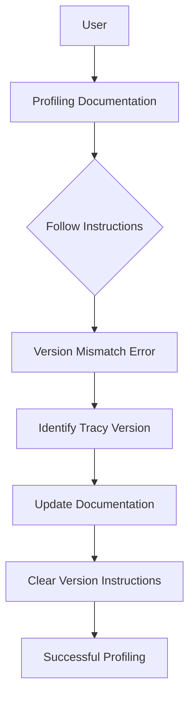

+++
title = "#20109 Mitigate Tracy dep version woes"
date = "2025-07-14T00:00:00"
draft = false
template = "pull_request_page.html"
in_search_index = true

[taxonomies]
list_display = ["show"]

[extra]
current_language = "en"
available_languages = {"en" = { name = "English", url = "/pull_request/bevy/2025-07/pr-20109-en-20250714" }, "zh-cn" = { name = "中文", url = "/pull_request/bevy/2025-07/pr-20109-zh-cn-20250714" }}
labels = ["C-Docs", "C-Performance", "A-Diagnostics"]
+++

## Mitigate Tracy dep version woes

### Basic Information
- **Title**: Mitigate Tracy dep version woes
- **PR Link**: https://github.com/bevyengine/bevy/pull/20109
- **Author**: liamaharon
- **Status**: MERGED
- **Labels**: C-Docs, C-Performance, S-Ready-For-Final-Review, A-Diagnostics
- **Created**: 2025-07-13T06:14:40Z
- **Merged**: 2025-07-14T21:18:55Z
- **Merged By**: mockersf

### Description Translation
The original description is in English and remains unchanged:

# Objective

Turns out, Tracy dep (in)compatibilities can be a headache. Here was my experience following the [Profiling Tracy documentation](https://github.com/bevyengine/bevy/blob/1525dff7ada14714b35c8908381d534a7833faa3/docs/profiling.md#tracy-profiler): 

I ran into this error when I attempted to connect to my bevy client:


Attempting to find where the version incompatibility stemmed, I found these tracy dep versions and a link to the compatibility table in the source:
 https://github.com/bevyengine/bevy/blob/1525dff7ada14714b35c8908381d534a7833faa3/crates/bevy_log/Cargo.toml#L32-L35 

This led me to believe I needed Tracy `0.11.1`, to match the `tracy-client` version `0.18.0`.

This was confusing because `0.11.1` is the version I already had installed (by running `brew install tracy`), and latest Tracy version currently available on `brew`.

It turned out that Cargo was eagerly pulling `tracy-client` `0.18.2` instead of `0.18.0`, making the Tracy version I needed actually `0.12.2`. At the time of writing, `0.12.2` is not published on `brew`.

## Solution

I've pinned the Tracy deps, and mentioned in the comment which Tracy version Bevy is compatible with.

I've also added some notes to [Profiling Tracy documentation](https://github.com/bevyengine/bevy/blob/1525dff7ada14714b35c8908381d534a7833faa3/docs/profiling.md#tracy-profiler) to explain
- How to determine which Tracy version to install
- That MacOS users may need to compile from source if the required Tracy version is not available on `brew`. 

## Testing

- Did you test these changes? If so, how?
I ran Tracy locally.

- Are there any parts that need more testing?
I don't think so.

- How can other people (reviewers) test your changes? Is there anything specific they need to know?
Follow instructions to run Tracy

- If relevant, what platforms did you test these changes on, and are there any important ones you can't test?
Tested MacOS. I think change should be OS agnostic.

### The Story of This Pull Request

When profiling Bevy applications with Tracy, users encountered version compatibility issues between the Tracy client and server components. The problem surfaced when following Bevy's profiling documentation: after installing Tracy via Homebrew and attempting to connect to a Bevy application, users saw version mismatch errors preventing successful profiling sessions. 

The core issue stemmed from version resolution differences between Cargo and Homebrew. While Bevy specified `tracy-client = "0.18.0"`, Cargo would resolve to `0.18.2` due to semantic versioning rules. This created a compatibility gap since Tracy `0.11.1` (available via Homebrew) only worked with `tracy-client` `0.18.0`, not `0.18.2`. The required Tracy `0.12.2` wasn't available through Homebrew, forcing users to build from source.

The solution implemented two key changes:
1. **Dependency pinning**: Tracy dependencies were pinned to prevent unexpected version resolution
2. **Documentation improvements**: Clear steps were added to help users determine compatible versions

The documentation changes provide explicit instructions for resolving version dependencies. The new guidance explains how to:
1. Identify actual Tracy dependency versions using `cargo tree`
2. Cross-reference versions with Tracy's compatibility table
3. Handle cases where required versions aren't available via package managers

For macOS users specifically, a note was added clarifying that Homebrew might not have the latest Tracy version, and that building from source might be necessary. This manages expectations and provides a workaround path.

The changes also included minor formatting improvements: image indentation was normalized for consistency, and a missing newline was added to satisfy markdown linter rules. These maintain documentation quality while solving the core compatibility issue.

### Visual Representation



### Key Files Changed

#### `docs/profiling.md`
Added clear version resolution instructions and macOS build note:

```markdown
# Before:
The [Tracy profiling tool](https://github.com/wolfpld/tracy) is:

There are binaries available for Windows, and installation / build instructions for other operating systems can be found in the [Tracy documentation PDF](https://github.com/wolfpld/tracy/releases/latest/download/tracy.pdf).

It has a command line capture tool...

On macOS, Tracy can be installed through Homebrew by running `brew install tracy`, and the GUI client can be launched by running `tracy`.

# After:
The [Tracy profiling tool](https://github.com/wolfpld/tracy) is:

There are binaries available for Windows, and installation / build instructions for other operating systems can be found in the [Tracy documentation PDF](https://github.com/wolfpld/tracy/releases/latest/download/tracy.pdf).

To determine which Tracy version to install

1. Run `cargo tree --features bevy/trace_tracy | grep tracy` in your Bevy workspace root to see which tracy dep versions are used
2. Cross reference the tracy dep versions with the [Version Support Table](https://github.com/nagisa/rust_tracy_client?tab=readme-ov-file#version-support-table)

It has a command line capture tool...

On macOS, Tracy can be installed through Homebrew by running `brew install tracy`, and the GUI client can be launched by running `tracy`. Note that `brew` does not always have the latest version of Tracy available, in which cases you may be required to build from source.
```

### Further Reading
1. [Tracy Profiler Documentation](https://github.com/wolfpld/tracy/releases/latest/download/tracy.pdf)
2. [rust_tracy_client Compatibility Table](https://github.com/nagisa/rust_tracy_client?tab=readme-ov-file#version-support-table)
3. [Cargo Dependency Resolution](https://doc.rust-lang.org/cargo/reference/resolver.html)
4. [Semantic Versioning in Rust](https://doc.rust-lang.org/cargo/reference/semver.html)