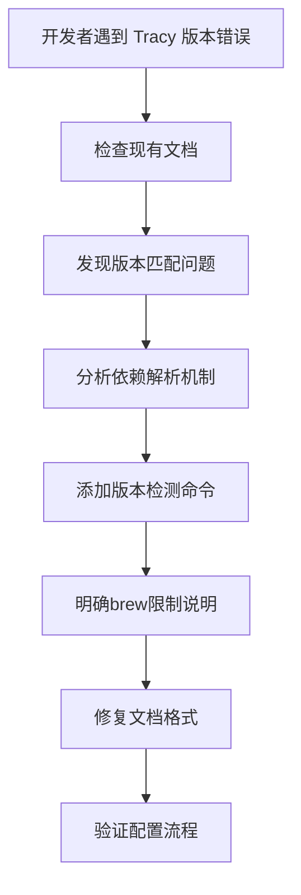

+++
title = "#20109 Mitigate Tracy dep version woes"
date = "2025-07-14T00:00:00"
draft = false
template = "pull_request_page.html"
in_search_index = false

[extra]
current_language = "zh-cn"
available_languages = {"en" = { name = "English", url = "/pull_request/bevy/2025-07/pr-20109-en-20250714" }, "zh-cn" = { name = "中文", url = "/pull_request/bevy/2025-07/pr-20109-zh-cn-20250714" }}
+++

# PR分析报告：Mitigate Tracy dep version woes

## 基础信息
- **标题**: Mitigate Tracy dep version woes
- **PR链接**: https://github.com/bevyengine/bevy/pull/20109
- **作者**: liamaharon
- **状态**: 已合并
- **标签**: C-Docs, C-Performance, S-Ready-For-Final-Review, A-Diagnostics
- **创建时间**: 2025-07-13T06:14:40Z
- **合并时间**: 2025-07-14T21:18:55Z
- **合并人**: mockersf

## 描述翻译
### 目标
Tracy依赖版本兼容性问题可能成为开发痛点。作者在遵循[Profiling Tracy文档](https://github.com/bevyengine/bevy/blob/1525dff7ada14714b35c8908381d534a7833faa3/docs/profiling.md#tracy-profiler)时遇到以下连接错误：


检查[tracy-client版本](https://github.com/bevyengine/bevy/blob/1525dff7ada14714b35c8908381d534a7833faa3/crates/bevy_log/Cargo.toml#L32-L35)后，作者误以为需要Tracy `0.11.1`。但实际是Cargo自动拉取了`tracy-client 0.18.2`而非`0.18.0`，真正需要的Tracy版本是`0.12.2`（该版本尚未在`brew`发布）。

### 解决方案
1. 在文档中明确说明如何确定兼容的Tracy版本
2. 添加说明：当brew未提供所需版本时，macOS用户需从源码编译
3. 修复文档中图片缩进问题

### 测试验证
- 在macOS本地运行Tracy验证
- 更改具有跨平台普适性
- 测试建议：按更新后的文档说明操作即可

## PR技术分析

### 问题背景
Tracy是Bevy引擎的性能分析工具，但版本兼容性问题导致开发者配置困难。核心问题在于：
1. Tracy客户端(tracy-client)与服务端(Tracy)需严格版本匹配
2. Cargo的依赖解析可能自动升级tracy-client版本
3. Homebrew的Tracy版本更新滞后
4. 现有文档未提供明确的版本确定方法

这导致开发者按文档操作时出现版本不匹配错误，尤其影响macOS用户通过brew安装的场景。

### 解决方案实现
文档更新聚焦两个关键改进：

**1. 添加版本确定流程**
```markdown
To determine which Tracy version to install

1. Run `cargo tree --features bevy/trace_tracy | grep tracy` in your Bevy workspace root to see which tracy dep versions are used
2. Cross reference the tracy dep versions with the [Version Support Table](https://github.com/nagisa/rust_tracy_client?tab=readme-ov-file#version-support-table)
```

此变更通过`cargo tree`命令动态获取实际依赖版本，替代了之前依赖静态Cargo.toml文件的方式。开发者可精确匹配[Tracy版本支持表](https://github.com/nagisa/rust_tracy_client?tab=readme-ov-file#version-support-table)，避免手动检查带来的误差。

**2. 明确macOS编译说明**
```markdown
On macOS, Tracy can be installed through Homebrew by running `brew install tracy`... 
Note that `brew` does not always have the latest version of Tracy available, 
in which cases you may be required to build from source.
```

此补充解决了brew版本滞后的实际问题，给出明确的应对方案。

**3. 修复文档格式**
```diff
-    
+   
```
移除图片链接前的多余空格，修复了Markdown渲染问题。

### 技术洞察
1. **动态依赖检测**：使用`cargo tree`替代静态文件检查，更准确反映实际依赖关系
2. **版本矩阵引用**：直接链接到官方[Version Support Table](https://github.com/nagisa/rust_tracy_client?tab=readme-ov-file#version-support-table)，确保信息可持续更新
3. **跨平台考量**：明确区分macOS的特殊处理，避免一刀切方案
4. **错误预防**：通过清晰步骤指导，减少用户配置错误可能性

### 影响分析
1. **开发者体验提升**：减少Tracy配置时的试错时间
2. **问题排查标准化**：提供明确的版本诊断路径
3. **文档可维护性**：链接外部版本表，降低Bevy文档更新负担
4. **跨平台一致性**：统一macOS/Linux/Windows的配置认知

## 关键文件变更
### docs/profiling.md
**变更说明**：更新Tracy配置指南，解决版本兼容性问题

```diff
@@ -67,9 +67,14 @@ The [Tracy profiling tool](https://github.com/wolfpld/tracy) is:
 
 There are binaries available for Windows, and installation / build instructions for other operating systems can be found in the [Tracy documentation PDF](https://github.com/wolfpld/tracy/releases/latest/download/tracy.pdf).
 
+To determine which Tracy version to install
+
+1. Run `cargo tree --features bevy/trace_tracy | grep tracy` in your Bevy workspace root to see which tracy dep versions are used
+2. Cross reference the tracy dep versions with the [Version Support Table](https://github.com/nagisa/rust_tracy_client?tab=readme-ov-file#version-support-table)
+
 It has a command line capture tool that can record the execution of graphical applications, saving it as a profile file. Tracy has a GUI to inspect these profile files. The GUI app also supports live capture, showing you in real time the trace of your app. The version of tracy must be matched to the version of tracing-tracy used in bevy. A compatibility table can be found on [crates.io](https://crates.io/crates/tracing-tracy) and the version used can be found [here](https://github.com/bevyengine/bevy/blob/latest/crates/bevy_log/Cargo.toml).
 
-On macOS, Tracy can be installed through Homebrew by running `brew install tracy`, and the GUI client can be launched by running `tracy`.
+On macOS, Tracy can be installed through Homebrew by running `brew install tracy`, and the GUI client can be launched by running `tracy`. Note that `brew` does not always have the latest version of Tracy available, in which cases you may be required to build from source.
 
 In one terminal, run:
 `./capture-release -o my_capture.tracy`
@@ -154,20 +159,20 @@ Follow the steps below to start GPU debugging on macOS. There is no need to crea
 
 1. In the menu bar click on Debug > Debug Executable…
 
-    
+   
 
 2. Select your executable from your project’s target folder.
 3. The Scheme Editor will open. If your assets are not located next to your executable, you can go to the Arguments tab and set `BEVY_ASSET_ROOT` to the absolute path for your project (the parent of your assets folder). The rest of the defaults should be fine.
 
-    
+   
 
 4. Click the play button in the top left and this should start your bevy app.
 
-    
+   
 
 5. Go back to Xcode and click on the Metal icon in the bottom drawer and then Capture in the following the popup menu.
 
-    
+   
 
 6. Start debugging and profiling!
 
```

## 技术关系图


## 延伸阅读
1. [Tracy官方文档](https://github.com/wolfpld/tracy/releases/latest/download/tracy.pdf) - 完整安装和使用指南
2. [rust_tracy_client版本支持表](https://github.com/nagisa/rust_tracy_client?tab=readme-ov-file#version-support-table) - 客户端/服务端兼容性参考
3. [Cargo tree命令文档](https://doc.rust-lang.org/cargo/commands/cargo-tree.html) - 依赖树分析工具
4. [Bevy性能分析指南](https://github.com/bevyengine/bevy/blob/main/docs/profiling.md) - 完整性能工具链配置

此PR通过精准的文档改进，系统性解决了Tracy版本配置痛点，体现了优秀开发者文档应具备的：准确的技术细节、可操作的步骤说明、对潜在问题的预见性提示。