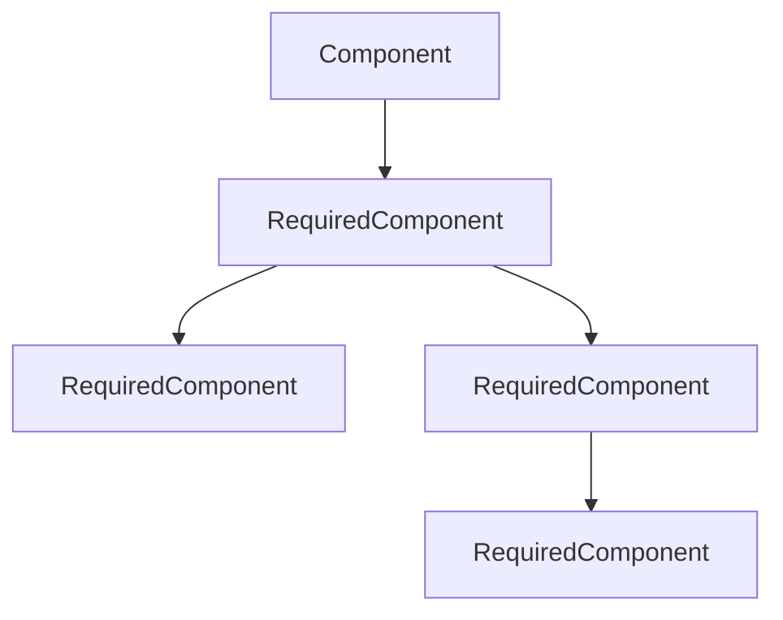

+++
title = "#20110 Ensure required components are consistently depth-first"
date = "2025-07-29T00:00:00"
draft = false
template = "pull_request_page.html"
in_search_index = true

[taxonomies]
list_display = ["show"]

[extra]
current_language = "en"
available_languages = {"en" = { name = "English", url = "/pull_request/bevy/2025-07/pr-20110-en-20250729" }, "zh-cn" = { name = "中文", url = "/pull_request/bevy/2025-07/pr-20110-zh-cn-20250729" }}
labels = ["C-Bug", "A-ECS", "C-Code-Quality", "D-Complex", "X-Contentious"]
+++

# Technical Report: Ensure Required Components Are Consistently Depth-First

## Basic Information
- **Title**: Ensure required components are consistently depth-first
- **PR Link**: https://github.com/bevyengine/bevy/pull/20110
- **Author**: SkiFire13
- **Status**: MERGED
- **Labels**: C-Bug, A-ECS, C-Code-Quality, S-Ready-For-Final-Review, D-Complex, X-Contentious
- **Created**: 2025-07-13T14:12:26Z
- **Merged**: 2025-07-29T21:18:41Z
- **Merged By**: alice-i-cecile

## Description Translation
# Objective

- Fixes #19863 by removing `inheritance_depth`
- Fixed #19333 by properly using depth-first order priority 
- Helps with #19300 (not sure if it could be closed with this PR)
- Fixes #20173
- Overall, fix the weird situation that required components are in, where some operations respect a depth-first order priority while other respect a breadth-first order priority.

## Solution

- Switch everything to a depth-first order priority as @cart originally intended it.
- Effectively revert #18028, which tried to give priority to components with higher inheritance depth (i.e. with a breadth-first order priority).

## Testing

Most existing tests pass, except a couple that were removed due to testing inheritance depth or the breadth-first order priority that this PR will remove.

Some tests were also added, some of which as regression tests and others to add more coverage.

## The Story of This Pull Request

### The Problem and Context
The ECS's required components system had inconsistent ordering behavior. Some operations used depth-first ordering while others used breadth-first ordering. This caused several issues:

1. #19333: Required component priorities didn't match user expectations
2. #19863: Inheritance depth tracking was complex and error-prone
3. #20173: Component removal could leave entities in invalid states

The core issue was the mixed use of two different ordering strategies:
- Depth-first: Processes dependencies before dependents
- Breadth-first: Processes components at same "level" first

This inconsistency made component requirements unpredictable, especially when multiple components required the same component with different constructors.

### The Solution Approach
The solution standardizes on depth-first ordering for all required component operations:
1. Remove inheritance depth tracking entirely
2. Replace breadth-first logic with depth-first traversal
3. Refactor registration to maintain depth-first invariants
4. Ensure bundle composition follows depth-first order

Key engineering decisions:
- Use `IndexMap`/`IndexSet` to preserve insertion order while deduplicating
- Maintain two distinct required component lists: 
  - `direct`: Explicitly declared requirements
  - `all`: Full depth-first ordered requirements
- Introduce `RequiredComponentsRegistrator` to safely handle registration

### The Implementation
The implementation replaces inheritance depth with strict depth-first ordering throughout the required components system:

**Component Macro (`component.rs`):**
```rust
// Before: Complex inheritance depth handling
for require in requires {
    register_recursive_requires.push(quote! { ... });
    // ... depth-based registration ...
}

// After: Simplified depth-first registration
for require in requires {
    register_required.push(quote! {
        required_components.register_required::<#ident>(#constructor);
    });
}
```
The macro now generates simpler code that directly registers requirements without recursion handling.

**Bundle Composition (`bundle/info.rs`):**
```rust
// Before: Separate component lists
let mut required_components = RequiredComponents::default();
for component_id in component_ids.iter().copied() {
    required_components.merge(info.required_components());
}

// After: Depth-first collection
let mut depth_first_components = IndexMap::default();
for &component_id in &component_ids {
    for (&required_id, required_component) in &info.required_components().all {
        depth_first_components.entry(required_id)
            .or_insert_with(|| required_component.clone());
    }
}
```
Bundles now collect requirements in depth-first order, ensuring consistent priority.

**Component Registration (`component/required.rs`):**
```rust
// New required components structure
pub struct RequiredComponents {
    pub(crate) direct: IndexMap<ComponentId, RequiredComponent, FixedHasher>,
    pub(crate) all: IndexMap<ComponentId, RequiredComponent, FixedHasher>,
}

// Depth-first registration
unsafe fn register_inherited_required_components_unchecked(
    all: &mut IndexMap<ComponentId, RequiredComponent, FixedHasher>,
    required_id: ComponentId,
    required_component: RequiredComponent,
    components: &Components,
) {
    // Recursively add requirements before the component itself
    let info = unsafe { components.get_info(required_id).debug_checked_unwrap() };
    if !all.contains_key(&required_id) {
        for (&inherited_id, inherited_required) in &info.required_components().all {
            all.entry(inherited_id)
                .or_insert_with(|| inherited_required.clone());
        }
    }
    all.insert(required_id, required_component);
}
```
This ensures components appear after their dependencies in the requirement list.

### Technical Insights
The key insight is that depth-first ordering provides natural dependency resolution:
1. Components are processed after their dependencies
2. Earlier registrations take precedence
3. The system maintains these invariants:
   - `all` contains components in depth-first order
   - A component appears after all components it requires
   - Direct requirements can override inherited ones

Performance considerations:
- `IndexMap` provides O(1) lookups while preserving order
- The depth-first approach minimizes redundant operations
- The change actually reduces total code size despite added complexity

### The Impact
These changes provide significant improvements:
1. Fixed priority inversion in required components
2. Resolved entity invalidation during removal
3. Simplified the component requirement model
4. Removed error-prone inheritance depth tracking
5. Improved consistency across ECS operations

The refactor also uncovered and fixed several edge cases around:
- Cyclic requirement detection
- Recursive requirement handling
- Runtime requirement registration

## Visual Representation


Depth-first order: C, E, D, B, A

## Key Files Changed

### `crates/bevy_ecs/src/component/required.rs` (+1491/-438)
**Purpose:** Core refactor of required components system  
**Key Changes:**
1. Replaced inheritance depth with depth-first ordering
2. Introduced direct/all requirement separation
3. Added cycle detection and recursion checks

**Code Snippet:**
```rust
// Before: Inheritance depth tracking
pub struct RequiredComponent {
    pub constructor: RequiredComponentConstructor,
    pub inheritance_depth: u16,
}

// After: Depth-first focused structure
pub struct RequiredComponents {
    pub(crate) direct: IndexMap<ComponentId, RequiredComponent, FixedHasher>,
    pub(crate) all: IndexMap<ComponentId, RequiredComponent, FixedHasher>,
}
```

### `crates/bevy_ecs/src/lib.rs` (+2/-792)
**Purpose:** Update tests to match new behavior  
**Key Changes:**
1. Removed tests for old breadth-first behavior
2. Added depth-first ordering tests

**Code Snippet:**
```rust
// Removed test validating old behavior
#[test]
fn required_components_inheritance_depth() {
    // ... old breadth-first test ...
}
```

### `crates/bevy_ecs/src/bundle/info.rs` (+50/-36)
**Purpose:** Align bundle composition with depth-first ordering  
**Key Changes:**
1. Replaced separate component lists with unified depth-first list
2. Simplified bundle component status tracking

**Code Snippet:**
```rust
// Before: Two separate component lists
let explicit_components_len = component_ids.len();
let mut required_components = RequiredComponents::default();

// After: Single depth-first ordered list
let mut depth_first_components = IndexMap::default();
for &component_id in &component_ids {
    for (&required_id, required_component) in &info.required_components().all {
        depth_first_components.entry(required_id)
            .or_insert_with(|| required_component.clone());
    }
}
```

### `crates/bevy_ecs/src/component/register.rs` (+30/-22)
**Purpose:** Improve component registration safety  
**Key Changes:**
1. Added recursion stack to registrator
2. Unified requirement registration path

**Code Snippet:**
```rust
// Before: No recursion tracking
pub struct ComponentsRegistrator<'w> {
    pub(super) components: &'w mut Components,
    pub(super) ids: &'w mut ComponentIds,
}

// After: Built-in recursion protection
pub struct ComponentsRegistrator<'w> {
    pub(super) components: &'w mut Components,
    pub(super) ids: &'w mut ComponentIds,
    pub(super) recursion_check_stack: Vec<ComponentId>,
}
```

### `crates/bevy_ecs/macros/src/component.rs` (+8/-41)
**Purpose:** Simplify derived component implementation  
**Key Changes:**
1. Removed recursive requirement handling
2. Simplified requirement registration

**Code Snippet:**
```rust
// Before: Manual recursion handling
let mut register_recursive_requires = Vec::new();
register_recursive_requires.push(quote! {
    <#ident as #bevy_ecs_path::component::Component>::register_required_components(
        // ... complex recursive call ...
    );
});

// After: Direct registration
register_required.push(quote! {
    required_components.register_required::<#ident>(#constructor);
});
```

## Further Reading
1. [Depth-First Search Algorithm](https://en.wikipedia.org/wiki/Depth-first_search) - Fundamental algorithm behind the ordering
2. [Component Dependency Management](https://www.geeksforgeeks.org/dependency-graph/) - Concepts for component requirements
3. [ECS Design Patterns](https://github.com/SanderMertens/ecs-faq) - General entity-component-system best practices
4. [IndexMap Documentation](https://docs.rs/indexmap/latest/indexmap/) - Preserving insertion order while deduplicating

The changes establish consistent depth-first ordering for required components, resolving long-standing priority issues and simplifying the ECS internals.