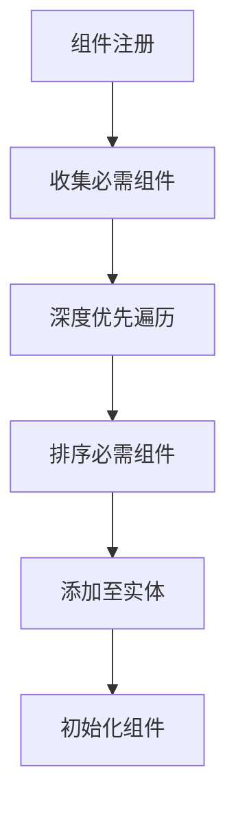

+++
title = "#20110 Ensure required components are consistently depth-first"
date = "2025-07-29T00:00:00"
draft = false
template = "pull_request_page.html"
in_search_index = false

[extra]
current_language = "zh-cn"
available_languages = {"en" = { name = "English", url = "/pull_request/bevy/2025-07/pr-20110-en-20250729" }, "zh-cn" = { name = "中文", url = "/pull_request/bevy/2025-07/pr-20110-zh-cn-20250729" }}
+++

# 分析报告：确保必需组件遵循一致的深度优先顺序

## 基本信息
- **标题**: Ensure required components are consistently depth-first
- **PR链接**: https://github.com/bevyengine/bevy/pull/20110
- **作者**: SkiFire13
- **状态**: MERGED
- **标签**: C-Bug, A-ECS, C-Code-Quality, S-Ready-For-Final-Review, D-Complex, X-Contentious
- **创建时间**: 2025-07-13T14:12:26Z
- **合并时间**: 2025-07-29T21:18:41Z
- **合并者**: alice-i-cecile

## 描述翻译
### 目标
- 通过移除`inheritance_depth`修复#19863
- 通过正确使用深度优先顺序优先级修复#19333
- 有助于解决#19300（不确定此PR是否能完全关闭该问题）
- 修复#20173
- 总体上，修复必需组件所处的奇怪情况：某些操作遵循深度优先顺序优先级，而其他操作遵循广度优先顺序优先级。

### 解决方案
- 将所有操作切换到深度优先顺序优先级，正如@cart最初的设计意图。
- 有效地撤销#18028，该PR试图给具有更高继承深度（即广度优先顺序优先级）的组件优先级。

### 测试
大多数现有测试通过，除了少数测试因涉及测试继承深度或此PR将移除的广度优先顺序优先级而被删除。
还添加了一些测试，其中一些作为回归测试，另一些用于增加覆盖率。

## 本PR的故事

### 问题和背景
在Bevy的ECS中，组件可以声明其他组件为"必需组件"。这意味着当组件被添加到实体时，这些必需组件也会被自动添加（如果实体上不存在）。然而，在PR之前，系统在处理必需组件时存在优先级不一致的问题：
- 某些操作（如派生宏）使用深度优先顺序（depth-first）
- 其他操作（如运行时注册的必需组件）使用广度优先顺序（breadth-first）
这种不一致导致了多个问题（#19863、#19333、#20173），并使得必需组件的行为难以预测。

例如，考虑以下组件依赖关系：
- 组件A需要组件B和C
- 组件B需要组件D
- 组件C需要组件E

在深度优先顺序中，添加A会导致组件按B、D、C、E的顺序添加。但在广度优先顺序中，可能按B、C、D、E的顺序添加。这种顺序差异可能导致在存在多个构造器时选择错误的构造器。

### 解决方案
PR的核心思想是统一使用深度优先顺序优先级，并移除之前引入的`inheritance_depth`（继承深度）概念：
1. **移除`inheritance_depth`**：该字段原本用于表示组件在依赖树中的深度（广度优先），现在不再需要
2. **重构必需组件的注册和收集逻辑**：使用深度优先遍历来收集必需组件，确保顺序一致
3. **修改宏和运行时注册逻辑**：调整派生宏和运行时注册方法，以符合深度优先顺序

### 实现细节
PR对多个关键文件进行了修改，主要围绕必需组件的处理逻辑：

#### `crates/bevy_ecs/macros/src/component.rs`
修改了`#[derive(Component)]`宏的实现，简化了必需组件的注册逻辑：
```rust
// 修改前
let mut register_recursive_requires = Vec::with_capacity(attrs.requires.iter().len());
// ... 复杂的手动注册逻辑

// 修改后
let mut register_required = Vec::with_capacity(attrs.requires.iter().len());
if let Some(requires) = requires {
    for require in requires {
        let ident = &require.path;
        let constructor = match &require.func {
            Some(func) => quote! { || { let x: #ident = (#func)().into(); x } },
            None => quote! { <#ident as Default>::default },
        };
        register_required.push(quote! {
            required_components.register_required::<#ident>(#constructor);
        });
    }
}
```
关键变化：
- 移除了递归注册逻辑
- 直接调用`register_required`方法，不再处理继承深度
- 简化了代码结构

#### `crates/bevy_ecs/src/bundle/info.rs`
重构了Bundle信息中必需组件的收集方式：
```rust
// 新逻辑：深度优先收集必需组件
let mut depth_first_components = IndexMap::<_, _, FixedHasher>::default();
for &component_id in &component_ids {
    let info = unsafe { components.get_info_unchecked(component_id) };
    
    for (&required_id, required_component) in &info.required_components().all {
        depth_first_components
            .entry(required_id)
            .or_insert_with(|| required_component.clone());
    }
}

// 过滤显式提供的组件
let required_components = depth_first_components
    .into_iter()
    .filter(|&(required_id, _)| !explicit_component_ids.contains(&required_id))
    .map(|(_, required_component)| required_component.constructor)
    .collect::<Vec<_>>();
```
关键变化：
- 使用`IndexMap`确保顺序一致性
- 深度优先遍历收集所有必需组件
- 显式过滤已由Bundle提供的组件

#### `crates/bevy_ecs/src/component/required.rs`
这是变化最大的文件，几乎完全重写了必需组件的处理逻辑：
```rust
// 新的RequiredComponents结构
pub struct RequiredComponents {
    pub(crate) direct: IndexMap<ComponentId, RequiredComponent, FixedHasher>,
    pub(crate) all: IndexMap<ComponentId, RequiredComponent, FixedHasher>,
}

// 深度优先注册方法
unsafe fn register_inherited_required_components_unchecked(
    all: &mut IndexMap<ComponentId, RequiredComponent, FixedHasher>,
    required_id: ComponentId,
    required_component: RequiredComponent,
    components: &Components,
) {
    let info = unsafe { components.get_info(required_id).debug_checked_unwrap() };
    
    if !all.contains_key(&required_id) {
        // 递归添加继承的必需组件
        for (&inherited_id, inherited_required) in &info.required_components().all {
            all.entry(inherited_id)
                .or_insert_with(|| inherited_required.clone());
        }
    }
    
    // 最后添加当前组件
    all.insert(required_id, required_component);
}
```
关键变化：
- 引入`direct`和`all`字段分别存储直接和所有必需组件
- 实现深度优先遍历算法
- 添加安全注释确保正确使用

#### `crates/bevy_ecs/src/component/register.rs`
修改了组件注册器以支持新的必需组件逻辑：
```rust
pub struct ComponentsRegistrator<'w> {
    pub(super) components: &'w mut Components,
    pub(super) ids: &'w mut ComponentIds,
    pub(super) recursion_check_stack: Vec<ComponentId>, // 新增
}

// 注册组件时自动处理递归检查
pub(super) fn register_component_checked<T: Component>(&mut self) -> ComponentId {
    let type_id = TypeId::of::<T>();
    if let Some(&id) = self.indices.get(&type_id) {
        enforce_no_required_components_recursion(self, &self.recursion_check_stack, id);
        return id;
    }
    // ... 其余注册逻辑
}
```
关键变化：
- 添加`recursion_check_stack`处理递归检查
- 简化组件注册流程

### 技术洞察
1. **深度优先顺序的重要性**：
   - 确保组件添加顺序可预测
   - 解决构造器优先级冲突
   - 符合开发者对依赖关系的直觉

2. **性能考虑**：
   - 使用`IndexMap`和`IndexSet`保持顺序且高效
   - 避免不必要的复制和递归

3. **安全改进**：
   - 添加`unsafe`标记强调关键操作的风险
   - 通过`RequiredComponentsRegistrator`封装安全访问
   ```rust
   pub struct RequiredComponentsRegistrator<'a, 'w> {
       components: &'a mut ComponentsRegistrator<'w>,
       required_components: &'a mut RequiredComponents,
   }
   ```

4. **API变化**：
   - `Component::register_required_components`方法签名变更
   - 移除`inheritance_depth`参数
   - 简化宏生成的代码

### 影响
1. **修复多个问题**：
   - #19863：移除inheritance_depth
   - #19333：正确使用深度优先顺序
   - #20173：解决必需组件优先级问题

2. **行为变化**：
   - 必需组件的添加顺序现在完全遵循深度优先
   - 构造器选择更可预测
   - 运行时注册的必需组件行为与派生宏一致

3. **代码质量提升**：
   - 移除约800行代码
   - 简化复杂逻辑
   - 提高可维护性

4. **迁移要求**：
   - 自定义组件需要更新`register_required_components`实现
   - 运行时注册必需组件的代码可能需要调整

## 视觉表示



## 关键文件变更

### 1. `crates/bevy_ecs/src/component/required.rs` (+1491/-438)
- **变更描述**：完全重构必需组件的存储和注册逻辑，实现深度优先遍历
- **关键代码**：
  ```rust
  pub struct RequiredComponents {
      pub(crate) direct: IndexMap<ComponentId, RequiredComponent, FixedHasher>,
      pub(crate) all: IndexMap<ComponentId, RequiredComponent, FixedHasher>,
  }
  
  // 深度优先注册继承的必需组件
  unsafe fn register_inherited_required_components_unchecked(
      all: &mut IndexMap<ComponentId, RequiredComponent, FixedHasher>,
      required_id: ComponentId,
      required_component: RequiredComponent,
      components: &Components,
  ) {
      // ... 实现深度优先遍历
  }
  ```
- **关联PR目标**：实现一致的深度优先顺序

### 2. `crates/bevy_ecs/src/lib.rs` (+2/-792)
- **变更描述**：移除过时的测试代码，迁移到更合适的模块
- **关键代码**：
  ```diff
   - // 旧测试代码...
   + // 测试已迁移到required.rs
  ```
- **关联PR目标**：清理代码库，提高可维护性

### 3. `crates/bevy_ecs/src/bundle/info.rs` (+50/-36)
- **变更描述**：修改Bundle信息处理，使用深度优先顺序收集必需组件
- **关键代码**：
  ```rust
  let mut depth_first_components = IndexMap::default();
  for &component_id in &component_ids {
      let info = unsafe { components.get_info_unchecked(component_id) };
      for (&required_id, required_component) in &info.required_components().all {
          depth_first_components
              .entry(required_id)
              .or_insert_with(|| required_component.clone());
      }
  }
  ```
- **关联PR目标**：确保Bundle处理遵循深度优先顺序

### 4. `crates/bevy_ecs/src/component/register.rs` (+30/-22)
- **变更描述**：增强组件注册器，支持深度优先必需组件注册
- **关键代码**：
  ```rust
  pub struct ComponentsRegistrator<'w> {
      // ...
      pub(super) recursion_check_stack: Vec<ComponentId>, // 新增
  }
  ```
- **关联PR目标**：提供必要的工具支持新机制

### 5. `crates/bevy_ecs/macros/src/component.rs` (+8/-41)
- **变更描述**：简化组件派生宏生成的必需组件注册代码
- **关键代码**：
  ```rust
  register_required.push(quote! {
      required_components.register_required::<#ident>(#constructor);
  });
  ```
- **关联PR目标**：使宏生成代码符合新的深度优先机制

## 进一步阅读
1. [深度优先搜索算法](https://en.wikipedia.org/wiki/Depth-first_search)
2. [Bevy ECS文档](https://docs.rs/bevy_ecs/latest/bevy_ecs/)
3. [实体组件系统模式](https://en.wikipedia.org/wiki/Entity_component_system)

## 完整代码差异
由于代码差异较大，以下是关键变更的摘要。完整差异请查看PR链接。

```diff
diff --git a/crates/bevy_ecs/macros/src/component.rs b/crates/bevy_ecs/macros/src/component.rs
index ce084474a2700..3ef6194ff5e0c 100644
--- a/crates/bevy_ecs/macros/src/component.rs
+++ b/crates/bevy_ecs/macros/src/component.rs
@@ -238,41 +238,16 @@ pub fn derive_component(input: TokenStream) -> TokenStream {
 
     let requires = &attrs.requires;
     let mut register_required = Vec::with_capacity(attrs.requires.iter().len());
-    let mut register_recursive_requires = Vec::with_capacity(attrs.requires.iter().len());
     if let Some(requires) = requires {
         for require in requires {
             let ident = &require.path;
-            register_recursive_requires.push(quote! {
-                <#ident as #bevy_ecs_path::component::Component>::register_required_components(
-                    requiree,
-                    components,
-                    required_components,
-                    inheritance_depth + 1,
-                    recursion_check_stack
-                );
+            let constructor = match &require.func {
+                Some(func) => quote! { || { let x: #ident = (#func)().into(); x } },
+                None => quote! { <#ident as Default>::default },
+            };
+            register_required.push(quote! {
+                required_components.register_required::<#ident>(#constructor);
             });
-            match &require.func {
-                Some(func) => {
-                    register_required.push(quote! {
-                        components.register_required_components_manual::<Self, #ident>(
-                            required_components,
-                            || { let x: #ident = (#func)().into(); x },
-                            inheritance_depth,
-                            recursion_check_stack
-                        );
-                    });
-                }
-                None => {
-                    register_required.push(quote! {
-                        components.register_required_components_manual::<Self, #ident>(
-                            required_components,
-                            <#ident as Default>::default,
-                            inheritance_depth,
-                            recursion_check_stack
-                        );
-                    });
-                }
-            }
         }
     }
     let struct_name = &ast.ident;
@@ -319,18 +294,10 @@ pub fn derive_component(input: TokenStream) -> TokenStream {
             const STORAGE_TYPE: #bevy_ecs_path::component::StorageType = #storage;
             type Mutability = #mutable_type;
             fn register_required_components(
-                requiree: #bevy_ecs_path::component::ComponentId,
-                components: &mut #bevy_ecs_path::component::ComponentsRegistrator,
-                required_components: &mut #bevy_ecs_path::component::RequiredComponents,
-                inheritance_depth: u16,
-                recursion_check_stack: &mut #bevy_ecs_path::__macro_exports::Vec<#bevy_ecs_path::component::ComponentId>
+                _requiree: #bevy_ecs_path::component::ComponentId,
+                required_components: &mut #bevy_ecs_path::component::RequiredComponentsRegistrator,
             ) {
-                #bevy_ecs_path::component::enforce_no_required_components_recursion(components, recursion_check_stack);
-                let self_id = components.register_component::<Self>();
-                recursion_check_stack.push(self_id);
                 #(#register_required)*
-                #(#register_recursive_requires)*
-                recursion_check_stack.pop();
             }
 
             #on_add
diff --git a/crates/bevy_ecs/src/bundle/info.rs b/crates/bevy_ecs/src/bundle/info.rs
index a4093f8a889a1..58a296a067519 100644
--- a/crates/bevy_ecs/src/bundle/info.rs
+++ b/crates/bevy_ecs/src/bundle/info.rs
@@ -1,16 +1,20 @@
 use alloc::{boxed::Box, vec, vec::Vec};
-use bevy_platform::collections::{HashMap, HashSet};
+use bevy_platform::{
+    collections::{HashMap, HashSet},
+    hash::FixedHasher,
+};
 use bevy_ptr::OwningPtr;
 use bevy_utils::TypeIdMap;
 use core::{any::TypeId, fmt::Debug, ops::Deref};
+use indexmap::{IndexMap, IndexSet};
 
 use crate::{
     archetype::{Archetype, BundleComponentStatus, ComponentStatus},
     bundle::{Bundle, DynamicBundle},
     change_detection::MaybeLocation,
     component::{
-        ComponentId, Components, ComponentsRegistrator, RequiredComponentConstructor,
-        RequiredComponents, StorageType, Tick,
+        ComponentId, Components, ComponentsRegistrator, RequiredComponentConstructor, StorageType,
+        Tick,
     },
     entity::Entity,
     query::DebugCheckedUnwrap as _,
@@ -59,6 +63,7 @@ pub enum InsertMode {
 /// [`World`]: crate::world::World
 pub struct BundleInfo {
     pub(super) id: BundleId,
+
     /// The list of all components contributed by the bundle (including Required Components). This is in
     /// the order `[EXPLICIT_COMPONENTS][REQUIRED_COMPONENTS]`
     ///
@@ -67,9 +72,10 @@ pub struct BundleInfo {
     /// must have its storage initialized (i.e. columns created in tables, sparse set created),
     /// and the range (0..`explicit_components_len`) must be in the same order as the source bundle
     /// type writes its components in.
-    pub(super) component_ids: Vec<ComponentId>,
-    pub(super) required_components: Vec<RequiredComponentConstructor>,
-    pub(super) explicit_components_len: usize,
+    pub(super) contributed_component_ids: Vec<ComponentId>,
+
+    /// The list of constructors for all required components indirectly contributed by this bundle.
+    pub(super) required_component_constructors: Vec<RequiredComponentConstructor>,
 }
 
 impl BundleInfo {
@@ -86,11 +92,13 @@ impl BundleInfo {
         mut component_ids: Vec<ComponentId>,
         id: BundleId,
     ) -> BundleInfo {
+        let explicit_component_ids = component_ids
+            .iter()
+            .copied()
+            .collect::<IndexSet<_, FixedHasher>>();
+
         // check for duplicates
-        let mut deduped = component_ids.clone();
-        deduped.sort_unstable();
-        deduped.dedup();
-        if deduped.len() != component_ids.len() {
+        if explicit_component_ids.len() != component_ids.len() {
             // TODO: Replace with `Vec::partition_dedup` once https://github.com/rust-lang/rust/issues/54279 is stabilized
             let mut seen = <HashSet<_>>::default();
             let mut dups = Vec::new();
@@ -111,31 +119,30 @@ impl BundleInfo {
             panic!("Bundle {bundle_type_name} has duplicate components: {names:?}");
         }
 
-        // handle explicit components
-        let explicit_components_len = component_ids.len();
-        let mut required_components = RequiredComponents::default();
-        for component_id in component_ids.iter().copied() {
+        let mut depth_first_components = IndexMap::<_, _, FixedHasher>::default();
+        for &component_id in &component_ids {
             // SAFETY: caller has verified that all ids are valid
             let info = unsafe { components.get_info_unchecked(component_id) };
-            required_components.merge(info.required_components());
+
+            for (&required_id, required_component) in &info.required_components().all {
+                depth_first_components
+                    .entry(required_id)
+                    .or_insert_with(|| required_component.clone());
+            }
+
             storages.prepare_component(info);
         }
-        required_components.remove_explicit_components(&component_ids);
 
-        // handle required components
-        let required_components = required_components
-            .0
+        let required_components = depth_first_components
             .into_iter()
-            .map(|(component_id, v)| {
-                // Safety: These ids came out of the passed `components`, so they must be valid.
-                let info = unsafe { components.get_info_unchecked(component_id) };
-                storages.prepare_component(info);
-                // This adds required components to the component_ids list _after_ using that list to remove explicitly provided
-                // components. This ordering is important!
-                component_ids.push(component_id);
-                v.constructor
+            .filter(|&(required_id, _)| !