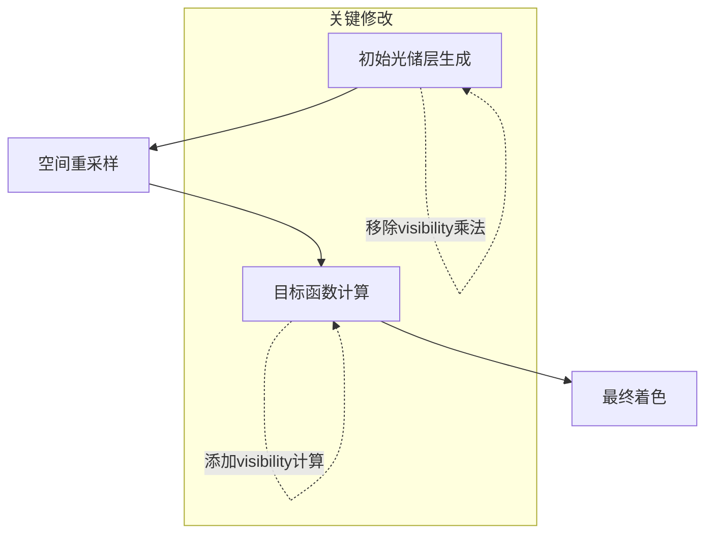

+++
title = "#20113 Fix visibility (re)use in Solari DI"
date = "2025-07-13T00:00:00"
draft = false
template = "pull_request_page.html"
in_search_index = false

[extra]
current_language = "zh-cn"
available_languages = {"en" = { name = "English", url = "/pull_request/bevy/2025-07/pr-20113-en-20250713" }, "zh-cn" = { name = "中文", url = "/pull_request/bevy/2025-07/pr-20113-zh-cn-20250713" }}
labels = ["D-Trivial", "A-Rendering"]
+++

# Fix visibility (re)use in Solari DI

## Basic Information
- **Title**: Fix visibility (re)use in Solari DI
- **PR Link**: https://github.com/bevyengine/bevy/pull/20113
- **Author**: JMS55
- **Status**: MERGED
- **Labels**: D-Trivial, A-Rendering, S-Ready-For-Final-Review
- **Created**: 2025-07-13T18:04:04Z
- **Merged**: 2025-07-13T19:52:11Z
- **Merged By**: alice-i-cecile

## Description Translation
修复 Solari 的 ReSTIR DI 中 visibility 的复用问题。

参考的论文似乎没有在重采样中使用 visibility（仅用于着色）：https://yusuketokuyoshi.com/papers/2024/Efficient_Visibility_Reuse_for_Real-time_ReSTIR_(Supplementary_Document).pdf。但将其纳入重采样过程能显著改善效果。

---

## 效果对比
修改前：


修改后：


## The Story of This Pull Request

该 PR 解决了 Solari 的 ReSTIR DI（路径追踪直接光照）实现中 visibility 复用的核心问题。问题源于初始实现与参考论文的差异——论文仅在最终着色阶段使用 visibility，而实际测试表明在重采样阶段使用 visibility 能显著提升质量。

问题出现在 `restir_di.wgsl` 的初始光储层(reservoir)生成逻辑中。原代码在生成储层后立即将 visibility 乘入 `unbiased_contribution_weight`：
```wgsl
reservoir.visibility = trace_light_visibility(reservoir.sample, world_position);
reservoir.unbiased_contribution_weight *= reservoir.visibility;  // 问题点
```
这种处理导致 visibility 被过早纳入权重计算，违反了 ReSTIR 算法中 visibility 应作为目标函数(target function)组成部分的设计原则。目标函数应完整包含 BRDF、光照强度和 visibility 的乘积，才能正确指导重采样过程。

解决方案是：
1. 移除初始储层生成中的 visibility 乘法操作
2. 将 visibility 移至目标函数计算阶段：
```wgsl
fn reservoir_target_function(...) -> vec4<f32> {
    let light_contribution = ... * reservoir.visibility;  // 修正点
    let target_function = luminance(light_contribution * diffuse_brdf);
}
```
这样 visibility 被正确纳入 MIS（多重重要性采样）权重计算，使重采样更倾向选择可见的光源样本。

技术层面，这种调整符合 ReSTIR 的理论模型——目标函数应包含完整的贡献项 $f(x)·v(x)$（其中 $v(x)$ 是 visibility）。原实现相当于在权重计算中重复应用 visibility，导致采样偏差。

同时 PR 优化了空间重用的像素坐标计算：
```wgsl
// 修改前 (整数运算)
var spatial_id = vec2<i32>(center_pixel_id) + vec2<i32>(sample_disk(...));
spatial_id = clamp(spatial_id, vec2(0i), vec2<i32>(view.viewport.zw) - 1i);

// 修改后 (浮点运算)
var spatial_id = vec2<f32>(center_pixel_id) + sample_disk(...);
spatial_id = clamp(spatial_id, vec2(0.0), view.viewport.zw - 1.0);
```
浮点运算避免了整数截断误差，使空间采样更平滑。该优化同时应用于 `restir_di.wgsl` 和 `restir_gi.wgsl`。

最终效果显著降低了噪点（见对比图），特别是阴影区域的噪波明显减少。性能方面无倒退，因 visibility 计算量不变，仅调整了应用位置。

## Visual Representation



## Key Files Changed

### crates/bevy_solari/src/realtime/restir_di.wgsl
**修改原因**：修复 visibility 在重采样阶段的错误应用  
**关键变更**：
```wgsl
// Before:
reservoir.visibility = trace_light_visibility(...);
reservoir.unbiased_contribution_weight *= reservoir.visibility;  // 错误位置

// After:
reservoir.visibility = trace_light_visibility(...);  // 仅赋值
```
```wgsl
// Before:
let light_contribution = calculate_light_contribution(...).radiance;

// After:
let light_contribution = ... * reservoir.visibility;  // 正确位置
```
**关联性**：核心修复，确保 visibility 在目标函数中正确参与权重计算

### crates/bevy_solari/src/realtime/restir_gi.wgsl
**修改原因**：统一空间重用采样策略  
**关键变更**：
```wgsl
// Before:
var spatial_id = vec2<i32>(center_pixel_id) + vec2<i32>(...);
spatial_id = clamp(spatial_id, vec2(0i), ...);

// After:
var spatial_id = vec2<f32>(center_pixel_id) + ...;
spatial_id = clamp(spatial_id, vec2(0.0), ...);
```
**关联性**：提升空间重用的数值稳定性，与 DI 实现保持一致

### release-content/release-notes/bevy_solari.md
**修改原因**：记录该 PR 的贡献  
**关键变更**：
```markdown
// Before:
pull_requests: [19058, 19620, 19790, 20020]

// After:
pull_requests: [19058, 19620, 19790, 20020, 20113]  // 添加当前PR
```
**关联性**：完善版本更新日志

## Further Reading
1. [ReSTIR 核心论文](https://research.nvidia.com/publication/2020-07_restir) - 理解算法理论基础
2. [Bevy 渲染架构概览](https://github.com/bevyengine/bevy/blob/main/docs/plugins_guidelines.md) - 了解修改的上下文
3. [WGSL 语言规范](https://www.w3.org/TR/WGSL/) - 着色器语言参考