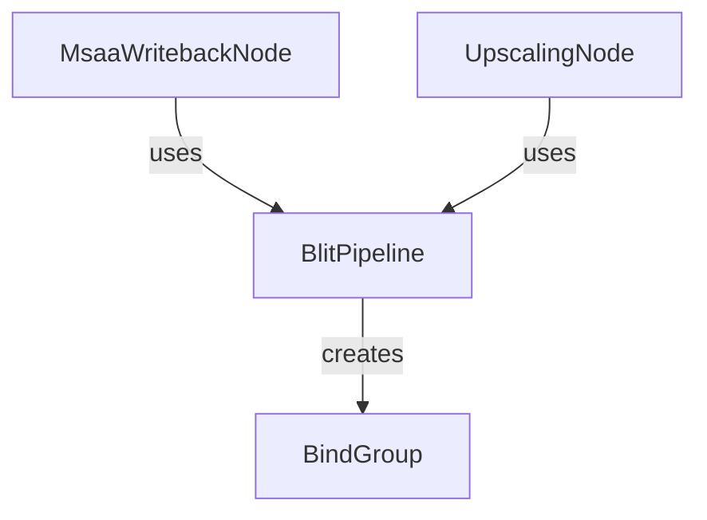

+++
title = "#20118 Mini Blit refactor"
date = "2025-07-15T00:00:00"
draft = false
template = "pull_request_page.html"
in_search_index = true

[taxonomies]
list_display = ["show"]

[extra]
current_language = "en"
available_languages = {"en" = { name = "English", url = "/pull_request/bevy/2025-07/pr-20118-en-20250715" }, "zh-cn" = { name = "中文", url = "/pull_request/bevy/2025-07/pr-20118-zh-cn-20250715" }}
labels = ["D-Trivial", "A-Rendering", "C-Usability"]
+++

### Mini Blit Refactor: Simplifying Bind Group Management

## Basic Information  
- **Title**: Mini Blit refactor  
- **PR Link**: https://github.com/bevyengine/bevy/pull/20118  
- **Author**: ecoskey  
- **Status**: MERGED  
- **Labels**: D-Trivial, A-Rendering, C-Usability, S-Ready-For-Final-Review  
- **Created**: 2025-07-13T20:53:05Z  
- **Merged**: 2025-07-14T22:40:16Z  
- **Merged By**: alice-i-cecile  

## Description Translation  
# Objective  
- Clean up usage of BlitPipeline  

## Solution  
- add `create_bind_group` method  
- adjust some field and variable names for clarity  

## Testing  
- ran 3d_scene  

## The Story of This Pull Request  

The PR addresses duplicated bind group creation logic across multiple rendering nodes by centralizing bind group management in the BlitPipeline. Previously, both `MsaaWritebackNode` and `UpscalingNode` contained identical boilerplate code for creating texture bind groups:  

```rust
// Old approach (duplicated in multiple nodes)
let bind_group = render_device.create_bind_group(
    None,
    &blit_pipeline.texture_bind_group,
    &BindGroupEntries::sequential((texture_view, &blit_pipeline.sampler)),
);
```

This violated DRY principles and made the code harder to maintain. The solution introduces a new `create_bind_group` method in the `BlitPipeline` implementation that encapsulates the bind group creation logic:  

```rust
impl BlitPipeline {
    pub fn create_bind_group(
        &self,
        render_device: &RenderDevice,
        src_texture: &TextureView,
    ) -> BindGroup {
        render_device.create_bind_group(
            None,
            &self.layout,
            &BindGroupEntries::sequential((src_texture, &self.sampler)),
        )
    }
}
```

The renaming of `texture_bind_group` to `layout` better reflects the field's actual purpose as a bind group layout rather than a bind group itself. This naming change improves code clarity and consistency with common graphics programming terminology.  

Variable names were updated throughout the affected files for better readability. For example, in `upscaling/node.rs`, `upscaled_texture` was renamed to `main_texture_view` to more accurately describe its role:  

```rust
// Before:
let upscaled_texture = target.main_texture_view();

// After:
let main_texture_view = target.main_texture_view();
```

Resource fetching was optimized by replacing `get_resource().unwrap()` with the more concise `resource()`:  

```rust
// Before:
let pipeline_cache = world.get_resource::<PipelineCache>().unwrap();

// After:
let pipeline_cache = world.resource::<PipelineCache>();
```

These changes collectively reduce code duplication, improve naming consistency, and make the rendering pipeline code more maintainable without altering any functional behavior.  

## Visual Representation  



## Key Files Changed  

1. **crates/bevy_core_pipeline/src/blit/mod.rs**  
   Added helper method and renamed fields:  
   ```rust
   // Before:
   pub struct BlitPipeline {
       pub texture_bind_group: BindGroupLayout,
       // ...
   }
   
   // After:
   pub struct BlitPipeline {
       pub layout: BindGroupLayout,  // Renamed field
       // ...
   }
   
   // New method:
   impl BlitPipeline {
       pub fn create_bind_group(&self, ...) -> BindGroup {
           // Bind group creation logic
       }
   }
   ```

2. **crates/bevy_core_pipeline/src/msaa_writeback.rs**  
   Replaced manual bind group creation:  
   ```rust
   // Before:
   let bind_group = render_device.create_bind_group(
       None,
       &blit_pipeline.texture_bind_group,
       &BindGroupEntries::sequential((post_process.source, &blit_pipeline.sampler)),
   );
   
   // After:
   let bind_group = blit_pipeline.create_bind_group(
       render_context.render_device(), 
       post_process.source
   );
   ```

3. **crates/bevy_core_pipeline/src/upscaling/node.rs**  
   Consolidated bind group creation and improved naming:  
   ```rust
   // Before:
   let upscaled_texture = target.main_texture_view();
   let bind_group = render_device.create_bind_group(...);
   
   // After:
   let main_texture_view = target.main_texture_view();
   let bind_group = blit_pipeline.create_bind_group(
       render_context.render_device(),
       main_texture_view
   );
   
   // Resource fetching improved:
   world.resource::<PipelineCache>() // vs old get_resource().unwrap()
   ```

## Further Reading  
- [Bevy Render Pipeline Documentation](https://bevyengine.org/learn/book/getting-started/pipeline/)  
- [WGSL Bind Groups Overview](https://gpuweb.github.io/gpuweb/wgsl/#bind-groups)  
- [DRY Principle in Systems Programming](https://en.wikipedia.org/wiki/Don%27t_repeat_yourself)  

## Full Code Diff  
<details>
<summary>View unified diff</summary>

```diff
diff --git a/crates/bevy_core_pipeline/src/blit/mod.rs b/crates/bevy_core_pipeline/src/blit/mod.rs
index 5acd98dd30e47..f515cdc58ce92 100644
--- a/crates/bevy_core_pipeline/src/blit/mod.rs
+++ b/crates/bevy_core_pipeline/src/blit/mod.rs
@@ -36,7 +36,7 @@ impl Plugin for BlitPlugin {
 
 #[derive(Resource)]
 pub struct BlitPipeline {
-    pub texture_bind_group: BindGroupLayout,
+    pub layout: BindGroupLayout,
     pub sampler: Sampler,
     pub fullscreen_shader: FullscreenShader,
     pub fragment_shader: Handle<Shader>,
@@ -46,7 +46,7 @@ impl FromWorld for BlitPipeline {
     fn from_world(render_world: &mut World) -> Self {
         let render_device = render_world.resource::<RenderDevice>();
 
-        let texture_bind_group = render_device.create_bind_group_layout(
+        let layout = render_device.create_bind_group_layout(
             "blit_bind_group_layout",
             &BindGroupLayoutEntries::sequential(
                 ShaderStages::FRAGMENT,
@@ -60,7 +60,7 @@ impl FromWorld for BlitPipeline {
         let sampler = render_device.create_sampler(&SamplerDescriptor::default());
 
         BlitPipeline {
-            texture_bind_group,
+            layout,
             sampler,
             fullscreen_shader: render_world.resource::<FullscreenShader>().clone(),
             fragment_shader: load_embedded_asset!(render_world, "blit.wgsl"),
@@ -68,6 +68,20 @@ impl FromWorld for BlitPipeline {
     }
 }
 
+impl BlitPipeline {
+    pub fn create_bind_group(
+        &self,
+        render_device: &RenderDevice,
+        src_texture: &TextureView,
+    ) -> BindGroup {
+        render_device.create_bind_group(
+            None,
+            &self.layout,
+            &BindGroupEntries::sequential((src_texture, &self.sampler)),
+        )
+    }
+}
+
 #[derive(PartialEq, Eq, Hash, Clone, Copy)]
 pub struct BlitPipelineKey {
     pub texture_format: TextureFormat,
@@ -81,7 +95,7 @@ impl SpecializedRenderPipeline for BlitPipeline {
     fn specialize(&self, key: Self::Key) -> RenderPipelineDescriptor {
         RenderPipelineDescriptor {
             label: Some("blit pipeline".into()),
-            layout: vec![self.texture_bind_group.clone()],
+            layout: vec![self.layout.clone()],
             vertex: self.fullscreen_shader.to_vertex_state(),
             fragment: Some(FragmentState {
                 shader: self.fragment_shader.clone(),
diff --git a/crates/bevy_core_pipeline/src/msaa_writeback.rs b/crates/bevy_core_pipeline/src/msaa_writeback.rs
index 93116dc9fdb91..151660876aeb0 100644
--- a/crates/bevy_core_pipeline/src/msaa_writeback.rs
+++ b/crates/bevy_core_pipeline/src/msaa_writeback.rs
@@ -98,11 +98,8 @@ impl ViewNode for MsaaWritebackNode {
             occlusion_query_set: None,
         };
 
-        let bind_group = render_context.render_device().create_bind_group(
-            None,
-            &blit_pipeline.texture_bind_group,
-            &BindGroupEntries::sequential((post_process.source, &blit_pipeline.sampler)),
-        );
+        let bind_group =
+            blit_pipeline.create_bind_group(render_context.render_device(), post_process.source);
 
         let mut render_pass = render_context
             .command_encoder()
diff --git a/crates/bevy_core_pipeline/src/upscaling/node.rs b/crates/bevy_core_pipeline/src/upscaling/node.rs
index ece71c194710c..493a1484c6e0d 100644
--- a/crates/bevy_core_pipeline/src/upscaling/node.rs
+++ b/crates/bevy_core_pipeline/src/upscaling/node.rs
@@ -3,9 +3,7 @@ use bevy_ecs::{prelude::*, query::QueryItem};
 use bevy_render::{
     camera::{CameraOutputMode, ClearColor, ClearColorConfig, ExtractedCamera},
     render_graph::{NodeRunError, RenderGraphContext, ViewNode},
-    render_resource::{
-        BindGroup, BindGroupEntries, PipelineCache, RenderPassDescriptor, TextureViewId,
-    },
+    render_resource::{BindGroup, PipelineCache, RenderPassDescriptor, TextureViewId},
     renderer::RenderContext,
     view::ViewTarget,
 };
@@ -30,9 +28,9 @@ impl ViewNode for UpscalingNode {
         (target, upscaling_target, camera): QueryItem<Self::ViewQuery>,
         world: &World,
     ) -> Result<(), NodeRunError> {
-        let pipeline_cache = world.get_resource::<PipelineCache>().unwrap();
-        let blit_pipeline = world.get_resource::<BlitPipeline>().unwrap();
-        let clear_color_global = world.get_resource::<ClearColor>().unwrap();
+        let pipeline_cache = world.resource::<PipelineCache>();
+        let blit_pipeline = world.resource::<BlitPipeline>();
+        let clear_color_global = world.resource::<ClearColor>();
 
         let clear_color = if let Some(camera) = camera {
             match camera.output_mode {
@@ -48,19 +46,18 @@ impl ViewNode for UpscalingNode {
             ClearColorConfig::None => None,
         };
         let converted_clear_color = clear_color.map(Into::into);
-        let upscaled_texture = target.main_texture_view();
+        // texture to be upscaled to the output texture
+        let main_texture_view = target.main_texture_view();
 
         let mut cached_bind_group = self.cached_texture_bind_group.lock().unwrap();
         let bind_group = match &mut *cached_bind_group {
-            Some((id, bind_group)) if upscaled_texture.id() == *id => bind_group,
+            Some((id, bind_group)) if main_texture_view.id() == *id => bind_group,
             cached_bind_group => {
-                let bind_group = render_context.render_device().create_bind_group(
-                    None,
-                    &blit_pipeline.texture_bind_group,
-                    &BindGroupEntries::sequential((upscaled_texture, &blit_pipeline.sampler)),
-                );
+                let bind_group = blit_pipeline
+                    .create_bind_group(render_context.render_device(), main_texture_view);
 
-                let (_, bind_group) = cached_bind_group.insert((upscaled_texture.id(), bind_group));
+                let (_, bind_group) =
+                    cached_bind_group.insert((main_texture_view.id(), bind_group));
                 bind_group
             }
         };
```

</details>