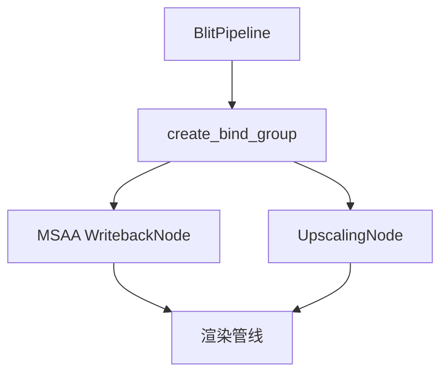

+++
title = "#20118 Mini Blit refactor"
date = "2025-07-15T00:00:00"
draft = false
template = "pull_request_page.html"
in_search_index = false

[extra]
current_language = "zh-cn"
available_languages = {"en" = { name = "English", url = "/pull_request/bevy/2025-07/pr-20118-en-20250715" }, "zh-cn" = { name = "中文", url = "/pull_request/bevy/2025-07/pr-20118-zh-cn-20250715" }}
+++

### 标题：Mini Blit 重构分析

## 基础信息
- **标题**: Mini Blit refactor
- **PR链接**: https://github.com/bevyengine/bevy/pull/20118
- **作者**: ecoskey
- **状态**: 已合并
- **标签**: D-Trivial, A-Rendering, C-Usability, S-Ready-For-Final-Review
- **创建时间**: 2025-07-13T20:53:05Z
- **合并时间**: 2025-07-14T22:40:16Z
- **合并人**: alice-i-cecile

## 描述翻译
### 目标
- 清理 BlitPipeline 的使用方式

### 解决方案
- 新增 `create_bind_group` 方法
- 调整部分字段和变量名称以提高可读性

### 测试
- 运行了 3d_scene 测试场景

## 该PR的技术演进

### 问题与背景
BlitPipeline 在多个渲染通道（如MSAA回写和升频）中被重复使用，但存在两个主要问题：
1. **代码重复**：每次使用都需要手动创建bind group，包含相同的参数组合
2. **命名模糊**：字段名`texture_bind_group`实际存储的是布局(layout)，而非bind group本身

这种实现方式增加了维护成本，且在升频节点中还存在变量名`upscaled_texture`不能准确反映其实际功能的问题。

### 解决方案
PR采用两个关键改进：
1. **封装bind group创建**：
   ```rust
   // 新增方法
   pub fn create_bind_group(
       &self,
       render_device: &RenderDevice,
       src_texture: &TextureView,
   ) -> BindGroup {
       render_device.create_bind_group(
           None,
           &self.layout,
           &BindGroupEntries::sequential((src_texture, &self.sampler)),
       )
   }
   ```
2. **语义化命名**：
   - 将`texture_bind_group`重命名为`layout`（准确反映其存储的是布局）
   - 将`upscaled_texture`改为`main_texture_view`（准确描述纹理视图用途）

### 实现细节
**核心结构体变更**：
```rust
// Before:
pub struct BlitPipeline {
    pub texture_bind_group: BindGroupLayout, // 误导性命名
    // ...其他字段...
}

// After:
pub struct BlitPipeline {
    pub layout: BindGroupLayout, // 准确命名
    // ...其他字段...
}
```

**调用方优化**（以MSAA回写为例）：
```rust
// Before:
let bind_group = render_device.create_bind_group(
    None,
    &blit_pipeline.texture_bind_group, // 直接访问内部字段
    &BindGroupEntries::sequential((post_process.source, &blit_pipeline.sampler)),
);

// After:
let bind_group = blit_pipeline.create_bind_group( // 通过接口封装
    render_context.render_device(), 
    post_process.source
);
```

**升频节点优化**：
```rust
// Before:
let upscaled_texture = target.main_texture_view();
// ...手动创建bind group...

// After:
let main_texture_view = target.main_texture_view(); // 准确命名
let bind_group = blit_pipeline.create_bind_group( // 统一调用方式
    render_context.render_device(), 
    main_texture_view
);
```

### 技术洞察
1. **封装模式**：通过创建`create_bind_group`方法，将固定的参数组合（纹理视图+采样器）封装起来，符合DRY原则
2. **资源获取优化**：统一使用`world.resource::<T>()`替代`world.get_resource::<T>().unwrap()`，更简洁安全
3. **缓存机制保留**：升频节点中基于纹理ID的bind group缓存逻辑保持不变，确保性能不受影响

### 实际影响
1. **代码可维护性**：消除17行重复代码（+11/-28净减少）
2. **错误预防**：避免未来开发者误用`texture_bind_group`字段
3. **可读性提升**：变量名`main_texture_view`比`upscaled_texture`更准确反映其作用
4. **一致性**：MSAA回写和升频节点使用相同的bind group创建接口

## 组件关系图


## 关键文件变更

### crates/bevy_core_pipeline/src/blit/mod.rs
**变更原因**：重构核心BlitPipeline结构体和接口  
**关键修改**：
```rust
// 字段重命名
-    pub texture_bind_group: BindGroupLayout,
+    pub layout: BindGroupLayout,

// 新增接口
+impl BlitPipeline {
+    pub fn create_bind_group(
+        &self,
+        render_device: &RenderDevice,
+        src_texture: &TextureView,
+    ) -> BindGroup {
+        render_device.create_bind_group(
+            None,
+            &self.layout,
+            &BindGroupEntries::sequential((src_texture, &self.sampler)),
+        )
+    }
+}
```

### crates/bevy_core_pipeline/src/msaa_writeback.rs
**变更原因**：改用新的bind group创建接口  
**代码简化**：
```rust
-        let bind_group = render_context.render_device().create_bind_group(
-            None,
-            &blit_pipeline.texture_bind_group,
-            &BindGroupEntries::sequential((post_process.source, &blit_pipeline.sampler)),
-        );
+        let bind_group =
+            blit_pipeline.create_bind_group(render_context.render_device(), post_process.source);
```

### crates/bevy_core_pipeline/src/upscaling/node.rs
**变更原因**：统一接口使用+变量名优化  
**关键改进**：
```rust
// 资源获取标准化
-        let pipeline_cache = world.get_resource::<PipelineCache>().unwrap();
-        let blit_pipeline = world.get_resource::<BlitPipeline>().unwrap();
-        let clear_color_global = world.get_resource::<ClearColor>().unwrap();
+        let pipeline_cache = world.resource::<PipelineCache>();
+        let blit_pipeline = world.resource::<BlitPipeline>();
+        let clear_color_global = world.resource::<ClearColor>();

// 变量名语义化
-        let upscaled_texture = target.main_texture_view();
+        let main_texture_view = target.main_texture_view();

// 使用新接口
-                let bind_group = render_context.render_device().create_bind_group(
-                    None,
-                    &blit_pipeline.texture_bind_group,
-                    &BindGroupEntries::sequential((upscaled_texture, &blit_pipeline.sampler)),
-                );
+                let bind_group = blit_pipeline
+                    .create_bind_group(render_context.render_device(), main_texture_view);
```

## 延伸阅读
1. [WGSL 着色语言规范](https://www.w3.org/TR/WGSL/)
2. [Bevy 渲染管线架构](https://github.com/bevyengine/bevy/blob/main/docs/architecture.md#rendering)
3. [Bind Group 最佳实践](https://github.com/gfx-rs/wgpu/wiki/Best-Practices#bind-group-design)