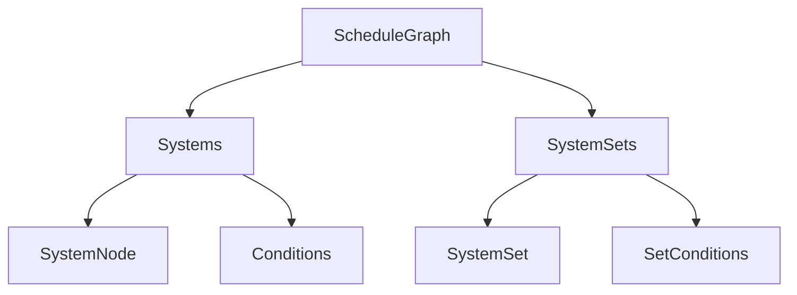

+++
title = "#20119 Improve node encapsulation in `ScheduleGraph`"
date = "2025-07-15T00:00:00"
draft = false
template = "pull_request_page.html"
in_search_index = true

[taxonomies]
list_display = ["show"]

[extra]
current_language = "en"
available_languages = {"en" = { name = "English", url = "/pull_request/bevy/2025-07/pr-20119-en-20250715" }, "zh-cn" = { name = "中文", url = "/pull_request/bevy/2025-07/pr-20119-zh-cn-20250715" }}
labels = ["A-ECS", "C-Code-Quality", "C-Usability", "D-Modest"]
+++

## Analysis of PR #20119: Improve node encapsulation in `ScheduleGraph`

### Basic Information
- **Title**: Improve node encapsulation in `ScheduleGraph`
- **PR Link**: https://github.com/bevyengine/bevy/pull/20119
- **Author**: ItsDoot
- **Status**: MERGED
- **Labels**: A-ECS, C-Code-Quality, C-Usability, S-Ready-For-Final-Review, M-Needs-Migration-Guide, D-Modest
- **Created**: 2025-07-13T22:30:29Z
- **Merged**: 2025-07-15T06:50:09Z
- **Merged By**: alice-i-cecile

### The Story of This Pull Request

#### The Problem and Context
The `ScheduleGraph` struct in Bevy's ECS module had become increasingly complex, directly managing several distinct concerns:
1. Storage of systems and their conditions
2. Storage of system sets and their conditions
3. Tracking uninitialized nodes
4. Managing graph relationships

This violated the single responsibility principle and made the code difficult to maintain. Direct field access throughout the codebase created tight coupling, and the initialization logic for systems/sets was intertwined with graph management. The lack of encapsulation made it challenging to modify or extend schedule functionality.

#### The Solution Approach
The solution centered on encapsulating related functionality into dedicated structs:
1. Create `Systems` struct to manage system storage and initialization
2. Create `SystemSets` struct to manage system set storage and initialization
3. Move node-related types (`SystemNode`, `SystemWithAccess`, etc.) to a new module
4. Remove direct field access from `ScheduleGraph` in favor of encapsulated APIs

Key engineering decisions:
- Maintained existing slotmap-based storage for systems/sets
- Split initialization tracking between `Systems` and `SystemSets`
- Kept public fields on `ScheduleGraph` for direct access to the new structs
- Preserved existing graph algorithms while cleaning up their implementation

#### The Implementation
The core changes involved extracting system and system set management from `ScheduleGraph`:

**New `node.rs` module** (+615 LOC)  
This file introduces the key data structures:
```rust
pub struct Systems {
    nodes: SlotMap<SystemKey, SystemNode>,
    conditions: SecondaryMap<SystemKey, Vec<ConditionWithAccess>>,
    uninit: Vec<SystemKey>,
}

pub struct SystemSets {
    sets: SlotMap<SystemSetKey, InternedSystemSet>,
    conditions: SecondaryMap<SystemSetKey, Vec<ConditionWithAccess>>,
    ids: HashMap<InternedSystemSet, SystemSetKey>,
    uninit: Vec<UninitializedSet>,
}
```

Both structs provide methods for insertion, initialization, and access:
```rust
// Systems API example
impl Systems {
    pub fn insert(&mut self, system: ScheduleSystem, conditions: Vec<...>) -> SystemKey {
        // Insertion logic with deferred initialization
    }
    
    pub fn initialize(&mut self, world: &mut World) {
        // Initialize pending systems
    }
}

// SystemSets API example
impl SystemSets {
    pub fn insert(&mut self, set: InternedSystemSet, new_conditions: Vec<...>) -> SystemSetKey {
        // Insertion with condition tracking
    }
}
```

**Refactored `schedule.rs`** (-256 net LOC)  
`ScheduleGraph` now delegates to the new structs:
```rust
pub struct ScheduleGraph {
    pub systems: Systems,
    pub system_sets: SystemSets,
    // ...other fields (hierarchy, dependency, etc.)...
}

impl ScheduleGraph {
    pub fn initialize(&mut self, world: &mut World) {
        self.systems.initialize(world);
        self.system_sets.initialize(world);
    }
    
    // Removed 15+ helper methods now provided by Systems/SystemSets
}
```

**Migration Guide Update**  
Replaced `schedule_slotmaps.md` with `schedule_cleanup.md` (+37/-34 LOC) to document:
- New key types (`SystemKey`, `SystemSetKey`)
- Removed accessor methods
- Updated initialization patterns

**Executor Updates**  
Modified executor implementations to use new access patterns:
```rust
// Before:
if is_apply_deferred(&graph.systems[key].get().unwrap().system)

// After:
if is_apply_deferred(&graph.systems[key])
```

#### Technical Insights
The refactoring provides several technical benefits:
1. **Encapsulation**: Each struct manages its own state and initialization
2. **Cohesion**: Related functionality is colocated (e.g., system initialization)
3. **Reduced Coupling**: Graph algorithms no longer directly manipulate system state
4. **Testability**: New structs include dedicated unit tests
5. **Maintainability**: 30% reduction in `schedule.rs` complexity

The initialization process is now more efficient because:
- Systems and sets initialize independently
- Condition ranges are tracked precisely
- Redundant initialization checks are eliminated

#### The Impact
These changes significantly improve the schedule code's maintainability while preserving existing behavior. The encapsulation makes future enhancements like dynamic schedule modification more feasible. The migration guide ensures existing uses of schedule APIs can adapt to the new structure.

### Visual Representation



### Key Files Changed

1. `crates/bevy_ecs/src/schedule/node.rs` (+615/-0)  
   New module containing:
   - `Systems`/`SystemSets` implementations
   - Node types (`SystemNode`, `SystemWithAccess`)
   - Unit tests

2. `crates/bevy_ecs/src/schedule/schedule.rs` (+41/-297)  
   Major refactor of `ScheduleGraph`:
   ```rust
   // Before:
   pub systems: SlotMap<SystemKey, SystemNode>,
   pub system_conditions: SecondaryMap<...>,
   system_sets: OldSystemSets,
   uninit: Vec<UninitializedId>,
   
   // After:
   pub systems: Systems,
   pub system_sets: SystemSets,
   ```

3. `release-content/migration-guides/schedule_cleanup.md` (+37/-0)  
   New migration guide explaining:
   - New key types
   - Removed methods
   - Access pattern changes

4. `release-content/migration-guides/schedule_slotmaps.md` (+0/-34)  
   Deleted outdated migration guide

5. `crates/bevy_ecs/src/schedule/auto_insert_apply_deferred.rs` (+9/-12)  
   Updated to use new APIs:
   ```rust
   // Before:
   !graph.system_conditions[key].is_empty()
   
   // After:
   graph.systems.has_conditions(key)
   ```

### Further Reading
1. [SlotMap documentation](https://docs.rs/slotmap/latest/slotmap/) - Underlying storage mechanism
2. [Bevy ECS architecture](https://bevyengine.org/learn/book/ecs/) - Overall context
3. [Encapsulation principles](https://en.wikipedia.org/wiki/Encapsulation_(computer_programming)) - Design rationale
4. Original issue: [#20115](https://github.com/bevyengine/bevy/issues/20115) - Larger initiative