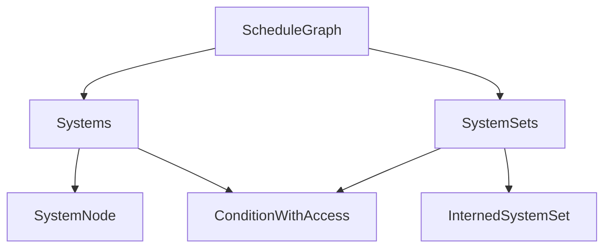

+++
title = "#20119 Improve node encapsulation in `ScheduleGraph"
date = "2025-07-15T00:00:00"
draft = false
template = "pull_request_page.html"
in_search_index = false

[extra]
current_language = "zh-cn"
available_languages = {"en" = { name = "English", url = "/pull_request/bevy/2025-07/pr-20119-en-20250715" }, "zh-cn" = { name = "中文", url = "/pull_request/bevy/2025-07/pr-20119-zh-cn-20250715" }}
+++

### 改进 ScheduleGraph 中的节点封装

#### 基本信息
- **标题**: Improve node encapsulation in `ScheduleGraph`
- **PR 链接**: https://github.com/bevyengine/bevy/pull/20119
- **作者**: ItsDoot
- **状态**: 已合并
- **标签**: A-ECS, C-Code-Quality, C-Usability, S-Ready-For-Final-Review, M-Needs-Migration-Guide, D-Modest
- **创建时间**: 2025-07-13T22:30:29Z
- **合并时间**: 2025-07-15T06:50:09Z
- **合并人**: alice-i-cecile

#### 描述翻译
- # 目标
  - 作为 #20115 的一部分
  - 将 `ScheduleGraph` 的各个部分封装到特定的结构体中，以提高可重用性和可维护性

- ## 解决方案
  - 将 `ScheduleGraph::systems` 和 `ScheduleGraph::system_conditions` 提取到 `Systems` 结构体中，并在 `ScheduleGraph` 中添加该结构体字段
  - 将 `ScheduleGraph::uninit` 拆分为 `Systems::uninit` 和 `SystemSets::uninit`，消除 `ScheduleGraph` 对这些类型的直接字段访问
  - 移除了 `ScheduleGraph` 的节点和条件访问器；相同操作现在通过 `Systems` 和 `SystemSets` 提供（通过它们在 `ScheduleGraph` 上的公共字段访问）
  - 将 `Systems`, `SystemSets`, `SystemNode`, `SystemWithAccess` 和 `ConditionWithAccess` 移动到单独的文件

- ## 测试
  - 新增了两个测试，分别覆盖 `Systems` 和 `SystemSets` 的 API 表面

---

### 技术分析叙事

#### 问题背景
在 Bevy 的 ECS 模块中，`ScheduleGraph` 负责管理调度中的系统和系统集（system sets）。随着功能增加，该结构体变得臃肿，直接操作其内部字段（如 `systems` 和 `system_conditions`）导致代码难以维护和重用。初始化逻辑分散在多个地方，增加了复杂度。PR #20115 的目标之一就是解决这个问题。

#### 解决方案
开发者采取了结构化封装策略：
1. 创建专用结构体 `Systems` 和 `SystemSets` 分别管理系统和系统集
2. 将初始化逻辑拆解到各自结构体中
3. 移除 `ScheduleGraph` 中直接访问底层数据的接口
4. 将相关类型迁移到独立文件 `node.rs`

这种设计符合单一职责原则，每个结构体专注于特定领域：
- `Systems` 管理系统节点及其条件
- `SystemSets` 管理系统集及其条件
- `ScheduleGraph` 负责高层调度逻辑

#### 实现细节
核心变化体现在节点管理方式的重构：

**1. 新建节点管理结构体 (node.rs)**
```rust
// 管理系统
pub struct Systems {
    nodes: SlotMap<SystemKey, SystemNode>,
    conditions: SecondaryMap<SystemKey, Vec<ConditionWithAccess>>,
    uninit: Vec<SystemKey>,
}

// 管理系统集
pub struct SystemSets {
    sets: SlotMap<SystemSetKey, InternedSystemSet>,
    conditions: SecondaryMap<SystemSetKey, Vec<ConditionWithAccess>>,
    ids: HashMap<InternedSystemSet, SystemSetKey>,
    uninit: Vec<UninitializedSet>,
}
```
这些结构体封装了节点存储、条件管理和未初始化状态跟踪，提供类型安全的访问接口。

**2. 重构 ScheduleGraph (schedule.rs)**
```diff
pub struct ScheduleGraph {
-    pub systems: SlotMap<SystemKey, SystemNode>,
-    pub system_conditions: SecondaryMap<SystemKey, Vec<ConditionWithAccess>>,
-    system_sets: SystemSets,
-    uninit: Vec<UninitializedId>,
+    pub systems: Systems,
+    pub system_sets: SystemSets,
    // ...其他字段保持不变
}
```
初始化逻辑简化为：
```rust
pub fn initialize(&mut self, world: &mut World) {
    self.systems.initialize(world);
    self.system_sets.initialize(world);
}
```

**3. 适配调用点 (auto_insert_apply_deferred.rs)**
```diff
- if is_apply_deferred(&graph.systems[key].get().unwrap().system)
+ if is_apply_deferred(&graph.systems[key])

- !graph.system_conditions[key].is_empty()
+ graph.systems.has_conditions(key)
```
调用点现在通过封装接口访问数据，不再直接操作底层结构。

#### 技术洞察
1. **封装边界**：
   - `Systems`/`SystemSets` 封装了节点生命周期管理
   - 初始化逻辑内聚到各自结构体中
   - 公共接口提供受控访问

2. **初始化优化**：
   ```rust
   // Systems 中的初始化实现
   pub fn initialize(&mut self, world: &mut World) {
       for key in self.uninit.drain(..) {
           if let Some(system) = self.get_mut(key) {
               system.access = system.system.initialize(world);
           }
           // 条件初始化...
       }
   }
   ```
   这种方法避免了之前的复杂状态跟踪，每个结构体独立管理初始化过程。

3. **API 清理**：
   移除了 10 个直接访问器方法（如 `get_system_at()`），改为通过结构体字段公开的接口访问：
   ```rust
   // 使用示例
   graph.systems.get(key)  // 替代 graph.get_system_at()
   graph.system_sets.get_conditions(key) // 替代 graph.get_set_conditions_at()
   ```

#### 影响
1. **代码质量提升**：
   - 减少 ScheduleGraph 300+ 行代码
   - 分离关注点，模块化程度提高
   - 为未来功能（如动态系统移除）奠定基础

2. **迁移要求**：
   - 更新访问节点的方式（见迁移指南）
   - 修改调度器扩展点实现

3. **维护性**：
   - 修改节点管理逻辑只需在对应结构体中调整
   - 测试更聚焦（新增 2 个专项测试）

---

### 可视化表示


---

### 关键文件变更

1. **crates/bevy_ecs/src/schedule/node.rs** (+615/-0)  
   新建文件，实现节点管理核心逻辑：
   ```rust
   // 管理系统
   pub struct Systems { /*...*/ }
   
   // 管理系统集
   pub struct SystemSets { /*...*/ }
   
   // 系统节点封装
   pub struct SystemWithAccess {
       pub system: ScheduleSystem,
       pub access: FilteredAccessSet<ComponentId>
   }
   ```

2. **crates/bevy_ecs/src/schedule/schedule.rs** (+41/-297)  
   重构 ScheduleGraph 使用新结构：
   ```diff
   - pub systems: SlotMap<SystemKey, SystemNode>,
   - pub system_conditions: SecondaryMap<SystemKey, Vec<ConditionWithAccess>>,
   - system_sets: SystemSets,
   + pub systems: Systems,
   + pub system_sets: SystemSets,
   
   // 初始化简化
   - for id in self.uninit.drain(..) { /* 复杂处理 */ }
   + pub fn initialize(&mut self, world: &mut World) {
   +     self.systems.initialize(world);
   +     self.system_sets.initialize(world);
   + }
   ```

3. **release-content/migration-guides/schedule_cleanup.md** (+37/-0)  
   新增迁移指南，说明 API 变更：
   ```markdown
   ## 变更摘要
   - 访问系统: 使用 `graph.systems.get(key)` 替代 `graph.get_system_at()`
   - 访问条件: 使用 `graph.system_sets.get_conditions(key)` 
   - 移除方法: `NodeId::index()`, `ScheduleGraph::set_conditions_at()`
   ```

4. **release-content/migration-guides/schedule_slotmaps.md** (+0/-34)  
   删除过时的迁移指南

5. **crates/bevy_ecs/src/schedule/auto_insert_apply_deferred.rs** (+9/-12)  
   适配新接口：
   ```diff
   - let system = graph.systems[key].get().unwrap().system;
   - if system.has_deferred()
   + if graph.systems[key].has_deferred()
   ```

---

### 延伸阅读
1. [Rust 封装最佳实践](https://doc.rust-lang.org/book/ch17-01-what-is-oo.html)
2. [Bevy ECS 调度系统文档](https://bevyengine.org/learn/book/ecs/schedules/)
3. [SlotMap 使用指南](https://docs.rs/slotmap/latest/slotmap/)