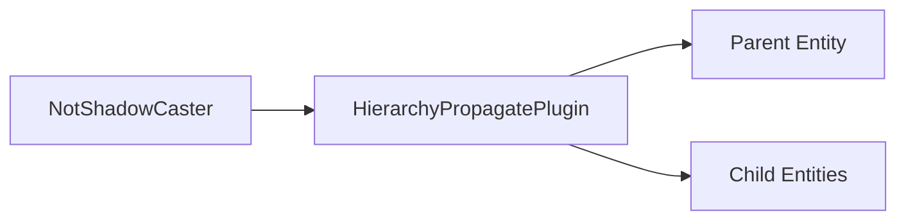

+++
title = "#20120 Allow NotShadowCaster to be used with HierarchyPropagatePlugin."
date = "2025-07-15T00:00:00"
draft = false
template = "pull_request_page.html"
in_search_index = true

[taxonomies]
list_display = ["show"]

[extra]
current_language = "en"
available_languages = {"en" = { name = "English", url = "/pull_request/bevy/2025-07/pr-20120-en-20250715" }, "zh-cn" = { name = "中文", url = "/pull_request/bevy/2025-07/pr-20120-zh-cn-20250715" }}
labels = ["D-Trivial", "A-Rendering"]
+++

## Analysis of PR #20120: Allow NotShadowCaster to be used with HierarchyPropagatePlugin

### Basic Information
- **Title**: Allow NotShadowCaster to be used with HierarchyPropagatePlugin.
- **PR Link**: https://github.com/bevyengine/bevy/pull/20120
- **Author**: coolcatcoder
- **Status**: MERGED
- **Labels**: D-Trivial, A-Rendering, S-Ready-For-Final-Review
- **Created**: 2025-07-13T23:47:31Z
- **Merged**: 2025-07-14T22:42:13Z
- **Merged By**: alice-i-cecile

### Description Translation
# Objective

Allow NotShadowCaster to be used with HierarchyPropagatePlugin.

## Solution

Implements Clone and PartialEq for NotShadowCaster.

### The Story of This Pull Request

The `NotShadowCaster` component in Bevy's lighting system allows developers to mark mesh entities that shouldn't cast shadows. However, when attempting to use this component with Bevy's `HierarchyPropagatePlugin`, developers encountered a limitation: the plugin requires components to implement both `Clone` and `PartialEq` traits to properly propagate component states through entity hierarchies.

This PR addresses the limitation by adding the missing trait implementations to `NotShadowCaster`. The solution is straightforward but important for workflow consistency - it enables `NotShadowCaster` to function with the same hierarchy propagation mechanics that other components use. Without this change, developers would need to implement custom propagation logic specifically for `NotShadowCaster`, creating unnecessary complexity and potential inconsistencies.

The implementation approach is minimal and focused. By adding `Clone` and `PartialEq` to the derive macro attributes, we ensure the struct gains the required functionality while maintaining all existing behavior. These traits are appropriate here since `NotShadowCaster` is a marker component without internal state - cloning produces identical instances, and equality comparison is trivially true for all instances.

The changes ensure consistency with how other components interact with the hierarchy system. This allows developers to use `NotShadowCaster` in parent entities and have it automatically propagate to child entities, which is particularly useful for complex scene hierarchies where shadow casting behavior should be inherited.

### Visual Representation



### Key Files Changed

**File:** `crates/bevy_light/src/lib.rs`

**Changes:** Added `Clone` and `PartialEq` trait implementations to the `NotShadowCaster` component.

**Code Diff:**
```rust
// Before:
#[derive(Debug, Component, Reflect, Default)]
#[reflect(Component, Default, Debug)]
pub struct NotShadowCaster;

// After:
#[derive(Debug, Component, Reflect, Default, Clone, PartialEq)]
#[reflect(Component, Default, Debug, Clone, PartialEq)]
pub struct NotShadowCaster;
```

**Explanation:**
1. Added `Clone` and `PartialEq` to the derive macro to implement the required traits
2. Extended the `#[reflect(...)]` attribute to include these new traits
3. Maintained all existing functionality while enabling hierarchy propagation

### Further Reading
- [Bevy Hierarchy Propagation Documentation](https://docs.rs/bevy/latest/bevy/scene/struct.HierarchyPropagatePlugin.html)
- [Rust Derivable Traits Reference](https://doc.rust-lang.org/book/appendix-03-derivable-traits.html)
- [Component Inheritance Patterns in ECS](https://github.com/bevyengine/bevy/discussions/1947)