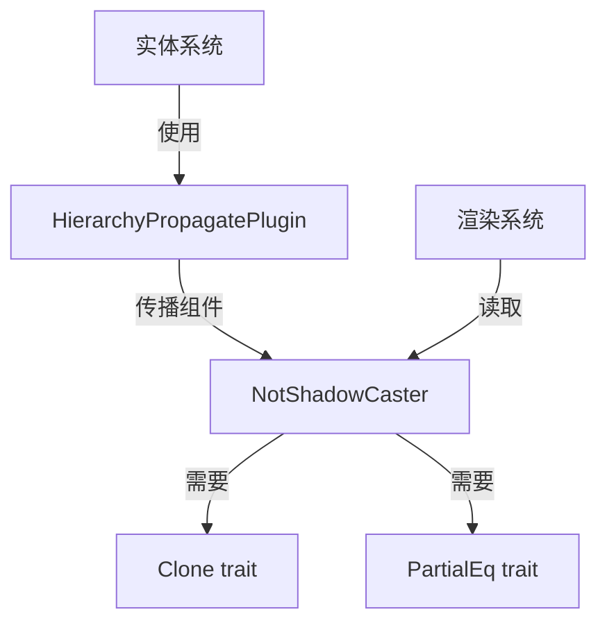

+++
title = "#20120 Allow NotShadowCaster to be used with HierarchyPropagatePlugin."
date = "2025-07-15T00:00:00"
draft = false
template = "pull_request_page.html"
in_search_index = false

[extra]
current_language = "zh-cn"
available_languages = {"en" = { name = "English", url = "/pull_request/bevy/2025-07/pr-20120-en-20250715" }, "zh-cn" = { name = "中文", url = "/pull_request/bevy/2025-07/pr-20120-zh-cn-20250715" }}
+++

# PR 分析报告：允许 NotShadowCaster 与 HierarchyPropagatePlugin 协同工作

## 基本信息
- **标题**: Allow NotShadowCaster to be used with HierarchyPropagatePlugin.
- **PR 链接**: https://github.com/bevyengine/bevy/pull/20120
- **作者**: coolcatcoder
- **状态**: 已合并
- **标签**: D-Trivial, A-Rendering, S-Ready-For-Final-Review
- **创建时间**: 2025-07-13T23:47:31Z
- **合并时间**: 2025-07-14T22:42:13Z
- **合并人**: alice-i-cecile

## 描述翻译
### Objective
允许 NotShadowCaster 与 HierarchyPropagatePlugin 配合使用。

### Solution
为 NotShadowCaster 实现 Clone 和 PartialEq。

## PR 技术分析

### 问题背景
在 Bevy 引擎中，`NotShadowCaster` 组件用于标记特定的 3D 网格（Mesh3d）不投射阴影。当开发者尝试将此组件与 `HierarchyPropagatePlugin` 一起使用时，会遇到功能限制。`HierarchyPropagatePlugin` 负责在实体层次结构中自动传播组件，但需要组件实现 `Clone` 和 `PartialEq` trait 才能正常工作。由于 `NotShadowCaster` 缺少这些 trait 实现，导致无法在父子实体间正确传播该组件状态。

### 解决方案
通过为 `NotShadowCaster` 结构体添加 `Clone` 和 `PartialEq` trait 实现来解决兼容性问题。具体修改是在组件定义中扩展 `derive` 宏和 `reflect` 属性：

```rust
// 修改前
#[derive(Debug, Component, Reflect, Default)]
#[reflect(Component, Default, Debug)]
pub struct NotShadowCaster;

// 修改后
#[derive(Debug, Component, Reflect, Default, Clone, PartialEq)]
#[reflect(Component, Default, Debug, Clone, PartialEq)]
pub struct NotShadowCaster;
```

### 技术实现细节
1. **Trait 实现**：
   - `Clone`：允许创建组件的独立副本，这是组件传播的基础要求
   - `PartialEq`：提供组件实例的相等性比较能力，用于变更检测

2. **反射系统集成**：
   在 `#[reflect(...)]` 属性中同步添加 `Clone` 和 `PartialEq`，确保反射系统能正确处理这些 trait。这对于 Bevy 的序列化、编辑器和运行时检查等功能至关重要。

3. **内存与性能考量**：
   由于 `NotShadowCaster` 是零大小的标记组件（ZST），添加这些 trait 不会增加内存开销或影响运行时性能。派生实现由编译器自动生成，没有额外逻辑开销。

### 影响分析
1. **功能扩展**：
   现在开发者可以在实体层次结构中使用 `NotShadowCaster`，例如：
   ```rust
   commands.spawn((
       SpatialBundle::default(),
       NotShadowCaster,
       // 子实体会自动继承 NotShadowCaster
   )).with_children(|parent| {
       parent.spawn(Mesh3dBundle::default());
   });
   ```

2. **API 一致性**：
   该修改使 `NotShadowCaster` 与其他类似组件（如 `NotShadowReceiver`）保持一致的 trait 实现，减少特殊处理逻辑。

3. **错误预防**：
   解决了潜在的运行时错误场景——当开发者尝试传播未实现必要 trait 的组件时，引擎会抛出编译错误。

## 组件关系图



## 关键文件变更

### `crates/bevy_light/src/lib.rs`
**变更描述**：为 `NotShadowCaster` 组件添加 `Clone` 和 `PartialEq` trait 实现，使其兼容层次结构传播系统。

**代码变更**：
```diff
@@ -201,8 +201,8 @@ impl Plugin for LightPlugin {
 pub type WithLight = Or<(With<PointLight>, With<SpotLight>, With<DirectionalLight>)>;
 
 /// Add this component to make a [`Mesh3d`] not cast shadows.
-#[derive(Debug, Component, Reflect, Default)]
-#[reflect(Component, Default, Debug)]
+#[derive(Debug, Component, Reflect, Default, Clone, PartialEq)]
+#[reflect(Component, Default, Debug, Clone, PartialEq)]
 pub struct NotShadowCaster;
 /// Add this component to make a [`Mesh3d`] not receive shadows.
 ///
```

**关联性**：
- 直接实现 PR 的核心目标
- 保持组件定义与反射声明同步
- 零运行时开销的解决方案

## 延伸阅读
1. [Bevy 组件文档](https://docs.rs/bevy/latest/bevy/ecs/component/trait.Component.html)
2. [实体层次结构系统](https://bevyengine.org/learn/book/getting-started/ecs/#hierarchy)
3. [标记组件设计模式](https://github.com/bevyengine/bevy/discussions/1313)
4. [派生宏在 Rust 中的应用](https://doc.rust-lang.org/book/ch19-06-macros.html#derive-macros)