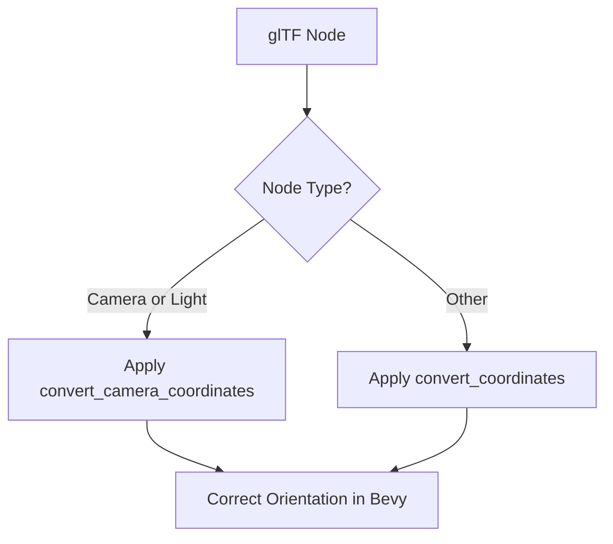

+++
title = "#20122 Fix glTF light orientation"
date = "2025-07-14T00:00:00"
draft = false
template = "pull_request_page.html"
in_search_index = true

[taxonomies]
list_display = ["show"]

[extra]
current_language = "en"
available_languages = {"en" = { name = "English", url = "/pull_request/bevy/2025-07/pr-20122-en-20250714" }, "zh-cn" = { name = "中文", url = "/pull_request/bevy/2025-07/pr-20122-zh-cn-20250714" }}
labels = ["C-Bug", "D-Trivial", "A-glTF"]
+++

# Fix glTF light orientation

## Basic Information
- **Title**: Fix glTF light orientation
- **PR Link**: https://github.com/bevyengine/bevy/pull/20122
- **Author**: janhohenheim
- **Status**: MERGED
- **Labels**: C-Bug, D-Trivial, S-Ready-For-Final-Review, A-glTF
- **Created**: 2025-07-14T01:32:14Z
- **Merged**: 2025-07-14T13:41:37Z
- **Merged By**: superdump

## Description Translation
# Objective

- Extracted from https://github.com/bevyengine/bevy/pull/20099
- Turns out glTF also uses its viewport coordinate system for lights, so let's account for that

## Solution

- Use the same branch for lights as for cameras when importing glTFs

## Testing

- Ran a dedicated Blender test scene to verify that this is the correct behavior.

## The Story of This Pull Request

When importing glTF assets into Bevy, we need to convert coordinate systems between glTF's right-handed Y-up convention and Bevy's left-handed Y-up coordinate system. Prior to this PR, Bevy handled this conversion correctly for cameras but not for lights. This caused lights in imported glTF scenes to appear with incorrect orientations relative to other scene elements.

The root issue was that glTF uses the same viewport coordinate system for both lights and cameras, as specified in the [glTF 2.0 specification](https://registry.khronos.org/glTF/specs/2.0/glTF-2.0.html#view-matrix). In this system:
- Forward direction is -Z
- Up direction is Y
- Right direction is X

Bevy's coordinate system differs in that it uses:
- Forward direction: -Z (same as glTF)
- Up direction: Y (same as glTF)
- Right direction: -X (different from glTF)

The existing implementation only applied the camera-specific coordinate conversion to nodes containing cameras. The fix extends this same conversion logic to light nodes, ensuring both camera and light transforms are handled consistently.

The solution modifies the coordinate conversion branch to include both cameras and lights. This required:
1. Updating the conditional logic in the node transform processing
2. Adding documentation to clarify that the camera coordinate convention applies to lights as well

The change is minimal but important for correct rendering of imported glTF scenes. Without this fix, directional lights and spotlights would point in the wrong direction, causing incorrect lighting in scenes.

Testing was performed using a dedicated Blender test scene to verify light orientations matched expectations after the fix. The trivial nature of the change (2 lines modified) and clear specification basis made this a straightforward bug fix.

## Visual Representation



## Key Files Changed

### crates/bevy_gltf/src/loader/gltf_ext/scene.rs
Modified the node transform logic to treat light nodes the same as camera nodes for coordinate conversion.

```rust
// Before:
if node.camera().is_some() {
    transform.convert_camera_coordinates()
} else {
    transform.convert_coordinates()
}

// After:
if node.camera().is_some() || node.light().is_some() {
    transform.convert_camera_coordinates()
} else {
    transform.convert_coordinates()
}
```

### crates/bevy_gltf/src/convert_coordinates.rs
Added documentation clarifying that the camera coordinate convention also applies to lights.

```rust
// Before:
/// - up: Y
/// - right: X
///
/// See <https://registry.khronos.org/glTF/specs/2.0/glTF-2.0.html#view-matrix>
fn convert_camera_coordinates(self) -> Self;

// After:
/// - up: Y
/// - right: X
///
/// The same convention is used for lights.
/// See <https://registry.khronos.org/glTF/specs/2.0/glTF-2.0.html#view-matrix>
fn convert_camera_coordinates(self) -> Self;
```

## Further Reading
1. [glTF 2.0 Specification - Coordinate System](https://registry.khronos.org/glTF/specs/2.0/glTF-2.0.html#coordinate-system-and-units)
2. [Bevy Coordinate System Documentation](https://bevyengine.org/learn/book/getting-started/coordinate-system/)
3. [Original PR where issue was discovered (#20099)](https://github.com/bevyengine/bevy/pull/20099)

## Full Code Diff
```diff
diff --git a/crates/bevy_gltf/src/convert_coordinates.rs b/crates/bevy_gltf/src/convert_coordinates.rs
index 4148cecd9ac72..e28992934815e 100644
--- a/crates/bevy_gltf/src/convert_coordinates.rs
+++ b/crates/bevy_gltf/src/convert_coordinates.rs
@@ -24,6 +24,7 @@ pub(crate) trait ConvertCameraCoordinates {
     /// - up: Y
     /// - right: X
     ///
+    /// The same convention is used for lights.
     /// See <https://registry.khronos.org/glTF/specs/2.0/glTF-2.0.html#view-matrix>
     fn convert_camera_coordinates(self) -> Self;
 }
diff --git a/crates/bevy_gltf/src/loader/gltf_ext/scene.rs b/crates/bevy_gltf/src/loader/gltf_ext/scene.rs
index 3fce51d52706b..d02a131002771 100644
--- a/crates/bevy_gltf/src/loader/gltf_ext/scene.rs
+++ b/crates/bevy_gltf/src/loader/gltf_ext/scene.rs
@@ -45,7 +45,7 @@ pub(crate) fn node_transform(node: &Node, convert_coordinates: bool) -> Transfor
         },
     };
     if convert_coordinates {
-        if node.camera().is_some() {
+        if node.camera().is_some() || node.light().is_some() {
             transform.convert_camera_coordinates()
         } else {
             transform.convert_coordinates()
```