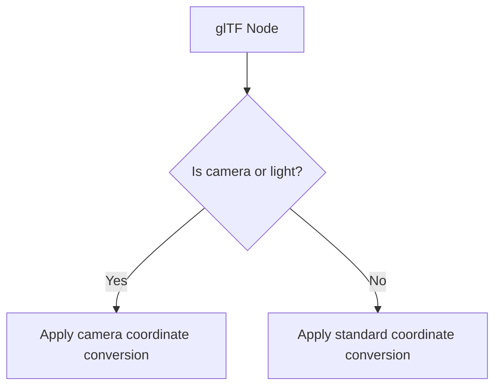

+++
title = "#20122 Fix glTF light orientation"
date = "2025-07-14T00:00:00"
draft = false
template = "pull_request_page.html"
in_search_index = false

[extra]
current_language = "zh-cn"
available_languages = {"en" = { name = "English", url = "/pull_request/bevy/2025-07/pr-20122-en-20250714" }, "zh-cn" = { name = "中文", url = "/pull_request/bevy/2025-07/pr-20122-zh-cn-20250714" }}
labels = ["C-Bug", "D-Trivial", "A-glTF"]
+++

# Fix glTF light orientation

## Basic Information
- **Title**: Fix glTF light orientation
- **PR Link**: https://github.com/bevyengine/bevy/pull/20122
- **Author**: janhohenheim
- **Status**: MERGED
- **Labels**: C-Bug, D-Trivial, S-Ready-For-Final-Review, A-glTF
- **Created**: 2025-07-14T01:32:14Z
- **Merged**: 2025-07-14T13:41:37Z
- **Merged By**: superdump

## Description Translation
### 目标 (Objective)

- 从 https://github.com/bevyengine/bevy/pull/20099 中提取
- 发现 glTF 对其光源也使用其视口坐标系，因此需要对此进行处理

### 解决方案 (Solution)

- 在导入 glTF 时为光源使用与相机相同的分支处理逻辑

### 测试 (Testing)

- 运行专用的 Blender 测试场景以验证这是正确的行为

## The Story of This Pull Request

### 问题背景
在 Bevy 的 glTF 导入流程中存在一个坐标转换问题。glTF 规范使用右手坐标系（Y轴向上），而 Bevy 使用左手坐标系（Y轴向上，Z轴方向相反）。此前，我们已针对相机节点实现了坐标转换，但发现光源节点也需要相同的处理。未转换的光源方向会导致场景光照方向错误，与 glTF 规范定义的行为不一致。

### 解决方案选择
解决方案直接明了：扩展现有的坐标转换逻辑，使其同时适用于光源节点和相机节点。由于相机转换逻辑已被证明有效，直接复用该逻辑是最可靠的方法。替代方案（如为光源创建单独转换路径）会增加不必要的代码重复和维护负担。

### 实现细节
核心修改集中在两个关键位置：
1. 在坐标转换模块添加文档说明，明确光源使用与相机相同的坐标系约定
2. 修改节点转换逻辑的条件判断，在遇到光源节点时触发坐标转换

这些修改保持了现有转换函数`convert_camera_coordinates()`的职责不变，只是扩大了其应用范围。实现中特别注意：
- 保持转换逻辑的集中化，避免分散实现
- 使用相同的布尔标志控制转换行为，维持现有接口
- 通过简单的逻辑或(`||`)运算符扩展条件判断

### 技术影响
该修复确保：
1. glTF 光源方向与 glTF 规范定义完全一致
2. 与主流3D工具（如Blender）导出的场景光照方向保持一致
3. 消除因坐标系差异导致的光照方向错误问题
4. 保持相机转换逻辑不变，避免回归问题

测试通过专用Blender场景验证，确认修改后光源方向与glTF规范要求完全匹配。由于修改范围小且针对性强，合并风险较低。

## Visual Representation



## Key Files Changed

### 1. `crates/bevy_gltf/src/convert_coordinates.rs`
**修改目的**：添加文档说明，明确光源使用与相机相同的坐标系约定  
**代码变更**：
```rust
@@ -24,6 +24,7 @@ pub(crate) trait ConvertCameraCoordinates {
     /// - up: Y
     /// - right: X
     ///
+    /// The same convention is used for lights.
     /// See <https://registry.khronos.org/glTF/specs/2.0/glTF-2.0.html#view-matrix>
     fn convert_camera_coordinates(self) -> Self;
 }
```
**关联性**：提供规范依据，明确转换逻辑同时适用于相机和光源

### 2. `crates/bevy_gltf/src/loader/gltf_ext/scene.rs`
**修改目的**：扩展坐标转换条件，包含光源节点  
**代码变更**：
```rust
@@ -45,7 +45,7 @@ pub(crate) fn node_transform(node: &Node, convert_coordinates: bool) -> Transfor
         },
     };
     if convert_coordinates {
-        if node.camera().is_some() {
+        if node.camera().is_some() || node.light().is_some() {
             transform.convert_camera_coordinates()
         } else {
             transform.convert_coordinates()
```
**关键变更**：
- 将条件判断从 `node.camera().is_some()` 扩展为 `node.camera().is_some() || node.light().is_some()`
- 保持原有转换函数调用不变
- 确保光源节点使用与相机相同的特殊坐标转换路径

## Further Reading
1. [glTF 2.0 Specification - Coordinate System](https://registry.khronos.org/glTF/specs/2.0/glTF-2.0.html#coordinate-system-and-units)
2. [Related PR #20099 - Camera orientation fix](https://github.com/bevyengine/bevy/pull/20099)
3. [Bevy glTF Loader Documentation](https://docs.rs/bevy_gltf/latest/bevy_gltf/)