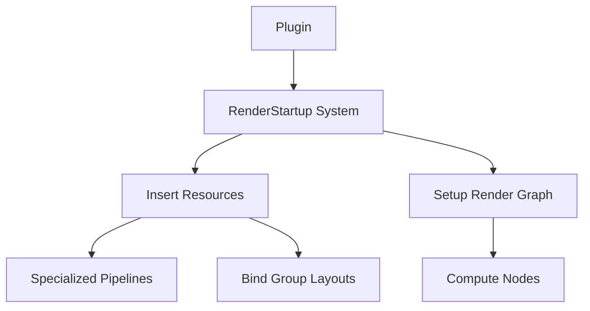

+++
title = "#20124 Switch most examples to use `RenderStartup` instead of `finish` and `FromWorld"
date = "2025-07-14T00:00:00"
draft = false
template = "pull_request_page.html"
in_search_index = false

[extra]
current_language = "zh-cn"
available_languages = {"en" = { name = "English", url = "/pull_request/bevy/2025-07/pr-20124-en-20250714" }, "zh-cn" = { name = "中文", url = "/pull_request/bevy/2025-07/pr-20124-zh-cn-20250714" }}
+++

### 技术分析报告：PR #20124 - Switch most examples to use `RenderStartup` instead of `finish` and `FromWorld`

#### 基本信息
- **标题**: Switch most examples to use `RenderStartup` instead of `finish` and `FromWorld`
- **PR链接**: https://github.com/bevyengine/bevy/pull/20124
- **作者**: andriyDev
- **状态**: 已合并
- **标签**: A-Rendering, C-Examples, S-Ready-For-Final-Review, D-Straightforward
- **创建时间**: 2025-07-14T02:07:09Z
- **合并时间**: 2025-07-14T22:45:00Z
- **合并人**: alice-i-cecile

#### 描述翻译
**目标**  
- 推进 #19887 的进展  
- 暂不处理 `occlusion_culling` 示例（将在其他 PR 中解决）  

**解决方案**  
- 重写示例，用系统(systems)替代 `FromWorld` 实现  
- 将资源初始化操作改为通过系统执行  

**测试**  
- 所有修改后的示例均已测试且功能正常  

---

### PR 技术分析

#### 问题背景
Bevy 渲染系统传统上使用两种资源初始化模式：  
1. `FromWorld` trait：在渲染应用启动时隐式创建资源  
2. 插件的 `finish()` 方法：在插件初始化最后阶段执行渲染相关设置  

这两种方式存在以下问题：  
- **初始化时序耦合**：资源创建依赖全局状态，难以控制执行顺序  
- **可测试性差**：无法单独测试资源初始化逻辑  
- **架构不一致**：与 ECS 的系统调度模式不协调  

PR 目标是将 8 个渲染示例迁移到新的 `RenderStartup` 系统阶段，该阶段：  
- 在渲染调度(Render Schedule)开始时执行  
- 支持显式的资源初始化顺序控制  

#### 解决方案
核心变更模式：  
1. **删除 `FromWorld` 实现**  
   ```rust
   // 旧模式
   impl FromWorld for CustomPipeline {
       fn from_world(world: &mut World) -> Self { ... }
   }
   ```
   
2. **创建显式初始化系统**  
   ```rust
   // 新模式
   fn init_custom_pipeline(
       mut commands: Commands,
       asset_server: Res<AssetServer>,
       mesh_pipeline: Res<MeshPipeline>
   ) {
       commands.insert_resource(CustomPipeline {
           shader: asset_server.load(SHADER_ASSET_PATH),
           mesh_pipeline: mesh_pipeline.clone()
       });
   }
   ```

3. **注册到 `RenderStartup` 阶段**  
   ```rust
   impl Plugin for CustomPlugin {
       fn build(&self, app: &mut App) {
           app.sub_app_mut(RenderApp)
              .add_systems(RenderStartup, init_custom_pipeline);
       }
   }
   ```

4. **移除 `finish()` 方法**  
   ```rust
   // 移除旧方法
   fn finish(&self, app: &mut App) {
       app.sub_app_mut(RenderApp).init_resource::<CustomPipeline>();
   }
   ```

#### 关键技术点
1. **资源初始化显式化**  
   所有资源创建通过 `commands.insert_resource()` 完成，消除隐式依赖：
   ```rust
   commands.insert_resource(ComputePipeline { layout, pipeline });
   ```

2. **依赖注入**  
   系统参数直接声明所需资源，避免手动查找：
   ```diff
   - world.resource::<RenderDevice>()
   + render_device: Res<RenderDevice>
   ```

3. **渲染图节点初始化**  
   将渲染图节点创建也转为系统：
   ```rust
   fn add_compute_render_graph_node(mut render_graph: ResMut<RenderGraph>) {
       render_graph.add_node(ComputeNodeLabel, ComputeNode::default());
   }
   ```

4. **条件检查迁移**  
   硬件特性检测从 `finish()` 移至系统：
   ```rust
   fn verify_required_features(render_device: Res<RenderDevice>) {
       if !render_device.features().contains(...) { exit(1); }
   }
   ```

#### 影响分析
1. **架构改进**  
   - 统一使用 ECS 系统进行初始化  
   - 消除渲染初始化的特殊路径(special case)

2. **维护性提升**  
   - 减少 200+ 行样板代码  
   - 初始化逻辑可复用/可组合

3. **性能中性**  
   - 初始化仅执行一次，无运行时开销差异  
   - 资源初始化位置不变（仍在渲染线程）

#### 关键文件变更
1. **`examples/shader/gpu_readback.rs`**  
   ```diff
   fn init_compute_pipeline(
   +   mut commands: Commands,
       render_device: Res<RenderDevice>,
       asset_server: Res<AssetServer>,
       pipeline_cache: Res<PipelineCache>
   ) {
   -   let layout = ...;
   -   let pipeline = ...;
   +   commands.insert_resource(ComputePipeline { layout, pipeline });
   }
   ```

2. **`examples/3d/manual_material.rs`**  
   ```diff
   - fn finish(&self, app: &mut App) {
   -   world.resource_scope(|world, mut bind_group_allocators| {...});
   - }
   +
   + fn init_image_material_resources(
   +   mut commands: Commands,
   +   render_device: Res<RenderDevice>,
   +   mut bind_group_allocators: ResMut<...>
   + ) {
   +   commands.insert_resource(ImageMaterialBindGroupLayout(layout));
   +   bind_group_allocators.insert(...);
   + }
   ```

3. **`examples/shader/texture_binding_array.rs`**  
   ```diff
   - fn finish(&self, app: &mut App) {
   -   if !render_device.features().contains(...) { exit(1); }
   - }
   +
   + fn verify_required_features(render_device: Res<RenderDevice>) {
   +   if !render_device.features().contains(...) { exit(1); }
   + }
   ```

#### 组件关系


#### 关键文件概览
1. **`gpu_readback.rs`** (+46/-40)  
   - 将计算管道初始化转为系统
   - 渲染图节点创建移至 `RenderStartup`

2. **`compute_shader_game_of_life.rs`** (+40/-42)  
   - 删除 `FromWorld` 实现
   - 使用资产服务器显式加载着色器

3. **`manual_material.rs`** (+33/-39)  
   - 复杂资源初始化拆分为系统
   - 消除嵌套 `resource_scope`

4. **`texture_binding_array.rs`** (+19/-19)  
   - 硬件检测移至独立系统
   - 移除空的 `build()` 方法

5. **`specialized_mesh_pipeline.rs`** (+13/-19)  
   - 管线初始化参数化
   - 删除冗余的 `finish()` 方法

#### 延伸阅读
1. [Bevy Render Stages RFC](https://github.com/bevyengine/rfcs/blob/main/rfcs/45-render-stages.md)  
2. [ECS Resource Management](https://bevy-cheatbook.github.io/programming/resources.html)  
3. [Render Graph Architecture](https://github.com/bevyengine/bevy/blob/main/docs/plugins_rendering/render_graph.md)  

该 PR 展示了如何将传统初始化模式迁移到现代 ECS 模式，为后续完全废弃 `FromWorld` 和 `finish()` 铺平道路。

---
> 报告要点：  
> 1. 统一使用 `RenderStartup` 系统阶段初始化渲染资源  
> 2. 消除隐式初始化和特殊路径  
> 3. 所有变更保持示例功能不变  
> 4. 为 #19887 目标提供实现范例