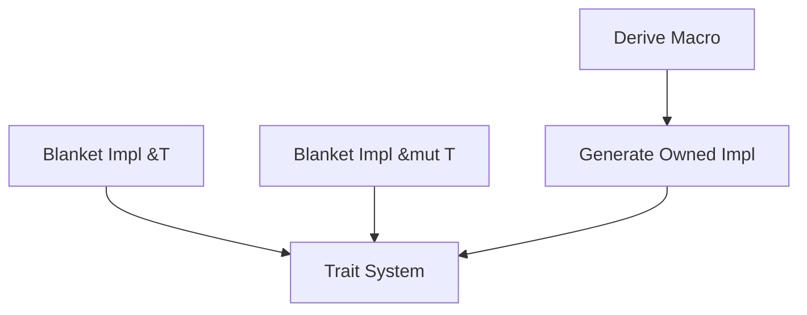

+++
title = "#20126 Streamline `GetOwnership`/`FromArg`/`IntoReturn`"
date = "2025-07-14T00:00:00"
draft = false
template = "pull_request_page.html"
in_search_index = true

[taxonomies]
list_display = ["show"]

[extra]
current_language = "en"
available_languages = {"en" = { name = "English", url = "/pull_request/bevy/2025-07/pr-20126-en-20250714" }, "zh-cn" = { name = "中文", url = "/pull_request/bevy/2025-07/pr-20126-zh-cn-20250714" }}
labels = ["C-Performance", "C-Code-Quality", "A-Reflection"]
+++

## Streamline `GetOwnership`/`FromArg`/`IntoReturn`

### Basic Information
- **Title**: Streamline `GetOwnership`/`FromArg`/`IntoReturn`
- **PR Link**: https://github.com/bevyengine/bevy/pull/20126
- **Author**: nnethercote
- **Status**: MERGED
- **Labels**: C-Performance, C-Code-Quality, S-Ready-For-Final-Review, A-Reflection
- **Created**: 2025-07-14T06:47:10Z
- **Merged**: 2025-07-14T22:45:00Z
- **Merged By**: alice-i-cecile

### Description
Three impls are generated for each of these traits when the `reflect_functions` feature is enabled.

Helps with #19873.

Two of the three (the `&T` and `&mut T` ones) can be avoided by instead providing blanket impls. The impl for `T` remains.

I checked the output via `cargo expand`.

According to `-Zmacro-stats`, the size of the `Reflect` code generate for `bevy_ui` drops by 10.4%.

### The Story of This Pull Request

**The Problem and Context**  
The `bevy_reflect` system was generating three separate implementations for each of three traits (`GetOwnership`, `FromArg`, and `IntoReturn`) whenever the `reflect_functions` feature was enabled. This occurred for every reflected type, resulting in significant code bloat. Each trait required implementations for:
1. The owned type `T`
2. The immutable reference `&T`
3. The mutable reference `&mut T`

This tripled the generated code for these traits, increasing compilation times and binary size unnecessarily. The problem was particularly noticeable in large projects like `bevy_ui`, where reflection is heavily used. The goal was to reduce generated code size while maintaining the same functionality.

**The Solution Approach**  
Instead of generating three implementations per type per trait, we implemented a more efficient approach:
1. Keep the concrete implementation only for the owned type `T`
2. Add blanket implementations for reference types `&T` and `&mut T`
3. Remove redundant macro-generated code for reference types

This leverages Rust's trait coherence rules to cover reference types through generic implementations rather than type-specific ones. The approach maintains identical functionality while eliminating two-thirds of the generated code for these traits.

**The Implementation**  
The changes focused on three key areas:

1. **Trait definitions** were modified to support blanket implementations:
```rust
// Before: No default implementation
pub trait GetOwnership {
    fn ownership() -> Ownership;
}

// After: Default implementation added
pub trait GetOwnership {
    fn ownership() -> Ownership {
        Ownership::Owned
    }
}
```

2. **Blanket implementations** were added for reference types:
```rust
// For FromArg
impl<T: Reflect + TypePath> FromArg for &'static T {
    type This<'a> = &'a T;
    fn from_arg(arg: Arg) -> Result<Self::This<'_>, ArgError> {
        arg.take_ref()
    }
}

// For GetOwnership
impl<T> GetOwnership for &'_ mut T {
    fn ownership() -> Ownership {
        Ownership::Mut
    }
}
```

3. **Derive macros** were simplified to generate only the owned type implementation:
```rust
// Before: Three implementations generated
impl #impl_generics #bevy_reflect::func::args::FromArg for #type_path #ty_generics #where_reflect_clause {
    // ... owned implementation ...
}

impl #impl_generics #bevy_reflect::func::args::FromArg for &'static #type_path #ty_generics #where_reflect_clause {
    // ... ref implementation ...
}

impl #impl_generics #bevy_reflect::func::args::FromArg for &'static mut #type_path #ty_generics #where_reflect_clause {
    // ... mut implementation ...
}

// After: Only owned implementation generated
impl #impl_generics #bevy_reflect::func::args::FromArg for #type_path #ty_generics #where_reflect_clause {
    // ... owned implementation ...
}
```

**Technical Insights**  
The key insight was recognizing that reference types (`&T`/`&mut T`) could be handled through generic blanket implementations rather than type-specific ones. This works because:
1. The behavior for references is consistent regardless of the underlying type
2. Trait bounds (`Reflect + TypePath` for `FromArg`, no bounds for `GetOwnership`) provide sufficient constraints
3. The owned type implementation remains type-specific due to potential specialization needs

The `impl_function_traits!` macro was streamlined to generate only the necessary owned type implementations, while the reference cases are covered by the new blanket impls.

**The Impact**  
This optimization achieved:
1. **10.4% reduction** in generated `Reflect` code size for `bevy_ui`
2. Elimination of redundant code generation
3. Faster compilation times due to less code to process
4. Maintained identical functionality through careful trait design

The changes required removing manual `impl_function_traits!` calls for reference types like `&'static str` and `&'static Path` since they're now covered by blanket implementations.

### Visual Representation



### Key Files Changed

1. **crates/bevy_reflect/src/func/args/ownership.rs** (+38/-59)  
   Added blanket implementations for reference types and simplified the macro:
   
   ```rust
   // Blanket impl for &T
   impl<T> GetOwnership for &'_ T {
       fn ownership() -> Ownership {
           Ownership::Ref
       }
   }
   
   // Macro now generates only owned impl
   impl_get_ownership!(...); // Only generates for T, not references
   ```

2. **crates/bevy_reflect/src/func/args/from_arg.rs** (+28/-43)  
   Added blanket implementations for reference arguments:
   
   ```rust
   impl<T: Reflect + TypePath> FromArg for &'static mut T {
       type This<'a> = &'a mut T;
       fn from_arg(arg: Arg) -> Result<Self::This<'_>, ArgError> {
           arg.take_mut()
       }
   }
   ```

3. **crates/bevy_reflect/src/func/return_type.rs** (+29/-40)  
   Added blanket implementations for reference returns:
   
   ```rust
   impl<T: PartialReflect> IntoReturn for &'_ mut T {
       fn into_return<'a>(self) -> Return<'a> where Self: 'a {
           Return::Mut(self)
       }
   }
   ```

4. **crates/bevy_reflect/src/func/macros.rs** (+12/-32)  
   Simplified the function traits macro to generate only owned implementations:
   
   ```rust
   // Before: Generated three impls per trait
   $crate::func::args::impl_get_ownership!($ty ...);
   
   // After: Still called but now generates only one impl
   ```

5. **crates/bevy_reflect/derive/src/impls/func/from_arg.rs** (+3/-15)  
   Removed reference implementations from derive output:
   
   ```rust
   // Before: Three impls generated
   impl ... for T { ... }
   impl ... for &T { ... }
   impl ... for &mut T { ... }
   
   // After: Only owned impl remains
   impl ... for T { ... }
   ```

### Further Reading
1. [Rust Blanket Implementations](https://doc.rust-lang.org/book/ch10-02-traits.html#using-trait-bounds-to-conditionally-implement-methods)
2. [Bevy Reflection System](https://bevyengine.org/learn/book/next/programming/reflection/)
3. [Macro Optimization Techniques](https://veykril.github.io/tlborm/)