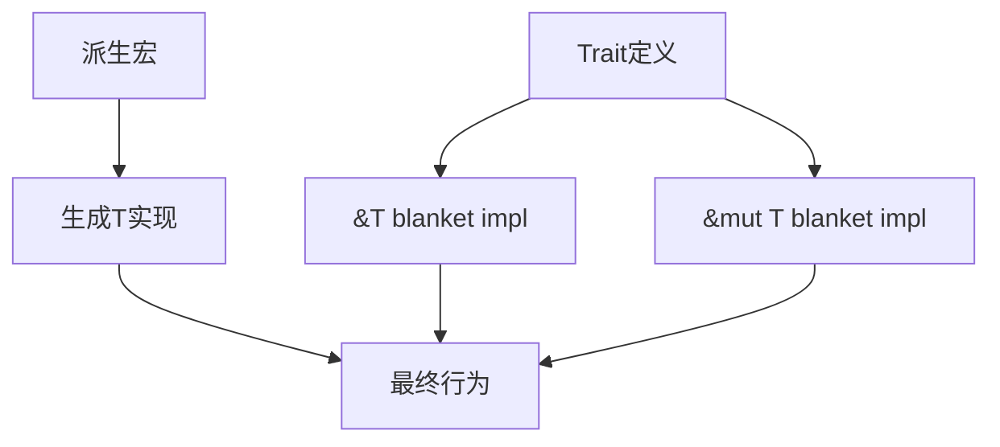

+++
title = "#20126 Streamline `GetOwnership`/`FromArg`/`IntoReturn`"
date = "2025-07-14T00:00:00"
draft = false
template = "pull_request_page.html"
in_search_index = false

[extra]
current_language = "zh-cn"
available_languages = {"en" = { name = "English", url = "/pull_request/bevy/2025-07/pr-20126-en-20250714" }, "zh-cn" = { name = "中文", url = "/pull_request/bevy/2025-07/pr-20126-zh-cn-20250714" }}
labels = ["C-Performance", "C-Code-Quality", "A-Reflection"]
+++

## Streamline `GetOwnership`/`FromArg`/`IntoReturn`

### Basic Information
- **Title**: Streamline `GetOwnership`/`FromArg`/`IntoReturn`
- **PR Link**: https://github.com/bevyengine/bevy/pull/20126
- **Author**: nnethercote
- **Status**: MERGED
- **Labels**: C-Performance, C-Code-Quality, S-Ready-For-Final-Review, A-Reflection
- **Created**: 2025-07-14T06:47:10Z
- **Merged**: 2025-07-14T22:45:00Z
- **Merged By**: alice-i-cecile

### Description Translation
当 `reflect_functions` 特性启用时，每个 trait 会生成三个实现。

帮助解决 #19873。

通过提供 blanket impls，可以避免其中两个实现（`&T` 和 `&mut T` 版本）。`T` 的实现保留。

通过 `cargo expand` 检查输出结果。

根据 `-Zmacro-stats`，`bevy_ui` 的 `Reflect` 代码生成大小减少了 10.4%。

---

### 这个 PR 的技术演进

#### 问题根源与优化契机
在 Bevy 的反射系统中，当启用 `reflect_functions` 特性时，三个核心 trait（`GetOwnership`、`FromArg` 和 `IntoReturn`）会为每个类型自动生成三个实现：
1. 值类型 (`T`)
2. 不可变引用 (`&T`)
3. 可变引用 (`&mut T`)

这种实现方式导致：
- 代码膨胀：每个类型产生三倍模板代码
- 编译时间增加：宏展开生成冗余代码
- 维护成本：修改需同步调整三处实现

具体案例可见于 `GetOwnership` 的派生宏实现，为单一类型生成三种所有权状态实现：

```rust
// 修改前：派生宏生成三个实现
impl GetOwnership for T {
    fn ownership() -> Ownership { Ownership::Owned }
}

impl GetOwnership for &T {
    fn ownership() -> Ownership { Ownership::Ref }
}

impl GetOwnership for &mut T {
    fn ownership() -> Ownership { Ownership::Mut }
}
```

#### 解决方案：统一抽象与空实现
PR 的核心优化策略是：
1. 为引用类型添加 blanket impls（统一实现）
2. 值类型保留具体实现
3. 移除派生宏中的冗余生成

以 `GetOwnership` 为例：
- 为 `&T` 和 `&mut T` 添加统一实现
- 值类型使用默认实现（`ownership()` 默认返回 `Owned`）

```rust
// 修改后：统一实现引用类型
impl<T> GetOwnership for &'_ T {
    fn ownership() -> Ownership { Ownership::Ref }  // 覆盖默认
}

impl<T> GetOwnership for &'_ mut T {
    fn ownership() -> Ownership { Ownership::Mut } // 覆盖默认
}

// 值类型使用默认实现（无需显式生成代码）
pub trait GetOwnership {
    fn ownership() -> Ownership {
        Ownership::Owned  // 默认实现
    }
}
```

#### 实现细节与协同修改
1. **派生宏精简**  
   移除 `from_arg.rs`、`get_ownership.rs` 和 `into_return.rs` 中引用类型的实现生成：
   ```rust
   // 修改前：生成三个实现
   impl FromArg for T { ... }
   impl FromArg for &T { ... }      // 移除
   impl FromArg for &mut T { ... }  // 移除
   ```

2. **Trait 增强**  
   在各 trait 的定义处添加 blanket impls：
   ```rust
   // 在 from_arg.rs 添加
   impl<T: Reflect + TypePath> FromArg for &'static T {
       type This<'a> = &'a T;
       fn from_arg(arg: Arg) -> Result<Self::This<'_>, ArgError> {
           arg.take_ref()  // 统一处理不可变引用
       }
   }
   ```

3. **宏逻辑简化**  
   重构 `impl_get_ownership!` 等宏，移除引用类型的展开逻辑：
   ```rust
   // 修改后：仅生成空实现（依赖默认行为）
   impl_get_ownership!(T);  // 展开为空块
   ```

4. **边缘案例处理**  
   清理特殊类型（如 `&'static str`）的冗余实现：
   ```rust
   // 移除 primitives.rs 中的特化实现
   -#[cfg(feature = "functions")]
   -crate::func::macros::impl_function_traits!(&'static str);
   ```

#### 性能收益与工程价值
1. **量化收益**  
   - `bevy_ui` 的反射代码生成量减少 10.4%（通过 `-Zmacro-stats` 验证）
   - 编译时开销降低：减少宏展开和代码生成量

2. **设计改进**  
   - 消除重复：引用类型处理逻辑集中到 blanket impls
   - 默认行为：值类型依赖 trait 默认实现
   - 派生宏输出精简 66%（每个 trait 从三个实现减为一个）

3. **维护性提升**  
   - 修改所有权逻辑只需调整 blanket impls
   - 消除派生宏与 trait 实现间的同步成本



### 关键文件变更

#### `crates/bevy_reflect/derive/src/impls/func/from_arg.rs`
- **变更原因**：移除冗余的引用类型实现生成
- **代码变更**：
  ```diff
  - // 移除 &T 和 &mut T 的生成代码
  - impl FromArg for &'static T { ... }
  - impl FromArg for &'static mut T { ... }
  ```

#### `crates/bevy_reflect/src/func/args/from_arg.rs`
- **变更原因**：添加引用类型的统一实现
- **代码变更**：
  ```rust
  // 添加 blanket impls
  impl<T: Reflect + TypePath> FromArg for &'static T {
      fn from_arg(arg: Arg) -> Result<Self::This<'_>, ArgError> {
          arg.take_ref()  // 统一处理逻辑
      }
  }
  ```

#### `crates/bevy_reflect/src/func/args/ownership.rs`
- **变更原因**：重构所有权系统默认行为
- **关键改进**：
  ```rust
  // 默认实现简化
  pub trait GetOwnership {
      fn ownership() -> Ownership {
          Ownership::Owned  // 值类型默认行为
      }
  }
  ```

#### `crates/bevy_reflect/src/func/macros.rs`
- **变更原因**：适配简化后的宏语法
- **变更示例**：
  ```diff
  // 宏调用参数简化
  - impl_get_ownership!(T; <A: Trait> [const N: usize] where B: Trait);
  + impl_get_ownership!(T; <A: Trait> [const N: usize] where B: Trait);
  ```

#### `crates/bevy_reflect/src/func/return_type.rs`
- **变更原因**：统一返回值处理
- **核心变更**：
  ```rust
  // 添加引用类型的 blanket impls
  impl<T: PartialReflect> IntoReturn for &'_ T {
      fn into_return<'a>(self) -> Return<'a> {
          Return::Ref(self)  // 统一处理
      }
  }
  ```

### 延伸阅读
1. [Rust Blanket Impls 设计模式](https://doc.rust-lang.org/book/ch10-02-traits.html#using-trait-bounds-to-conditionally-implement-methods)
2. [Bevy 反射系统架构](https://bevyengine.org/learn/book/next/programming/reflection/)
3. [过程宏代码生成优化技巧](https://veykril.github.io/tlborm/)