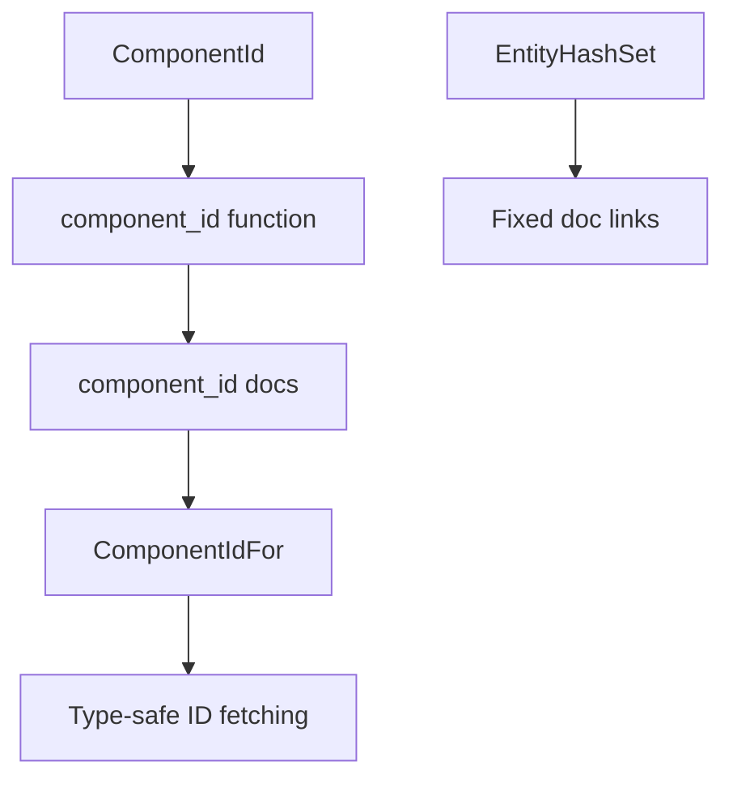

+++
title = "#20127 Link `ComponentIdFor` in the `ComponentId` related docs"
date = "2025-07-14T00:00:00"
draft = false
template = "pull_request_page.html"
in_search_index = true

[taxonomies]
list_display = ["show"]

[extra]
current_language = "en"
available_languages = {"en" = { name = "English", url = "/pull_request/bevy/2025-07/pr-20127-en-20250714" }, "zh-cn" = { name = "中文", url = "/pull_request/bevy/2025-07/pr-20127-zh-cn-20250714" }}
labels = ["C-Docs", "A-ECS"]
+++

## Technical Analysis: PR #20127 - Link `ComponentIdFor` in `ComponentId` Docs

### Basic Information
- **Title**: Link `ComponentIdFor` in the `ComponentId` related docs
- **PR Link**: https://github.com/bevyengine/bevy/pull/20127
- **Author**: Sieluna
- **Status**: MERGED
- **Labels**: C-Docs, A-ECS, S-Ready-For-Final-Review
- **Created**: 2025-07-14T09:41:55Z
- **Merged**: 2025-07-14T22:59:24Z
- **Merged By**: alice-i-cecile

### Description Translation
**Objective**

Fixes https://github.com/bevyengine/bevy/issues/19535. Improve interoperability of type documentation to make it easier for users to find related types

**Solution**

- Add a reference to [`ComponentIdFor`](crate::component::ComponentIdFor) in the `component_id` function documentation in `crates/bevy_ecs/src/world/mod.rs`
- Add a reference to [`ComponentIdFor`](super::ComponentIdFor) in the `component_id` function documentation in `crates/bevy_ecs/src/component/info.rs`

**Testing**

- Verify documentation generation: `cargo doc`
- Check the validity of cross-reference links in the documentation
- Confirm that the documentation generated by rustdoc can correctly jump to the type definition of `ComponentIdFor`

---

### The Story of This Pull Request

This PR addresses a documentation discoverability issue in Bevy's ECS (Entity Component System) module. The core problem was that developers looking up `ComponentId`-related functionality in the API documentation couldn't easily discover the existence of `ComponentIdFor`, a helper type that fetches component IDs at compile time. This gap in documentation cross-referencing made it harder for users to navigate between related ECS concepts.

The solution implements two targeted documentation improvements. First, it adds explicit references to `ComponentIdFor` in the "See also" sections of both `component_id` functions. Second, it fixes incorrect links to `EntityHashSet` that were mistakenly pointing to `EntityHashMap`. These changes required careful path resolution since the references live in different modules - `world/mod.rs` uses an absolute path (`crate::component::ComponentIdFor`) while `component/info.rs` uses a relative path (`super::ComponentIdFor`).

The implementation follows Rust's best practices for documentation by:
1. Maintaining consistent "See also" sections
2. Using correct intra-doc links ([RFC 1946](https://github.com/rust-lang/rfcs/blob/master/text/1946-intra-rustdoc-links.md))
3. Preserving existing documentation structure

Testing involved standard Rust documentation workflows: generating docs with `cargo doc`, verifying link integrity, and confirming navigation works as expected. The changes are low-risk since they only affect documentation and don't modify any runtime behavior.

These improvements directly enhance developer experience by creating better connections between related ECS concepts. Developers reading about `component_id` will now immediately see and be able to navigate to `ComponentIdFor`, which is particularly useful when working with type-driven ECS patterns.

---

### Visual Representation



---

### Key Files Changed

1. **crates/bevy_ecs/src/component/info.rs** (+1/-0)
   - Added reference to `ComponentIdFor` in "See also" section
   - Enables discovery from `Components::component_id` docs

```rust
// Before:
/// # See also
///
/// * [`Components::get_id()`]
/// * [`Components::resource_id()`]
/// * [`World::component_id()`](crate::world::World::component_id)

// After:
/// # See also
///
/// * [`ComponentIdFor`](super::ComponentIdFor)
/// * [`Components::get_id()`]
/// * [`Components::resource_id()`]
/// * [`World::component_id()`](crate::world::World::component_id)
```

2. **crates/bevy_ecs/src/world/mod.rs** (+3/-2)
   - Added `ComponentIdFor` reference to `World::component_id` docs
   - Fixed two `EntityHashSet` links that incorrectly pointed to `EntityHashMap`

```rust
// ComponentIdFor reference:
// Before:
/// # See also
///
/// * [`Components::component_id()`]
/// * [`Components::get_id()`]

// After:
/// # See also
///
/// * [`ComponentIdFor`](crate::component::ComponentIdFor)
/// * [`Components::component_id()`]
/// * [`Components::get_id()`]

// EntityHashSet link fixes:
// Before:
/// ## [`EntityHashSet`](crate::entity::EntityHashMap)

// After:
/// ## [`EntityHashSet`](crate::entity::EntityHashSet)
```

---

### Further Reading
1. [Rust Documentation Guidelines](https://rust-lang.github.io/rfcs/1574-more-api-documentation-conventions.html)
2. [Bevy ECS Component Documentation](https://docs.rs/bevy_ecs/latest/bevy_ecs/component/index.html)
3. [Intra-doc Linking RFC](https://github.com/rust-lang/rfcs/blob/master/text/1946-intra-rustdoc-links.md)
4. [`ComponentIdFor` Source Code](https://github.com/bevyengine/bevy/blob/main/crates/bevy_ecs/src/component/mod.rs#L110-L113)

---

### Full Code Diff
```diff
diff --git a/crates/bevy_ecs/src/component/info.rs b/crates/bevy_ecs/src/component/info.rs
index 5a1bf96e1685e..3c3059f6be1f2 100644
--- a/crates/bevy_ecs/src/component/info.rs
+++ b/crates/bevy_ecs/src/component/info.rs
@@ -641,6 +641,7 @@ impl Components {
     ///
     /// # See also
     ///
+    /// * [`ComponentIdFor`](super::ComponentIdFor)
     /// * [`Components::get_id()`]
     /// * [`Components::resource_id()`]
     /// * [`World::component_id()`](crate::world::World::component_id)
diff --git a/crates/bevy_ecs/src/world/mod.rs b/crates/bevy_ecs/src/world/mod.rs
index e77b348c9605d..57380b489b11e 100644
--- a/crates/bevy_ecs/src/world/mod.rs
+++ b/crates/bevy_ecs/src/world/mod.rs
@@ -602,6 +602,7 @@ impl World {
     ///
     /// # See also
     ///
+    /// * [`ComponentIdFor`](crate::component::ComponentIdFor)
     /// * [`Components::component_id()`]
     /// * [`Components::get_id()`]
     #[inline]
@@ -704,7 +705,7 @@ impl World {
     /// }
     /// ```
     ///
-    /// ## [`EntityHashSet`](crate::entity::EntityHashMap)
+    /// ## [`EntityHashSet`](crate::entity::EntityHashSet)
     ///
     /// ```
     /// # use bevy_ecs::{prelude::*, entity::EntityHashSet};
@@ -838,7 +839,7 @@ impl World {
     /// }
     /// ```
     ///
-    /// ## [`EntityHashSet`](crate::entity::EntityHashMap)
+    /// ## [`EntityHashSet`](crate::entity::EntityHashSet)
     ///
     /// ```
     /// # use bevy_ecs::{prelude::*, entity::EntityHashSet};
```