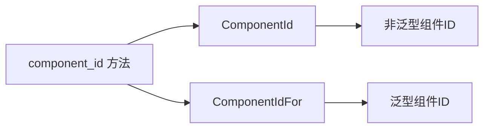

+++
title = "#20127 Link `ComponentIdFor` in the `ComponentId` related docs"
date = "2025-07-14T00:00:00"
draft = false
template = "pull_request_page.html"
in_search_index = false

[extra]
current_language = "zh-cn"
available_languages = {"en" = { name = "English", url = "/pull_request/bevy/2025-07/pr-20127-en-20250714" }, "zh-cn" = { name = "中文", url = "/pull_request/bevy/2025-07/pr-20127-zh-cn-20250714" }}
labels = ["C-Docs", "A-ECS"]
+++

# Link `ComponentIdFor` in the `ComponentId` related docs

## Basic Information
- **Title**: Link `ComponentIdFor` in the `ComponentId` related docs
- **PR Link**: https://github.com/bevyengine/bevy/pull/20127
- **Author**: Sieluna
- **Status**: MERGED
- **Labels**: C-Docs, A-ECS, S-Ready-For-Final-Review
- **Created**: 2025-07-14T09:41:55Z
- **Merged**: 2025-07-14T22:59:24Z
- **Merged By**: alice-i-cecile

## Description Translation
### 目标
修复 https://github.com/bevyengine/bevy/issues/19535。改进类型文档的互操作性，让用户更容易发现相关类型

### 解决方案
- 在 `crates/bevy_ecs/src/world/mod.rs` 的 `component_id` 函数文档中添加对 [`ComponentIdFor`](crate::component::ComponentIdFor) 的引用
- 在 `crates/bevy_ecs/src/component/info.rs` 的 `component_id` 函数文档中添加对 [`ComponentIdFor`](super::ComponentIdFor) 的引用

### 测试
- 验证文档生成：`cargo doc`
- 检查文档中交叉引用链接的有效性
- 确认 rustdoc 生成的文档能正确跳转到 `ComponentIdFor` 的类型定义

## 该 PR 的技术分析

### 问题背景
在 Bevy ECS 系统中，`ComponentId` 是标识组件的核心类型，而 `ComponentIdFor<T>` 是其泛型版本，提供类型安全的组件 ID 访问。用户反馈（issue #19535）指出文档中缺少两者之间的关联说明，导致开发者在查找类型安全的替代方案时效率低下。良好的文档互操作性是 API 可用性的关键因素，尤其在复杂的 ECS 架构中。

### 解决方案
该 PR 采用最小侵入式修改策略，在 `component_id()` 方法的文档注释中添加精确的交叉引用：
1. 在 `world/mod.rs` 的 `World::component_id()` 文档中增加 `ComponentIdFor` 的链接
2. 在 `component/info.rs` 的 `Components::component_id()` 文档中增加相同引用

### 技术实现
修改集中在文档注释的 "See also" 部分，保持现有文档结构的同时添加新条目。关键修改点：

**文件：crates/bevy_ecs/src/component/info.rs**
```rust
// 修改前
///
/// # See also
///
/// * [`Components::get_id()`]
/// * [`Components::resource_id()`]
/// * [`World::component_id()`](crate::world::World::component_id)

// 修改后
///
/// # See also
///
/// * [`ComponentIdFor`](super::ComponentIdFor)
/// * [`Components::get_id()`]
/// * [`Components::resource_id()`]
/// * [`World::component_id()`](crate::world::World::component_id)
```

**文件：crates/bevy_ecs/src/world/mod.rs**
```rust
// 修改前
///
/// # See also
///
/// * [`Components::component_id()`]
/// * [`Components::get_id()`]

// 修改后
///
/// # See also
///
/// * [`ComponentIdFor`](crate::component::ComponentIdFor)
/// * [`Components::component_id()`]
/// * [`Components::get_id()`]
```

### 技术考量
1. **路径准确性**：根据文件位置使用不同路径引用（`super::` vs `crate::component::`）
2. **文档结构一致性**：保持现有 "See also" 部分的格式和排序
3. **链接有效性**：通过 `cargo doc` 验证生成文档中的链接可正确跳转
4. **无功能影响**：修改仅涉及注释，不影响运行时行为

### 影响与价值
1. **提升文档可用性**：开发者从 `component_id()` 文档可直达类型安全的替代方案
2. **降低学习曲线**：明确展示 `ComponentId` 和 `ComponentIdFor` 的关系
3. **遵循最佳实践**：符合 Rust 文档的交叉引用规范
4. **维护成本为零**：不增加运行时开销或维护负担

## 组件关系图


## 关键文件变更

### crates/bevy_ecs/src/component/info.rs
- **变更说明**：在 `Components::component_id()` 文档中添加 `ComponentIdFor` 引用
- **代码差异**：
```diff
@@ -641,6 +641,7 @@ impl Components {
     ///
     /// # See also
     ///
+    /// * [`ComponentIdFor`](super::ComponentIdFor)
     /// * [`Components::get_id()`]
     /// * [`Components::resource_id()`]
     /// * [`World::component_id()`](crate::world::World::component_id)
```

### crates/bevy_ecs/src/world/mod.rs
- **变更说明**：修复两个 `EntityHashSet` 的错误链接，并在 `World::component_id()` 文档中添加引用
- **代码差异**：
```diff
@@ -602,6 +602,7 @@ impl World {
     ///
     /// # See also
     ///
+    /// * [`ComponentIdFor`](crate::component::ComponentIdFor)
     /// * [`Components::component_id()`]
     /// * [`Components::get_id()`]
     #[inline]
@@ -704,7 +705,7 @@ impl World {
     /// }
     /// ```
     ///
-    /// ## [`EntityHashSet`](crate::entity::EntityHashMap)
+    /// ## [`EntityHashSet`](crate::entity::EntityHashSet)
     ///
     /// ```
     /// # use bevy_ecs::{prelude::*, entity::EntityHashSet};
@@ -838,7 +839,7 @@ impl World {
     /// }
     /// ```
     ///
-    /// ## [`EntityHashSet`](crate::entity::EntityHashMap)
+    /// ## [`EntityHashSet`](crate::entity::EntityHashSet)
     ///
     /// ```
     /// # use bevy_ecs::{prelude::*, entity::EntityHashSet};
```

## 延伸阅读
1. [Rustdoc 链接语法参考](https://doc.rust-lang.org/rustdoc/linking-to-items-by-name.html)
2. [Bevy ECS 组件文档](https://docs.rs/bevy_ecs/latest/bevy_ecs/component/index.html)
3. [Rust API 指南 - 文档规范](https://rust-lang.github.io/api-guidelines/documentation.html)