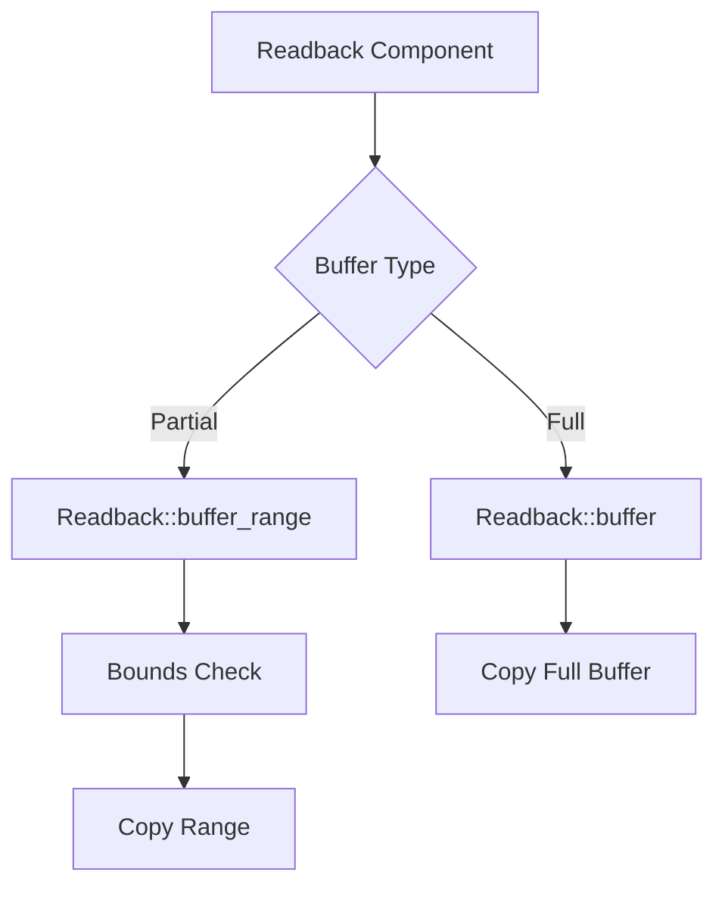

+++
title = "#20133"
date = "2025-07-14T00:00:00"
draft = false
template = "pull_request_page.html"
in_search_index = true

[taxonomies]
list_display = ["show"]

[extra]
current_language = "en"
available_languages = {"en" = { name = "English", url = "/pull_request/bevy/2025-07/pr-20133-en-20250714" }, "zh-cn" = { name = "中文", url = "/pull_request/bevy/2025-07/pr-20133-zh-cn-20250714" }}
+++

## The Story of This Pull Request

### The Problem and Context
The GPU readback system in Bevy only supported reading entire buffers into CPU-accessible memory. This limitation forced developers to copy entire buffers even when they only needed a small subset of the data. In scenarios like streaming large datasets or reading specific subsections of buffers, this was inefficient and wasted bandwidth. The existing `Readback` component's `Buffer` variant lacked parameters for specifying read ranges, and internal structures like `ReadbackSource` contained unused fields (`src_start`, `dst_start`) that were always zero.

### The Solution Approach
The solution adds partial buffer read capability while maintaining backwards compatibility. Key decisions:
1. Extended the `Readback::Buffer` variant with an optional `(offset, size)` tuple
2. Removed redundant fields from `ReadbackSource` since destination offset was always zero
3. Added bounds checking to prevent reading beyond buffer limits
4. Maintained existing full-buffer functionality through a new constructor
5. Updated the example to validate both full and partial reads

The approach avoids breaking changes by:
- Keeping the original `buffer()` constructor for full reads
- Adding `buffer_range()` for partial reads
- Using `Option` to distinguish between full/partial reads

### The Implementation
The core changes refactor the buffer readback logic:

```rust
// crates/bevy_render/src/gpu_readback.rs
// Before:
pub enum Readback {
    Buffer(Handle<ShaderStorageBuffer>),
}

// After:
pub enum Readback {
    Buffer {
        buffer: Handle<ShaderStorageBuffer>,
        start_offset_and_size: Option<(u64, u64)>,
    },
}
```

New constructors provide clear usage:
```rust
pub fn buffer(buffer: Handle<ShaderStorageBuffer>) -> Self {
    Self::Buffer {
        buffer,
        start_offset_and_size: None,
    }
}

pub fn buffer_range(buffer: Handle<ShaderStorageBuffer>, start_offset: u64, size: u64) -> Self {
    Self::Buffer {
        buffer,
        start_offset_and_size: Some((start_offset, size)),
    }
}
```

The copy operation now handles ranges:
```rust
// Before:
command_encoder.copy_buffer_to_buffer(
    buffer,
    *src_start,
    &readback.buffer,
    *dst_start,
    buffer.size(),
);

// After:
let (src_start, size) = start_offset_and_size.unwrap_or((0, buffer.size()));
command_encoder.copy_buffer_to_buffer(buffer, src_start, &readback.buffer, 0, size);
```

Bounds checking prevents overreads:
```rust
let full_size = ssbo.buffer.size();
let size = start_offset_and_size.map(|(start, size)| {
    let end = start + size;
    if end > full_size {
        panic!("Tried to read past buffer end");
    }
    size
}).unwrap_or(full_size);
```

### Technical Insights
1. **Zero-Copy Optimization**: The implementation maintains zero destination offset since staging buffers are sized exactly for the requested range
2. **API Design**: Using `Option<(u64, u64)>` clearly distinguishes between full/partial reads without boolean flags
3. **Safety**: Explicit bounds checking prevents GPU memory access violations
4. **Resource Efficiency**: Partial reads reduce memory bandwidth by copying only necessary data

### The Impact
- Enables efficient partial buffer reads without breaking existing code
- Removes dead code (unused offset fields)
- Reduces memory bandwidth for readback operations
- Maintains full backwards compatibility
- Provides clear example usage for both full and partial reads

## Visual Representation



## Key Files Changed

### `crates/bevy_render/src/gpu_readback.rs`
Refactored buffer readback to support partial reads:
```rust
// Before:
Readback::Buffer(buffer)

// After:
Readback::Buffer {
    buffer,
    start_offset_and_size: Option<(u64, u64)>,
}
```

### `examples/shader/gpu_readback.rs`
Enhanced demo to validate partial reads:
```rust
// Before:
let buffer = vec![0u32; BUFFER_LEN];

// After:
let buffer: Vec<u32> = (0..BUFFER_LEN as u32).collect();

// Added partial readback:
commands.spawn(Readback::buffer_range(
    buffer.clone(),
    4 * u32::SHADER_SIZE.get(), // Skip first 4 elements
    8 * u32::SHADER_SIZE.get(), // Read next 8 elements
))
```

## Further Reading
- [WebGPU Buffer Operations](https://gpuweb.github.io/gpuweb/#buffers)
- [Bevy GPU Resources Documentation](https://docs.rs/bevy/latest/bevy/render/render_resource/index.html)
- [WGPU CopyBufferToBuffer](https://docs.rs/wgpu/latest/wgpu/struct.CommandEncoder.html#method.copy_buffer_to_buffer)