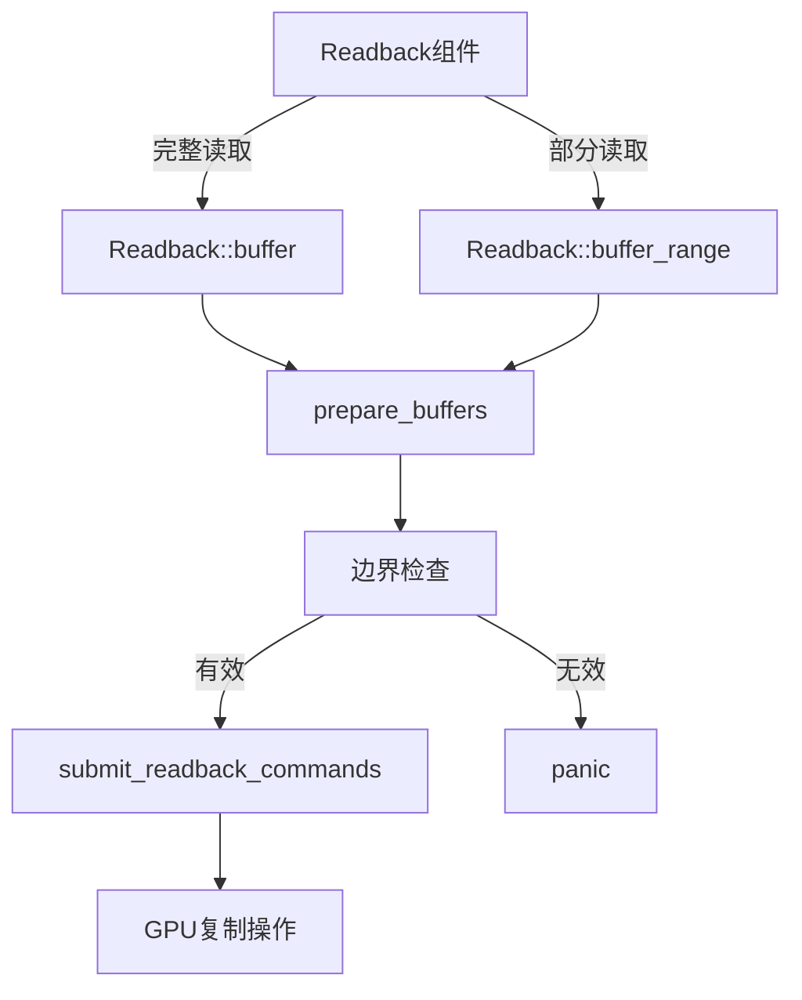

+++
title = "#20133 GpuReadbackPlugin`: Allow reading only a part of a buffer"
date = "2025-07-14T00:00:00"
draft = false
template = "pull_request_page.html"
in_search_index = false

[extra]
current_language = "zh-cn"
available_languages = {"en" = { name = "English", url = "/pull_request/bevy/2025-07/pr-20133-en-20250714" }, "zh-cn" = { name = "中文", url = "/pull_request/bevy/2025-07/pr-20133-zh-cn-20250714" }}
+++

## 技术分析报告：GpuReadbackPlugin 部分缓冲区读取功能增强

### 基本信息
- **标题**: `GpuReadbackPlugin`: Allow reading only a part of a buffer
- **PR链接**: https://github.com/bevyengine/bevy/pull/20133
- **作者**: EmbersArc
- **状态**: 已合并
- **标签**: C-Feature, A-Rendering, S-Ready-For-Final-Review
- **创建时间**: 2025-07-14T14:15:50Z
- **合并时间**: 2025-07-14T22:01:10Z
- **合并者**: mockersf

### 描述翻译
#### 目标
- 目前仅支持完整缓冲区读取。此PR增加了读取缓冲区部分内容的能力。

#### 解决方案
- 在创建`Readback`组件时，允许传入起始偏移量和要读取的字节数
- 同时移除了`ReadbackSource`中未使用的`src_start`和`dst_start`字段（这些字段始终为0）

#### 测试
- 你是否测试了这些更改？如果是，如何测试的？
  我扩展了示例以展示部分读取功能

- 是否有部分需要更多测试？
  没有想到

- 其他人（审查者）如何测试你的更改？需要了解什么特殊事项？
  运行`gpu_readback`示例。它现在会读取并打印部分读取的缓冲区

- 如果相关，你在哪些平台测试了这些更改，是否有重要平台无法测试？
  仅在Linux测试

#### 展示
示例输出：
<details>
  <summary>点击查看展示</summary>

```
2025-07-14T14:05:15.614876Z  INFO gpu_readback: Buffer [257, 258, 259, 260, 261, 262, 263, 264, 265, 266, 267, 268, 269, 270, 271, 272]
2025-07-14T14:05:15.614921Z  INFO gpu_readback: Buffer range [261, 262, 263, 264, 265, 266, 267, 268]
2025-07-14T14:05:15.614937Z  INFO gpu_readback: Image [257, 258, 259, 260, 261, 262, 263, 264, 265, 266, 267, 268, 269, 270, 271, 272, 0, 0, 0, 0, 0, 0, 0, 0, 0, 0, 0, 0, 0, 0, 0, 0, 0, 0, 0, 0, 0, 0, 0, 0, 0, 0, 0, 0, 0, 0, 0, 0, 0, 0, 0, 0, 0, 0, 0, 0, 0, 0, 0, 0, 0, 0, 0, 0]
```

</details>

---

### PR技术分析

#### 问题背景
在Bevy的GPU读回系统中，`GpuReadbackPlugin`原本只支持完整缓冲区读取操作。当开发者需要读取大型缓冲区的特定子集时，这种限制会导致：
1. 不必要的带宽消耗
2. 额外的内存开销
3. CPU处理延迟（需过滤不需要的数据）

特别是在处理大型Shader Storage Buffer Object（SSBO）时，读取整个缓冲区既低效又不实用。该PR通过实现部分缓冲区读取能力来解决这些限制。

#### 解决方案设计
核心方案是扩展`Readback`组件的API，引入部分读取支持：
1. 重构`Readback::Buffer`变体为结构体形式，增加`start_offset_and_size`字段
2. 添加边界检查防止越界读取
3. 移除未使用的字段简化代码
4. 更新底层缓冲区复制逻辑以支持偏移量

实现保持向后兼容：现有`Readback::buffer()`方法行为不变，新增`buffer_range()`方法提供部分读取能力。

#### 关键技术实现
在`gpu_readback.rs`中，主要修改集中在三个区域：

1. **API扩展** - 重构`Readback`枚举并添加新方法：
```rust
// Before:
pub enum Readback {
    Texture(Handle<Image>),
    Buffer(Handle<ShaderStorageBuffer>),
}

// After:
pub enum Readback {
    Texture(Handle<Image>),
    Buffer {
        buffer: Handle<ShaderStorageBuffer>,
        start_offset_and_size: Option<(u64, u64)>,
    },
}

pub fn buffer_range(buffer: Handle<ShaderStorageBuffer>, start_offset: u64, size: u64) -> Self {
    Self::Buffer {
        buffer,
        start_offset_and_size: Some((start_offset, size)),
    }
}
```

2. **边界安全检查** - 在准备阶段添加范围校验：
```rust
let full_size = ssbo.buffer.size();
let size = start_offset_and_size
    .map(|(start, size)| {
        let end = start + size;
        if end > full_size {
            panic!(
                "Tried to read past the end of the buffer (start: {start}, \
                size: {size}, buffer size: {full_size})."
            );
        }
        size
    })
    .unwrap_or(full_size);
```

3. **复制命令优化** - 简化缓冲区复制逻辑：
```rust
// Before:
command_encoder.copy_buffer_to_buffer(
    buffer,
    *src_start,
    &readback.buffer,
    *dst_start,
    buffer.size(),
);

// After:
let (src_start, size) = start_offset_and_size.unwrap_or((0, buffer.size()));
command_encoder.copy_buffer_to_buffer(buffer, src_start, &readback.buffer, 0, size);
```

在示例文件`gpu_readback.rs`中，演示了部分读取的实际应用：
```rust
// 创建包含连续整数的缓冲区
let buffer: Vec<u32> = (0..BUFFER_LEN as u32).collect();

// 部分读取示例（跳过前4个元素，读取8个元素）
commands.spawn(Readback::buffer_range(
        buffer.clone(),
        4 * u32::SHADER_SIZE.get(), // 偏移量
        8 * u32::SHADER_SIZE.get(), // 读取长度
    ))
    .observe(|trigger: On<ReadbackComplete>| {
        let data: Vec<u32> = trigger.event().to_shader_type();
        info!("Buffer range {:?}", data);
    });
```

#### 技术权衡
1. **错误处理策略**：使用`panic!`处理越界访问而非Result类型，符合Bevy的"快速失败"设计哲学
2. **API设计**：选择`Option<(u64, u64)>`而非单独字段，避免无效状态组合
3. **内存效率**：读取操作始终从目标缓冲区0偏移开始，简化内存管理
4. **兼容性**：保留原有API确保向后兼容

#### 实际影响
1. **性能优化**：减少GPU→CPU数据传输量，尤其对大缓冲区
2. **新功能**：支持基于偏移量的精确数据读取
3. **代码简化**：移除未使用字段（src_start/dst_start）减少维护成本
4. **开发者体验**：示例展示完整和部分读取对比，提供清晰使用范式

### 可视化表示


### 关键文件变更

1. **crates/bevy_render/src/gpu_readback.rs** (+40 -18)
   - 扩展Readback API支持部分缓冲区读取
   - 添加边界安全检查
   - 优化缓冲区复制命令逻辑

```rust
// 变更点1: Readback枚举重构
// Before:
pub enum Readback {
    Buffer(Handle<ShaderStorageBuffer>),
}

// After:
pub enum Readback {
    Buffer {
        buffer: Handle<ShaderStorageBuffer>,
        start_offset_and_size: Option<(u64, u64)>,
    },
}

// 变更点2: 复制命令优化
// Before:
command_encoder.copy_buffer_to_buffer(
    buffer,
    *src_start,
    &readback.buffer,
    *dst_start,
    buffer.size(),
);

// After:
let (src_start, size) = start_offset_and_size.unwrap_or((0, buffer.size()));
command_encoder.copy_buffer_to_buffer(buffer, src_start, &readback.buffer, 0, size);
```

2. **examples/shader/gpu_readback.rs** (+14 -1)
   - 更新示例展示部分读取功能
   - 改进缓冲区初始化数据

```rust
// 变更点1: 缓冲区初始化
// Before:
let buffer = vec![0u32; BUFFER_LEN];

// After:
let buffer: Vec<u32> = (0..BUFFER_LEN as u32).collect();

// 变更点2: 添加部分读取示例
commands.spawn(Readback::buffer_range(
        buffer.clone(),
        4 * u32::SHADER_SIZE.get(),
        8 * u32::SHADER_SIZE.get(),
    ))
    .observe(|trigger: On<ReadbackComplete>| {
        info!("Buffer range {:?}", trigger.event().to_shader_type::<Vec<u32>>());
    });
```

### 延伸阅读
1. [WebGPU Buffer Operations规范](https://www.w3.org/TR/webgpu/#buffer-ops)
2. [Bevy GPU Readback原理解析](https://bevyengine.org/learn/book/features/rendering/gpu-readback/)
3. [现代图形API数据传输优化实践](https://developer.nvidia.com/gpugems/gpugems3/part-vi-gpu-computing/chapter-39-asynchronous-compute-and-data-readback)
4. [WGSL存储缓冲区规范](https://www.w3.org/TR/WGSL/#address-spaces-storage)