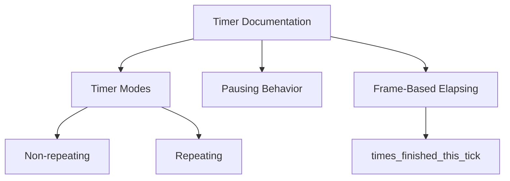

+++
title = "#20137 Documentation of Timer Behavior in Bevy's Time Module"
date = "2025-07-14T00:00:00"
draft = false
template = "pull_request_page.html"
in_search_index = true

[taxonomies]
list_display = ["show"]

[extra]
current_language = "en"
available_languages = {"en" = { name = "English", url = "/pull_request/bevy/2025-07/pr-20137-en-20250714" }, "zh-cn" = { name = "中文", url = "/pull_request/bevy/2025-07/pr-20137-zh-cn-20250714" }}
labels = ["C-Docs", "A-Time", "D-Straightforward"]
+++

## Title: Documentation of Timer Behavior in Bevy's Time Module

## Basic Information
- **Title**: Document repeating timer tick behavior
- **PR Link**: https://github.com/bevyengine/bevy/pull/20137
- **Author**: onbjerg
- **Status**: MERGED
- **Labels**: C-Docs, S-Ready-For-Final-Review, A-Time, D-Straightforward
- **Created**: 2025-07-14T16:06:15Z
- **Merged**: 2025-07-14T23:02:02Z
- **Merged By**: alice-i-cecile

## Description
# Objective

Closes #20132 

## Solution

I found docs describing the behavior elsewhere in Bevy, which I pulled in to the main `Timer` docs: https://github.com/bevyengine/bevy/blob/b01de70bdd927bcc9cdc5d0b8c677f480e54f4b1/crates/bevy_time/src/common_conditions.rs#L27-L35

I also restructured the docs a little bit.

## The Story of This Pull Request

The PR addresses a documentation gap in Bevy's time module regarding timer behavior. Developers needed clearer documentation about how repeating timers handle multiple elapses within a single frame and how pausing affects timer progression. Without this documentation, users might misunderstand timer behavior, leading to incorrect implementations in game logic and systems.

The solution approach involved consolidating existing documentation scattered across the codebase. The author identified relevant documentation in `common_conditions.rs` that described timer ticking behavior and integrated it into the main `Timer` struct documentation. This centralized approach improves discoverability and consistency.

The implementation restructured the documentation using Markdown sections to organize information logically. The author moved the note about requiring `tick()` to advance timers higher in the documentation for better visibility. They then organized the content into three clear sections: timer modes, pausing behavior, and frame-based elapsing. The most significant addition was documenting how repeating timers can elapse multiple times per frame and how to access this information through `times_finished_this_tick`.

The technical insight here is that repeating timers don't just fire once per duration period - they can trigger multiple times if the frame duration exceeds the timer duration. This behavior is important for game systems that need to process accumulated timer events. The documentation now explicitly states that for non-repeating timers, `times_finished_this_tick` will only be 0 or 1.

These changes improve developer experience by clarifying edge case behavior without modifying any functional code. The documentation now accurately reflects the existing timer implementation, helping users correctly utilize timer features in their Bevy projects.

## Visual Representation



## Key Files Changed

### `crates/bevy_time/src/timer.rs` (+17/-5)
The changes restructure and enhance the documentation for the `Timer` struct. The documentation now better explains timer modes, pausing behavior, and frame-based elapsing.

**Key modifications:**
```rust
// Before:
/// Tracks elapsed time. Enters the finished state once `duration` is reached.
///
/// Non repeating timers will stop tracking and stay in the finished state until reset.
/// Repeating timers will only be in the finished state on each tick `duration` is reached or
/// exceeded, and can still be reset at any given point.
///
/// Paused timers will not have elapsed time increased.
///
/// Note that in order to advance the timer [`tick`](Timer::tick) **MUST** be called.

// After:
/// Tracks elapsed time. Enters the finished state once `duration` is reached.
///
/// Note that in order to advance the timer [`tick`](Timer::tick) **MUST** be called.
///
/// # Timer modes
///
/// There are two timer modes ([`TimerMode`]):
///
/// - Non repeating timers will stop tracking and stay in the finished state until reset.
/// - Repeating timers will only be in the finished state on each tick `duration` is reached or
///   exceeded, and can still be reset at any given point.
///
/// # Pausing timers
///
/// You can pause a timer using [`Timer::pause`]. Paused timers will not have elapsed time increased.
///
/// # Elapsing multiple times a frame
///
/// Repeating timers might elapse multiple times per frame if the time is advanced by more than the timer duration.
/// You can check how many times a timer elapsed each tick with [`Timer::times_finished_this_tick`].
/// For non-repeating timers, this will always be 0 or 1.
```

The changes:
1. Move the `tick()` requirement note higher for visibility
2. Add section headers for better organization
3. Include new documentation about multiple elapses per frame
4. Add links to related types and methods (`TimerMode`, `Timer::pause`, `times_finished_this_tick`)

## Further Reading
1. [Bevy Time Module Documentation](https://docs.rs/bevy_time/latest/bevy_time/)
2. [Timer API Reference](https://docs.rs/bevy_time/latest/bevy_time/struct.Timer.html)
3. [Game Timing Concepts](https://gameprogrammingpatterns.com/game-loop.html)