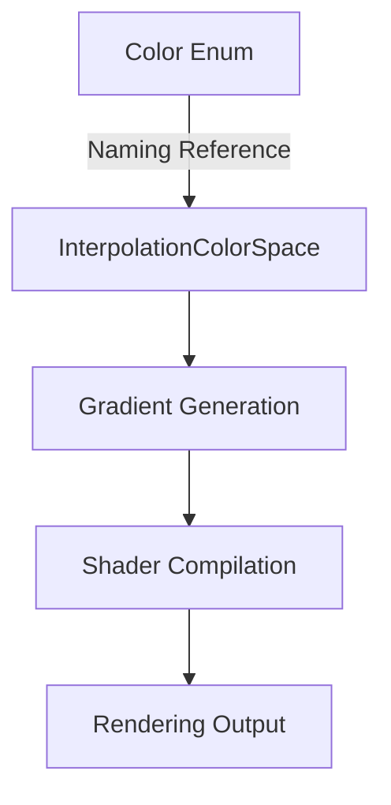

+++
title = "#20142 Rename the `InterpolationColorSpace` variants to match `Color`."
date = "2025-07-14T00:00:00"
draft = false
template = "pull_request_page.html"
in_search_index = true

[taxonomies]
list_display = ["show"]

[extra]
current_language = "en"
available_languages = {"en" = { name = "English", url = "/pull_request/bevy/2025-07/pr-20142-en-20250714" }, "zh-cn" = { name = "中文", url = "/pull_request/bevy/2025-07/pr-20142-zh-cn-20250714" }}
labels = ["D-Trivial", "A-UI", "C-Code-Quality", "M-Deliberate-Rendering-Change"]
+++

## Rename the `InterpolationColorSpace` variants to match `Color`

### Basic Information
- **Title**: Rename the `InterpolationColorSpace` variants to match `Color`.
- **PR Link**: https://github.com/bevyengine/bevy/pull/20142
- **Author**: ickshonpe
- **Status**: MERGED
- **Labels**: D-Trivial, A-UI, C-Code-Quality, S-Ready-For-Final-Review, M-Deliberate-Rendering-Change
- **Created**: 2025-07-14T21:33:07Z
- **Merged**: 2025-07-14T22:59:24Z
- **Merged By**: alice-i-cecile

### Description
The names of the variants of `InterpolationColorSpace` didn't match the corresponding `Color` variants, which could be potentially confusing. For instance, `Color` has an `Oklaba` variant, while in `InterpolationColorSpace` it was called `OkLab`. 

This PR renames variants of `InterpolationColorSpace` to mirror the variants of `Color`.

### The Story of This Pull Request

The inconsistency between `Color` and `InterpolationColorSpace` variant names created potential confusion for developers. While `Color` uses suffixes like `Oklaba` and `Srgba`, `InterpolationColorSpace` used shorter forms like `OkLab` and `Srgb`. This naming mismatch could lead to incorrect assumptions about color space behavior during gradient interpolation.

To resolve this, all variant names in `InterpolationColorSpace` were updated to match their corresponding `Color` counterparts. For example:
- `OkLab` → `Oklaba`
- `Srgb` → `Srgba`
- `Hsl` → `Hsla`

This change required updates across multiple areas:
1. The enum definition itself
2. Helper methods in the `InColorSpace` trait
3. Shader compilation logic
4. Example code and test cases

The implementation approach was straightforward but required careful updates to ensure consistency. Each variant was systematically renamed with attention to:
- Maintaining correct functionality
- Updating documentation comments
- Preserving default values (`#[default]` remained on `Oklaba`)
- Ensuring method names remained technically accurate (`in_oklaba()` instead of `in_oklab()`)

Here's the core enum change showing the naming alignment:

```rust
// Before:
pub enum InterpolationColorSpace {
    OkLab,
    OkLch,
    // ... other variants
}

// After:
pub enum InterpolationColorSpace {
    Oklaba,
    Oklcha,
    // ... other variants
}
```

The trait methods were updated to match the new variant names:

```rust
// Before:
fn in_oklab(self) -> Self {
    self.in_color_space(InterpolationColorSpace::OkLab)
}

// After:
fn in_oklaba(self) -> Self {
    self.in_color_space(InterpolationColorSpace::Oklaba)
}
```

Shader compilation was updated to maintain correct behavior:

```rust
// Before:
match key.color_space {
    InterpolationColorSpace::OkLab => "IN_OKLAB",
    // ...
}

// After:
match key.color_space {
    InterpolationColorSpace::Oklaba => "IN_OKLAB", // Note: string constant unchanged
    // ...
}
```

The impact of these changes is improved API consistency and reduced cognitive load for developers. The color space variants now directly correspond to their `Color` counterparts, eliminating naming discrepancies. This is particularly valuable for:
- New developers learning the API
- Code maintenance and readability
- Preventing subtle bugs from incorrect color space assumptions

Since this was a pure renaming change with no functional modifications, it was classified as trivial (D-Trivial). The PR required updates to examples and test cases to maintain correctness, but no behavioral changes were introduced.

### Visual Representation



### Key Files Changed

1. **crates/bevy_ui/src/gradients.rs** (+24/-24)  
   Core enum and trait changes:
   ```rust
   // Before:
   pub enum InterpolationColorSpace {
       OkLab,
       OkLch,
       // ...
   }
   
   // After:
   pub enum InterpolationColorSpace {
       Oklaba,
       Oklcha,
       // ...
   }
   ```

2. **crates/bevy_ui_render/src/gradient.rs** (+9/-9)  
   Shader compilation updates:
   ```rust
   // Before:
   InterpolationColorSpace::OkLab => "IN_OKLAB",
   
   // After:
   InterpolationColorSpace::Oklaba => "IN_OKLAB",
   ```

3. **examples/ui/gradients.rs** (+18/-18)  
   Example UI updates:
   ```rust
   // Before:
   InterpolationColorSpace::OkLab => InterpolationColorSpace::OkLch,
   
   // After:
   InterpolationColorSpace::Oklaba => InterpolationColorSpace::Oklcha,
   ```

4. **examples/testbed/ui.rs** (+9/-9)  
   Test case updates:
   ```rust
   // Before:
   InterpolationColorSpace::LinearRgb,
   
   // After:
   InterpolationColorSpace::LinearRgba,
   ```

5. **crates/bevy_feathers/src/controls/slider.rs** (+1/-1)  
   Component update:
   ```rust
   // Before:
   color_space: InterpolationColorSpace::Srgb,
   
   // After:
   color_space: InterpolationColorSpace::Srgba,
   ```

### Further Reading
1. [Bevy Color Documentation](https://docs.rs/bevy/latest/bevy/prelude/struct.Color.html)
2. [Color Spaces in Computer Graphics](https://en.wikipedia.org/wiki/Color_space)
3. [OKLab Color Space Explanation](https://bottosson.github.io/posts/oklab/)