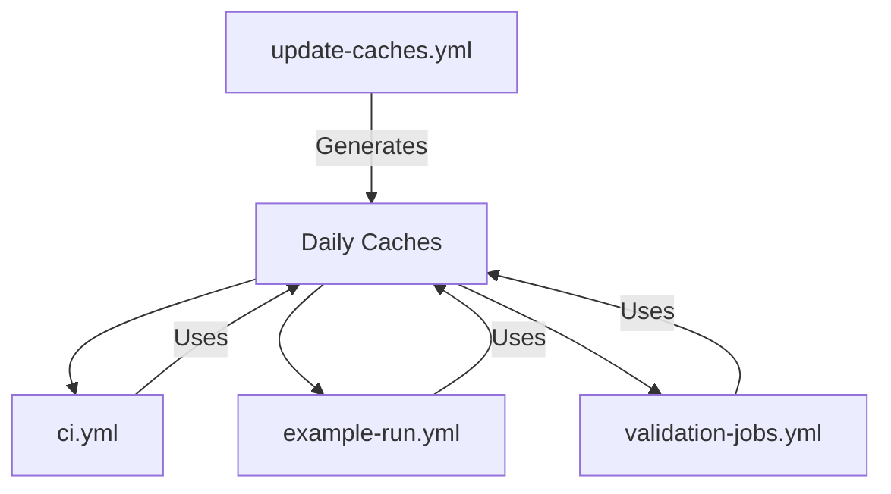

+++
title = "#20144 Refactor actions cache to be build on main"
date = "2025-07-22T00:00:00"
draft = false
template = "pull_request_page.html"
in_search_index = true

[taxonomies]
list_display = ["show"]

[extra]
current_language = "en"
available_languages = {"en" = { name = "English", url = "/pull_request/bevy/2025-07/pr-20144-en-20250722" }, "zh-cn" = { name = "中文", url = "/pull_request/bevy/2025-07/pr-20144-zh-cn-20250722" }}
labels = ["A-Build-System", "C-Performance"]
+++

### Refactor actions cache to be build on main

## Basic Information
- **Title**: Refactor actions cache to be build on main
- **PR Link**: https://github.com/bevyengine/bevy/pull/20144
- **Author**: mockersf
- **Status**: MERGED
- **Labels**: A-Build-System, C-Performance, S-Ready-For-Final-Review
- **Created**: 2025-07-14T22:27:08Z
- **Merged**: 2025-07-21T23:11:55Z
- **Merged By**: alice-i-cecile

## Description Translation
# Objective

- Cache is not reused across days as we produce too much cache and it gets cleaned by github

## Solution

- create cache from main
- reuse cache in other jobs

## The Story of This Pull Request

The GitHub Actions cache for Bevy's CI pipelines was being invalidated too frequently due to size limitations, causing redundant rebuilds and longer CI times. GitHub automatically cleans older caches when storage limits are exceeded, which occurred daily due to the volume of cache artifacts generated across multiple jobs and configurations. This led to cache misses on subsequent days, forcing full rebuilds instead of incremental compilation.

To address this, we implemented a centralized cache generation strategy. Rather than having each CI job create its own cache, we now build caches once per day from the main branch and reuse them across all workflows. This reduces cache fragmentation and ensures older caches aren't prematurely deleted.

We introduced a new workflow (update-caches.yml) that runs on main branch updates, manual triggers, and a daily schedule. This workflow builds caches for all significant toolchain and target combinations:
- Multiple operating systems (Ubuntu, macOS, Windows)
- Toolchains (stable, nightly, MSRV)
- Targets (wasm32, x86_64-unknown-none, thumbv6m-none-eabi, etc.)

The cache keys now include the date in YYYYMMDD format:
```yaml
key: ${{ runner.os }}-${{ matrix.toolchain }}-${{ matrix.target }}-${{ hashFiles('**/Cargo.toml') }}-${{ hashFiles('Cargo.lock') }}-${{ steps.get-date.outputs.date }}
```

Existing workflows were modified to use `actions/cache/restore` with restore-keys that match the new key patterns. Instead of exact key matches, jobs now fall back to older caches using restore-keys patterns:
```yaml
restore-keys: |
  ${{ runner.os }}-stable--${{ hashFiles('**/Cargo.toml') }}-
  ${{ runner.os }}-stable--
```

We ensured environment variables are kept consistent across workflows by adding synchronization comments:
```yaml
# Environment variables must be kept in sync with all workflows that defines them.
env:
  CARGO_INCREMENTAL: 0
  CARGO_PROFILE_TEST_DEBUG: 0
```

The cache restoration process was optimized by:
1. Separating cache restore/save operations
2. Only saving caches when no match exists (`if: steps.cache.outputs.cache-hit != 'true'`)
3. Building both dev and test profiles to maximize cache coverage

For the MSRV (Minimum Supported Rust Version) check, we moved the cache restoration after toolchain setup since the MSRV value is determined at runtime:
```yaml
- name: get MSRV
  id: msrv
  run: |
    msrv=`cargo metadata --no-deps --format-version 1 | jq --raw-output '.packages[] | select(.name=="bevy") | .rust_version'`
    echo "MSRV=$msrv" >> $GITHUB_OUTPUT

- uses: actions/cache/restore@v4
  with:
    key: ${{ runner.os }}-${{ steps.msrv.outputs.msrv }}--${{ hashFiles('**/Cargo.toml') }}-
```

These changes reduce CI execution time by maximizing cache reuse across jobs and days while staying within GitHub's cache storage limits. The daily cache rebuild ensures fresh dependencies while the restore-key strategy provides fallbacks when exact matches aren't available.

## Visual Representation



## Key Files Changed

### `.github/workflows/update-caches.yml` (+137/-0)
New workflow for centralized cache generation. Builds caches for all major configurations.

```yaml
name: Update Actions Caches

on:
  workflow_dispatch:
  push:
    branches:
      - main
  schedule:
    - cron: "0 1 * * *"

env:
  CARGO_INCREMENTAL: 0
  CARGO_PROFILE_TEST_DEBUG: 0
  NIGHTLY_TOOLCHAIN: nightly

jobs:
  build-caches:
    strategy:
      matrix:
        include:
          - os: ubuntu-latest
            toolchain: stable
            target: ""
          - os: macos-latest
            toolchain: stable
            target: ""
          # Additional configurations omitted for brevity
    steps:
      - name: Get Date
        id: get-date
        run: echo "date=$(/bin/date -u '+%Y%m%d')" >> $GITHUB_OUTPUT
        
      - uses: actions/cache/restore@v4
        id: cache
        with:
          key: ${{ runner.os }}-${{ matrix.toolchain }}-${{ matrix.target }}-${{ hashFiles('**/Cargo.toml') }}-${{ hashFiles('Cargo.lock') }}-${{ steps.get-date.outputs.date }}
          
      - name: Build dev cache
        if: steps.cache.outputs.cache-hit != 'true'
        run: cargo build --profile dev --package bevy
        
      - name: Save cache
        if: steps.cache.outputs.cache-hit != 'true'
        uses: actions/cache/save@v4
        with:
          key: ${{ runner.os }}-${{ matrix.toolchain }}-${{ matrix.target }}-${{ hashFiles('**/Cargo.toml') }}-${{ hashFiles('Cargo.lock') }}-${{ steps.get-date.outputs.date }}
```

### `.github/workflows/ci.yml` (+87/-37)
Modified all jobs to use new cache restoration pattern with restore-keys.

```yaml
env:
  # Environment variables must be kept in sync with all workflows that defines them.
  CARGO_TERM_COLOR: always
  CARGO_INCREMENTAL: 0

jobs:
  build:
    steps:
      - uses: actions/cache/restore@v4
        with:
          key: ${{ runner.os }}-stable--${{ hashFiles('**/Cargo.toml') }}-
          restore-keys: |
            ${{ runner.os }}-stable--${{ hashFiles('**/Cargo.toml') }}-
            ${{ runner.os }}-stable--
```

### `.github/workflows/validation-jobs.yml` (+48/-20)
Updated validation jobs to match new cache key patterns.

```yaml
jobs:
  android:
    steps:
      - uses: actions/cache/restore@v4
        with:
          key: ${{ runner.os }}-stable-aarch64-linux-android-${{ hashFiles('**/Cargo.toml') }}-
          restore-keys: |
            ${{ runner.os }}-stable-aarch64-linux-android-${{ hashFiles('**/Cargo.toml') }}-
            ${{ runner.os }}-stable-aarch64-linux-android-
```

### `.github/workflows/example-run.yml` (+37/-3)
Synchronized environment variables and implemented cache restoration.

```yaml
env:
  # Environment variables must be kept in sync with all workflows that defines them.
  CARGO_TERM_COLOR: always
  CARGO_INCREMENTAL: 0

jobs:
  run-examples:
    steps:
      - uses: actions/cache/restore@v4
        with:
          key: ${{ runner.os }}-stable--${{ hashFiles('**/Cargo.toml') }}-
          restore-keys: |
            ${{ runner.os }}-stable--${{ hashFiles('**/Cargo.toml') }}-
            ${{ runner.os }}-stable--
```

## Further Reading
1. [GitHub Actions Cache Documentation](https://docs.github.com/en/actions/using-workflows/caching-dependencies-to-speed-up-workflows)
2. [Cache Action Usage Patterns](https://github.com/actions/cache/blob/main/tips-and-workarounds.md)
3. [Rust Cargo Caching Best Practices](https://doc.rust-lang.org/cargo/guide/cargo-home.html#caching-the-cargo-home-in-ci)