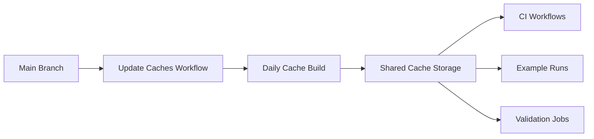

+++
title = "#20144 Refactor actions cache to be build on main"
date = "2025-07-22T00:00:00"
draft = false
template = "pull_request_page.html"
in_search_index = false

[extra]
current_language = "zh-cn"
available_languages = {"en" = { name = "English", url = "/pull_request/bevy/2025-07/pr-20144-en-20250722" }, "zh-cn" = { name = "中文", url = "/pull_request/bevy/2025-07/pr-20144-zh-cn-20250722" }}
labels = ["A-Build-System", "C-Performance"]
+++

# Refactor actions cache to be build on main

## Basic Information
- **Title**: Refactor actions cache to be build on main
- **PR Link**: https://github.com/bevyengine/bevy/pull/20144
- **Author**: mockersf
- **Status**: MERGED
- **Labels**: A-Build-System, C-Performance, S-Ready-For-Final-Review
- **Created**: 2025-07-14T22:27:08Z
- **Merged**: 2025-07-21T23:11:55Z
- **Merged By**: alice-i-cecile

## Description Translation
# Objective

- 缓存无法跨天复用，因为我们生成了太多缓存而被 GitHub 清理

## Solution

- 从 main 分支创建缓存
- 在其他作业中复用缓存

## The Story of This Pull Request

### 问题背景
Bevy 项目的 GitHub Actions 工作流面临一个效率问题：现有的缓存策略导致缓存无法在连续多天的构建中复用。根本原因在于 GitHub 会定期清理旧缓存，而现有方案每天都会生成大量新缓存，这些缓存很快就会被清理掉。这导致 CI 构建无法利用之前的缓存结果，每次都需要重新下载依赖和编译代码，显著增加了构建时间和资源消耗。

### 解决方案设计
PR 采用了集中式缓存生成策略来解决这个问题：
1. 创建专用工作流在 main 分支上构建缓存
2. 所有其他工作流改为复用这些预生成的缓存
3. 引入日期戳缓存键确保缓存每天更新一次但不过期过快
4. 使用分层恢复键(restore-keys)提高缓存命中率

这种设计的核心优势是将缓存生成与日常 CI 执行解耦，确保缓存来自稳定的 main 分支，并且通过日期戳控制缓存版本，避免 GitHub 过早清理。

### 具体实现
#### 新增缓存生成工作流
创建了 `.github/workflows/update-caches.yml` 文件，该工作流：
- 在 main 合并、手动触发或每日定时执行
- 使用矩阵策略为不同平台/工具链组合生成缓存
- 包含日期戳的缓存键确保每日更新

```yaml
# File: .github/workflows/update-caches.yml
name: Update Actions Caches
on:
  workflow_dispatch:
  push:
    branches:
      - main
  schedule:
    - cron: "0 1 * * *"
...
jobs:
  build-caches:
    steps:
      - name: Get Date
        run: echo "date=$(/bin/date -u "+%Y%m%d")" >> $GITHUB_OUTPUT
      - uses: actions/cache/restore@v4
        id: cache
        with:
          key: ${{ runner.os }}-${{ matrix.toolchain }}-${{ matrix.target }}-${{ hashFiles('**/Cargo.toml') }}-${{ hashFiles('Cargo.lock') }}-${{ steps.get-date.outputs.date }}
      - name: Build dev cache
        if: steps.cache.outputs.cache-hit != 'true'
        run: cargo build --profile dev --package bevy
      - name: Save cache
        if: steps.cache.outputs.cache-hit != 'true'
        uses: actions/cache/save@v4
        with:
          key: ${{ runner.os }}-${{ matrix.toolchain }}-${{ matrix.target }}-${{ hashFiles('**/Cargo.toml') }}-${{ hashFiles('Cargo.lock') }}-${{ steps.get-date.outputs.date }}
```

#### 改造现有工作流
修改了所有 CI 相关工作流文件，将原来的 `actions/cache` 替换为 `actions/cache/restore` 并配置分层恢复键：

```yaml
# File: .github/workflows/ci.yml
# Before:
- uses: actions/cache@v4
  with:
    path: |
      ~/.cargo/bin/
      ...
    key: ${{ runner.os }}-cargo-build-stable-${{ hashFiles('**/Cargo.toml') }}

# After:
- uses: actions/cache/restore@v4
  with:
    key: ${{ runner.os }}-stable--${{ hashFiles('**/Cargo.toml') }}-
    restore-keys: |
      ${{ runner.os }}-stable--${{ hashFiles('**/Cargo.toml') }}-
      ${{ runner.os }}-stable--
```

这种恢复键设计允许：
1. 首先匹配精确的 Cargo.toml 哈希+日期组合
2. 回退到相同工具链的通用缓存
3. 确保即使依赖变化也能部分命中缓存

#### 环境变量同步
所有工作流都添加了同步注释，确保环境变量定义一致：
```yaml
# Environment variables must be kept in sync with all workflows that defines them.
env:
  CARGO_INCREMENTAL: 0
  NIGHTLY_TOOLCHAIN: nightly
```

#### 缓存恢复顺序优化
调整了某些作业步骤顺序，确保先设置 Rust 工具链再恢复缓存，避免工具链变化导致缓存失效：
```yaml
# File: .github/workflows/validation-jobs.yml
# Before:
- uses: actions/cache@v4
- uses: dtolnay/rust-toolchain@master

# After:
- uses: dtolnay/rust-toolchain@master
- uses: actions/cache/restore@v4
```

### 技术洞察
1. **缓存键设计**：采用 `{os}-{toolchain}-{target}-{toml_hash}-{lock_hash}-{date}` 格式
   - 包含 lockfile 哈希确保依赖版本匹配
   - 日期戳实现缓存轮转而不无限增长
   
2. **分层恢复策略**：restore-keys 实现渐进式回退
   - 第一级：精确匹配（工具链+目标+依赖哈希）
   - 第二级：部分匹配（工具链+目标）
   - 提高跨分支/PR 的缓存命中率

3. **资源优化**：仅在缓存未命中时执行构建
   ```yaml
   if: steps.cache.outputs.cache-hit != 'true'
   ```

### 影响评估
1. **性能提升**：减少重复编译，加速 CI 工作流
2. **缓存利用率**：避免 GitHub 过早清理有用缓存
3. **维护性**：集中管理缓存生成逻辑
4. **可扩展性**：矩阵策略轻松支持新平台/工具链

## Visual Representation



## Key Files Changed

### 1. `.github/workflows/update-caches.yml` (+137/-0)
新增的缓存生成工作流，核心功能是定时构建和保存缓存
```yaml
name: Update Actions Caches
on:
  workflow_dispatch:
  push:
    branches:
      - main
  schedule:
    - cron: "0 1 * * *"
...
      - name: Save cache
        if: steps.cache.outputs.cache-hit != 'true'
        uses: actions/cache/save@v4
        with:
          path: |
            ~/.cargo/bin/
            ~/.cargo/registry/index/
            ~/.cargo/registry/cache/
            ~/.cargo/git/db/
            target/
          key: ${{ runner.os }}-${{ matrix.toolchain }}-${{ matrix.target }}-${{ hashFiles('**/Cargo.toml') }}-${{ hashFiles('Cargo.lock') }}-${{ steps.get-date.outputs.date }}
```

### 2. `.github/workflows/ci.yml` (+87/-37)
改造所有 CI 作业使用新的缓存恢复模式
```yaml
# Before:
- uses: actions/cache@v4
  with:
    path: ...
    key: ${{ runner.os }}-cargo-build-stable-${{ hashFiles('**/Cargo.toml') }}

# After:
- uses: actions/cache/restore@v4
  with:
    key: ${{ runner.os }}-stable--${{ hashFiles('**/Cargo.toml') }}-
    restore-keys: |
      ${{ runner.os }}-stable--${{ hashFiles('**/Cargo.toml') }}-
      ${{ runner.os }}-stable--
```

### 3. `.github/workflows/validation-jobs.yml` (+48/-20)
更新验证作业的缓存处理逻辑
```yaml
# Before:
- uses: actions/cache@v4
  with:
    path: target
    key: ${{ runner.os }}-ios-install-${{ hashFiles('**/Cargo.lock') }}

# After:
- uses: actions/cache/restore@v4
  with:
    key: ${{ runner.os }}-stable-aarch64-apple-ios-sim-${{ hashFiles('**/Cargo.toml') }}-
    restore-keys: |
      ${{ runner.os }}-stable-aarch64-apple-ios-sim-${{ hashFiles('**/Cargo.toml') }}-
      ${{ runner.os }}-stable-aarch64-apple-ios-sim-
```

### 4. `.github/workflows/example-run.yml` (+37/-3)
为示例运行工作流添加缓存支持
```yaml
# Added cache restoration
- uses: actions/cache/restore@v4
  with:
    key: ${{ runner.os }}-stable--${{ hashFiles('**/Cargo.toml') }}-
    restore-keys: |
      ${{ runner.os }}-stable--${{ hashFiles('**/Cargo.toml') }}-
      ${{ runner.os }}-stable--
```

## Further Reading
1. [GitHub Actions Caching Documentation](https://docs.github.com/en/actions/using-workflows/caching-dependencies-to-speed-up-workflows)
2. [rust-toolchain Action](https://github.com/dtolnay/rust-toolchain)
3. [Cache Action Advanced Usage](https://github.com/actions/cache/blob/main/tips-and-workarounds.md)
4. [Bevy CI Optimization Discussions](https://github.com/bevyengine/bevy/discussions/categories/development-discussions)