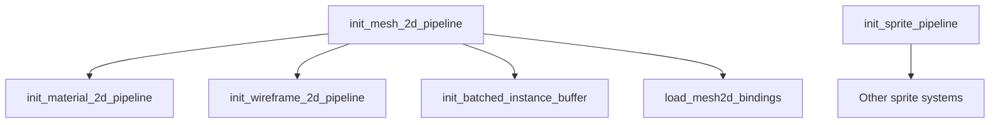

+++
title = "#20147 RenderStartup in bevy_sprite"
date = "2025-07-15T00:00:00"
draft = false
template = "pull_request_page.html"
in_search_index = true

[taxonomies]
list_display = ["show"]

[extra]
current_language = "en"
available_languages = {"en" = { name = "English", url = "/pull_request/bevy/2025-07/pr-20147-en-20250715" }, "zh-cn" = { name = "中文", url = "/pull_request/bevy/2025-07/pr-20147-zh-cn-20250715" }}
labels = ["A-Rendering", "C-Code-Quality", "D-Straightforward"]
+++

# RenderStartup in bevy_sprite

## Basic Information
- **Title**: RenderStartup in bevy_sprite
- **PR Link**: https://github.com/bevyengine/bevy/pull/20147
- **Author**: andriyDev
- **Status**: MERGED
- **Labels**: A-Rendering, C-Code-Quality, S-Ready-For-Final-Review, D-Straightforward
- **Created**: 2025-07-15T00:22:24Z
- **Merged**: 2025-07-15T06:50:26Z
- **Merged By**: alice-i-cecile

## Description Translation
### Objective
- Progress towards #19887.

### Solution
- Convert FromWorld implementations into systems.
- Move any resource "manipulation" from `Plugin::finish` to systems.
- Add `after` dependencies to any uses of these resources (basically all `SpritePipeline`).

### Testing
- Ran the `sprite`, and `mesh2d_manual` example and it worked.

## The Story of This Pull Request

### The Problem and Context
This PR addresses a systematic issue in Bevy's rendering initialization. Several resources in `bevy_sprite` were being initialized using `FromWorld` implementations and `Plugin::finish` methods. This approach had limitations:
1. It prevented explicit ordering dependencies between initialization steps
2. Made resource initialization harder to trace and maintain
3. Created implicit dependencies that weren't visible in the system graph

The core issue was that pipeline resources like `Mesh2dPipeline`, `SpritePipeline`, and `Material2dPipeline` were being constructed without clear dependencies on other systems. This became problematic as the engine evolved and required more explicit initialization ordering.

### The Solution Approach
The solution converted all `FromWorld` implementations into discrete systems that run during the `RenderStartup` schedule. This approach provides:
1. Explicit system ordering through `.after()` dependencies
2. Clear resource initialization sequencing
3. Better integration with Bevy's ECS scheduling

Key engineering decisions:
- Replaced `FromWorld` with systems that insert resources
- Moved initialization from `Plugin::finish` to `RenderStartup` systems
- Added explicit ordering constraints between pipeline initialization systems
- Preserved existing functionality while improving maintainability

### The Implementation
The implementation systematically converted resource initialization patterns:

**Pattern 1: FromWorld conversion**
```rust
// Before
impl FromWorld for Mesh2dPipeline {
    fn from_world(world: &mut World) -> Self {
        // Initialization logic
    }
}

// After
pub fn init_mesh_2d_pipeline(
    mut commands: Commands,
    render_device: Res<RenderDevice>,
    // ... other dependencies
) {
    // Initialization logic
    commands.insert_resource(Mesh2dPipeline { ... });
}
```

**Pattern 2: Plugin.finish removal**
```rust
// Before
fn finish(&self, app: &mut App) {
    if let Some(render_app) = app.get_sub_app_mut(RenderApp) {
        render_app.init_resource::<SpritePipeline>();
    }
}

// After
// In plugin setup:
render_app.add_systems(RenderStartup, init_sprite_pipeline)
```

**Pattern 3: Dependency ordering**
```rust
render_app.add_systems(
    RenderStartup,
    init_material_2d_pipeline::<M>
        .after(init_mesh_2d_pipeline)  // Explicit dependency
);
```

Shader loading was refactored to handle runtime-dependent shader definitions. The new approach loads shaders in systems that can access render device capabilities:

```rust
pub fn load_mesh2d_bindings(
    render_device: Res<RenderDevice>,
    asset_server: Res<AssetServer>
) {
    let mut mesh_bindings_shader_defs = Vec::new();
    
    if let Some(per_object_buffer_batch_size) = 
        GpuArrayBuffer::<Mesh2dUniform>::batch_size(&render_device) 
    {
        mesh_bindings_shader_defs.push(ShaderDefVal::UInt(
            "PER_OBJECT_BUFFER_BATCH_SIZE".into(),
            per_object_buffer_batch_size,
        ));
    }
    
    // Load shader with runtime-defined settings
    let handle: Handle<Shader> = load_embedded_asset!(...);
    core::mem::forget(handle);
}
```

### Technical Insights
The changes leverage Bevy's scheduling system to solve initialization ordering problems. Key technical aspects:

1. **Resource Initialization Timing**: Resources are now created during `RenderStartup` after render device initialization but before main rendering begins
2. **Explicit Dependencies**: Systems declare dependencies using `.after()` ensuring pipelines initialize before materials that use them
3. **Runtime Configuration**: Shader definitions can now be set based on runtime device capabilities
4. **ECS Patterns**: The implementation follows Bevy's system-centric design philosophy

A notable challenge was handling shader loading with device-dependent configurations. The solution uses a system that:
- Queries device capabilities
- Constructs appropriate shader definitions
- Loads shaders with these definitions

### The Impact
These changes provide concrete improvements:
1. **Maintainability**: Initialization logic is now centralized in systems
2. **Debuggability**: Initialization order is explicit and visible
3. **Extensibility**: New pipeline resources can be added with clear dependencies
4. **Consistency**: Aligns sprite rendering with Bevy's render initialization patterns

The PR also enables future work on:
- More granular initialization scheduling
- Async shader loading
- Dynamic pipeline reinitialization

## Visual Representation



## Key Files Changed

### `crates/bevy_sprite/src/mesh2d/mesh.rs` (+112/-107)
Refactored mesh pipeline initialization into systems with explicit dependencies.

**Key changes:**
```rust
// Before
impl Plugin for Mesh2dRenderPlugin {
    fn finish(&self, app: &mut App) {
        // Resource initialization in finish
    }
}

// After
impl Plugin for Mesh2dRenderPlugin {
    fn build(&self, app: &mut App) {
        render_app.add_systems(
            RenderStartup,
            (
                init_mesh_2d_pipeline,
                init_batched_instance_buffer,
                load_mesh2d_bindings,
            ),
        );
    }
}

// New initialization systems
pub fn init_mesh_2d_pipeline(commands: Commands, ...) {
    // Pipeline creation logic
    commands.insert_resource(Mesh2dPipeline { ... });
}

pub fn init_batched_instance_buffer(commands: Commands, ...) {
    commands.insert_resource(BatchedInstanceBuffer::<Mesh2dUniform>::new(...));
}
```

### `crates/bevy_sprite/src/render/mod.rs` (+64/-67)
Converted sprite pipeline initialization to a system.

**Key changes:**
```rust
// Before
impl FromWorld for SpritePipeline {
    fn from_world(world: &mut World) -> Self { ... }
}

// After
pub fn init_sprite_pipeline(
    mut commands: Commands,
    render_device: Res<RenderDevice>,
    ...
) {
    // Initialization logic
    commands.insert_resource(SpritePipeline { ... });
}

// In SpritePlugin:
render_app.add_systems(RenderStartup, init_sprite_pipeline)
```

### `crates/bevy_sprite/src/mesh2d/material.rs` (+31/-30)
Material pipeline now initializes after mesh pipeline.

**Key changes:**
```rust
// Before
impl<M: Material2d> FromWorld for Material2dPipeline<M> { ... }

// After
pub fn init_material_2d_pipeline<M: Material2d>(
    mut commands: Commands,
    mesh_2d_pipeline: Res<Mesh2dPipeline>,
    ...
) {
    commands.insert_resource(Material2dPipeline::<M> { ... });
}

// In plugin setup:
render_app.add_systems(
    RenderStartup,
    init_material_2d_pipeline::<M>.after(init_mesh_2d_pipeline)
);
```

### `crates/bevy_sprite/src/mesh2d/wireframe2d.rs` (+17/-18)
Wireframe pipeline initialization with dependency.

**Key changes:**
```rust
// Before
impl FromWorld for Wireframe2dPipeline { ... }

// After
pub fn init_wireframe_2d_pipeline(
    mut commands: Commands,
    mesh_2d_pipeline: Res<Mesh2dPipeline>,
    ...
) {
    commands.insert_resource(Wireframe2dPipeline { ... });
}

// In plugin setup:
render_app.add_systems(
    RenderStartup,
    init_wireframe_2d_pipeline.after(init_mesh_2d_pipeline)
);
```

### `crates/bevy_sprite/src/lib.rs` (+3/-9)
Removed finish method and added startup systems.

**Key changes:**
```diff
 impl Plugin for SpritePlugin {
     fn build(&self, app: &mut App) {
         render_app
+            .add_systems(RenderStartup, init_sprite_pipeline)
             .add_systems(ExtractSchedule, ...);
     }
-
-    fn finish(&self, app: &mut App) {
-        // Resource initialization removed
-    }
 }
```

## Further Reading
1. [Bevy Render Stages Documentation](https://github.com/bevyengine/bevy/blob/main/crates/bevy_render/src/lib.rs#L141)
2. [ECS System Ordering](https://bevyengine.org/learn/book/getting-started/ecs/#system-order)
3. [RenderStartup Migration Guide](https://github.com/bevyengine/bevy/blob/main/release-content/migration-guides/render_startup.md)