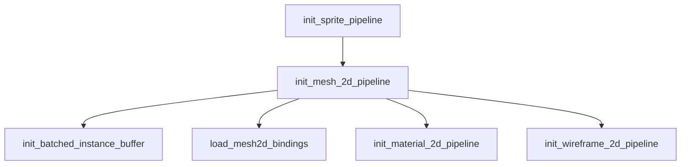

+++
title = "#20147 Use `RenderStartup` in `bevy_sprite"
date = "2025-07-15T00:00:00"
draft = false
template = "pull_request_page.html"
in_search_index = false

[extra]
current_language = "zh-cn"
available_languages = {"en" = { name = "English", url = "/pull_request/bevy/2025-07/pr-20147-en-20250715" }, "zh-cn" = { name = "中文", url = "/pull_request/bevy/2025-07/pr-20147-zh-cn-20250715" }}
+++

# RenderStartup 在 bevy_sprite 中的使用

## 基本信息
- **标题**: Use `RenderStartup` in `bevy_sprite`
- **PR 链接**: https://github.com/bevyengine/bevy/pull/20147
- **作者**: andriyDev
- **状态**: 已合并 (MERGED)
- **标签**: A-Rendering, C-Code-Quality, S-Ready-For-Final-Review, D-Straightforward
- **创建时间**: 2025-07-15T00:22:24Z
- **合并时间**: 2025-07-15T06:50:26Z
- **合并人**: alice-i-cecile

## 描述翻译

### 目标
- 推进 #19887 的实现进度。

### 解决方案
- 将 `FromWorld` 实现转换为系统
- 将资源"操作"从 `Plugin::finish` 移至系统
- 为这些资源的使用添加 `after` 依赖（主要是所有 `SpritePipeline`）

### 测试
- 运行了 `sprite` 和 `mesh2d_manual` 示例，功能正常

## 本 PR 的技术实现过程

### 问题背景
在 Bevy 的渲染架构中，资源初始化传统上在 `Plugin::finish` 方法中完成。然而这种方法存在限制：
1. 无法直接访问渲染专用资源（如 `RenderDevice`）
2. 初始化逻辑与 ECS 系统分离
3. 缺乏显式的执行顺序控制

该 PR 是 #19887 工作的一部分，目标是将资源初始化从 `Plugin::finish` 迁移到 `RenderStartup` 系统，利用 ECS 的优势进行更灵活的资源管理。

### 解决方案
核心方案是将多个 `FromWorld` 实现转换为 `RenderStartup` 系统：
1. 删除各模块中的 `FromWorld` 实现
2. 创建对应的初始化系统函数
3. 在 `RenderStartup` 阶段注册这些系统
4. 使用 `after` 明确系统执行顺序
5. 移除所有相关模块的 `Plugin::finish` 实现

### 技术实现细节
#### 1. SpritePipeline 初始化迁移
`SpritePipeline` 的初始化从 `FromWorld` 迁移到专用系统：

```rust
// crates/bevy_sprite/src/render/mod.rs
// 之前:
impl FromWorld for SpritePipeline {
    fn from_world(world: &mut World) -> Self {
        // 复杂的世界资源访问逻辑
    }
}

// 之后:
pub fn init_sprite_pipeline(
    mut commands: Commands,
    render_device: Res<RenderDevice>,
    default_sampler: Res<DefaultImageSampler>,
    render_queue: Res<RenderQueue>,
    asset_server: Res<AssetServer>,
) {
    // 直接使用 Res 获取资源
    commands.insert_resource(SpritePipeline {
        // 初始化逻辑
    });
}
```

#### 2. 运行时依赖的着色器加载
需要运行时信息的着色器（如 `mesh2d_bindings.wgsl`）现在在系统中加载：

```rust
// crates/bevy_sprite/src/mesh2d/mesh.rs
fn load_mesh2d_bindings(render_device: Res<RenderDevice>, asset_server: Res<AssetServer>) {
    let mut mesh_bindings_shader_defs = vec![];
    
    if let Some(per_object_buffer_batch_size) = 
        GpuArrayBuffer::<Mesh2dUniform>::batch_size(&render_device)
    {
        mesh_bindings_shader_defs.push(/*...*/);
    }
    
    let handle: Handle<Shader> = load_embedded_asset!(
        asset_server.as_ref(),
        "mesh2d_bindings.wgsl",
        move |settings| { /* 应用 shader_defs */ }
    );
    mem::forget(handle); // 保持资源加载
}
```

#### 3. 系统执行顺序控制
关键初始化步骤通过 `after` 明确依赖关系：

```rust
// crates/bevy_sprite/src/mesh2d/material.rs
.add_systems(
    RenderStartup,
    init_material_2d_pipeline::<M>.after(init_mesh_2d_pipeline)
)
```

#### 4. 插件架构调整
`SpritePlugin` 完全移除了 `finish` 方法：

```rust
// crates/bevy_sprite/src/lib.rs
// 之前:
fn finish(&self, app: &mut App) {
    if let Some(render_app) = app.get_sub_app_mut(RenderApp) {
        render_app
            .init_resource::<SpriteBatches>()
            .init_resource::<SpritePipeline>();
    }
}

// 之后:
// 在 build 方法中直接初始化
render_app
    .init_resource::<SpriteBatches>()
    .add_systems(RenderStartup, init_sprite_pipeline)
```

### 技术影响
1. **架构改进**：符合 ECS 模式，初始化逻辑更透明
2. **依赖管理**：通过 `after` 显式控制初始化顺序
3. **资源访问**：可直接使用 `Res<RenderDevice>` 等渲染资源
4. **可维护性**：消除 `FromWorld` 的"魔法"初始化
5. **迁移路径**：为 #19887 的最终完成铺平道路

### 潜在注意事项
1. **系统顺序**：新增的 `after` 依赖必须正确配置
2. **资源可用性**：确保所有必要资源在 `RenderStartup` 阶段可用
3. **跨插件依赖**：不同插件间的初始化顺序需要协调

## 可视化关系


## 关键文件变更

### crates/bevy_sprite/src/lib.rs
- 移除 `finish` 方法
- 在 `build` 中直接初始化 `SpriteBatches`
- 添加 `init_sprite_pipeline` 到 `RenderStartup`

```diff
@@ -56,7 +56,7 @@ use bevy_render::{
     render_phase::AddRenderCommand,
     render_resource::SpecializedRenderPipelines,
     view::{NoFrustumCulling, VisibilitySystems},
-    ExtractSchedule, Render, RenderApp, RenderSystems,
+    ExtractSchedule, Render, RenderApp, RenderStartup, RenderSystems,
 };
 
 /// Adds support for 2D sprite rendering.
@@ -118,7 +118,9 @@ impl Plugin for SpritePlugin {
                 .init_resource::<ExtractedSprites>()
                 .init_resource::<ExtractedSlices>()
                 .init_resource::<SpriteAssetEvents>()
+                .init_resource::<SpriteBatches>()
                 .add_render_command::<Transparent2d, DrawSprite>()
+                .add_systems(RenderStartup, init_sprite_pipeline)
                 .add_systems(
                     ExtractSchedule,
                     (
@@ -140,14 +142,6 @@ impl Plugin for SpritePlugin {
                 );
         };
     }
-
-    fn finish(&self, app: &mut App) {
-        if let Some(render_app) = app.get_sub_app_mut(RenderApp) {
-            render_app
-                .init_resource::<SpriteBatches>()
-                .init_resource::<SpritePipeline>();
-        }
-    }
 }
```

### crates/bevy_sprite/src/render/mod.rs
- 将 `SpritePipeline` 初始化从 `FromWorld` 迁移到系统

```diff
-impl FromWorld for SpritePipeline {
-    fn from_world(world: &mut World) -> Self {
-        // 复杂初始化逻辑
-    }
-}
+pub fn init_sprite_pipeline(
+    mut commands: Commands,
+    render_device: Res<RenderDevice>,
+    default_sampler: Res<DefaultImageSampler>,
+    render_queue: Res<RenderQueue>,
+    asset_server: Res<AssetServer>,
+) {
+    // 初始化逻辑
+    commands.insert_resource(SpritePipeline { ... });
+}
```

### crates/bevy_sprite/src/mesh2d/mesh.rs
- 拆分初始化逻辑为多个系统
- 添加运行时着色器加载

```rust
pub fn init_mesh_2d_pipeline(...) { ... }
pub fn init_batched_instance_buffer(...) { ... }
fn load_mesh2d_bindings(...) { ... }
```

### crates/bevy_sprite/src/mesh2d/material.rs
- 添加材质初始化系统依赖

```diff
.add_systems(
    RenderStartup,
    init_material_2d_pipeline::<M>.after(init_mesh_2d_pipeline)
)
```

### crates/bevy_sprite/src/mesh2d/wireframe2d.rs
- 线框初始化迁移

```rust
pub fn init_wireframe_2d_pipeline(...) { ... }
```

## 延伸阅读
1. [Bevy Render Startup 迁移指南](https://github.com/bevyengine/bevy/blob/main/release-content/migration-guides/render_startup.md)
2. [ECS 系统调度文档](https://docs.rs/bevy_ecs/latest/bevy_ecs/schedule/index.html)
3. [Bevy 渲染架构概览](https://github.com/bevyengine/bevy/blob/main/docs/plugins_guidelines.md#rendering-plugins)