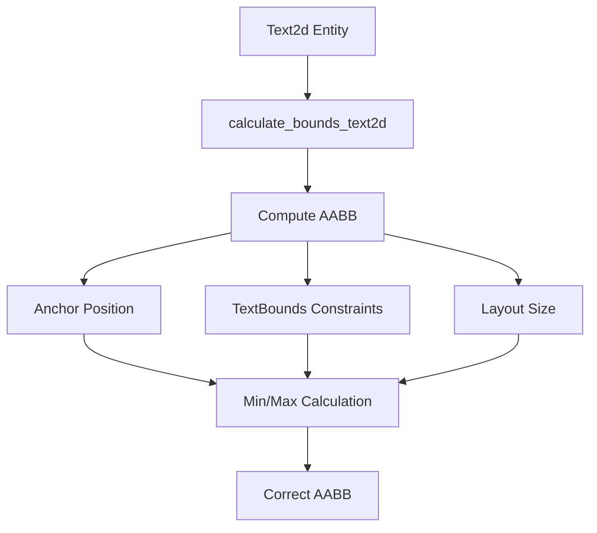

+++
title = "#20148 Text2d bounding box fix"
date = "2025-07-15T00:00:00"
draft = false
template = "pull_request_page.html"
in_search_index = true

[taxonomies]
list_display = ["show"]

[extra]
current_language = "en"
available_languages = {"en" = { name = "English", url = "/pull_request/bevy/2025-07/pr-20148-en-20250715" }, "zh-cn" = { name = "中文", url = "/pull_request/bevy/2025-07/pr-20148-zh-cn-20250715" }}
labels = ["C-Bug", "A-UI", "P-Regression", "D-Straightforward", "M-Deliberate-Rendering-Change"]
+++

# Text2d bounding box fix

## Basic Information
- **Title**: Text2d bounding box fix
- **PR Link**: https://github.com/bevyengine/bevy/pull/20148
- **Author**: ickshonpe
- **Status**: MERGED
- **Labels**: C-Bug, A-UI, S-Ready-For-Final-Review, P-Regression, D-Straightforward, M-Deliberate-Rendering-Change
- **Created**: 2025-07-15T00:27:06Z
- **Merged**: 2025-07-15T17:36:34Z
- **Merged By**: alice-i-cecile

## Description Translation
# Objective

`calculate_bounds_text2d` generates `Aabb`s with the wrong size and position for `Text2d` entities with `TextBounds`, which breaks culling.

## Solution

Calculate the correct bounds.

Fixes #20145

## Testing

```
cargo run --example testbed_2d
```

#### main


#### This PR


## The Story of This Pull Request

The problem started when users noticed that text rendering with `TextBounds` was behaving incorrectly - specifically, the axis-aligned bounding boxes (AABBs) generated for `Text2d` entities were misaligned and incorrectly sized. This manifested as visible rendering artifacts where text would be incorrectly culled when it should have been visible, or remain visible when it should have been culled. The issue was particularly noticeable when using constrained text layouts with `TextBounds`.

Looking at the `calculate_bounds_text2d` function, we found the root cause: the AABB calculation was using an incorrect approach to position and size the bounding box. The original implementation tried to compute the center and half-extents separately:

```rust
let center = (-anchor.as_vec() * size + (size.y - layout_info.size.y) * Vec2::Y)
    .extend(0.)
    .into();

let half_extents = (0.5 * layout_info.size).extend(0.0).into();
```

This approach had two main issues:
1. The vertical adjustment `(size.y - layout_info.size.y) * Vec2::Y` didn't properly account for the text bounds constraints
2. The half-extents calculation didn't consider the full dimensions needed for constrained text layouts

The solution was to replace this indirect calculation with a direct min/max approach that properly accounts for both the anchor position and text bounds. The new implementation calculates the actual corners of the text's bounding box in world space:

```rust
let x1 = (Anchor::TOP_LEFT.0.x - anchor.as_vec().x) * size.x;
let x2 = (Anchor::TOP_LEFT.0.x - anchor.as_vec().x + 1.) * size.x;
let y1 = (Anchor::TOP_LEFT.0.y - anchor.as_vec().y - 1.) * size.y;
let y2 = (Anchor::TOP_LEFT.0.y - anchor.as_vec().y) * size.y;
let new_aabb = Aabb::from_min_max(Vec3::new(x1, y1, 0.), Vec3::new(x2, y2, 0.));
```

This change has several advantages:
- It directly computes the min and max points of the AABB in one operation
- It properly accounts for the text bounds constraints by using the full `size` parameter (which combines layout size and text bounds)
- It eliminates separate center/half-extents calculations that could accumulate floating-point errors
- It handles all anchor positions consistently by using the anchor's vector representation

To verify the fix, we updated the text example in `testbed_2d.rs`:
1. Adjusted text bounds height from 55 to 60 to better demonstrate the fix
2. Added AABB visualization with a distinct amber color:
```rust
ShowAabbGizmo {
    color: Some(palettes::tailwind::AMBER_400.into()),
},
```

The before/after screenshots clearly demonstrate the fix:
- Before: AABBs are misaligned and don't match text positions
- After: AABBs correctly wrap each text element

This fix restores correct frustum culling behavior for text elements and ensures that text rendering behaves consistently with other UI elements. The changes are localized to the text bounding calculation and don't affect other rendering systems.

## Visual Representation



## Key Files Changed

### crates/bevy_text/src/text2d.rs
The core fix replaces the incorrect AABB calculation with a direct min/max approach:

```rust
// Before:
let center = (-anchor.as_vec() * size + (size.y - layout_info.size.y) * Vec2::Y)
    .extend(0.)
    .into();

let half_extents = (0.5 * layout_info.size).extend(0.0).into();

if let Some(mut aabb) = aabb {
    *aabb = Aabb {
        center,
        half_extents,
    };
} else {
    commands.entity(entity).try_insert(Aabb {
        center,
        half_extents,
    });
}

// After:
let x1 = (Anchor::TOP_LEFT.0.x - anchor.as_vec().x) * size.x;
let x2 = (Anchor::TOP_LEFT.0.x - anchor.as_vec().x + 1.) * size.x;
let y1 = (Anchor::TOP_LEFT.0.y - anchor.as_vec().y - 1.) * size.y;
let y2 = (Anchor::TOP_LEFT.0.y - anchor.as_vec().y) * size.y;
let new_aabb = Aabb::from_min_max(Vec3::new(x1, y1, 0.), Vec3::new(x2, y2, 0.));

if let Some(mut aabb) = aabb {
    *aabb = new_aabb;
} else {
    commands.entity(entity).try_insert(new_aabb);
}
```

### examples/testbed/2d.rs
Updated the example to better demonstrate the fix and added AABB visualization:

```rust
// Before:
Some(TextBounds::new(150., 55.)),

// After:
Some(TextBounds::new(150., 60.)),

// Added AABB visualization:
ShowAabbGizmo {
    color: Some(palettes::tailwind::AMBER_400.into()),
},
```

## Further Reading
1. [Bevy UI System Documentation](https://docs.rs/bevy_ui/latest/bevy_ui/)
2. [Axis-Aligned Bounding Boxes (AABB) in Computer Graphics](https://en.wikipedia.org/wiki/Minimum_bounding_box#Axis-aligned_minimum_bounding_box)
3. [Bevy Text Rendering Internals](https://github.com/bevyengine/bevy/blob/main/crates/bevy_text/src/lib.rs)