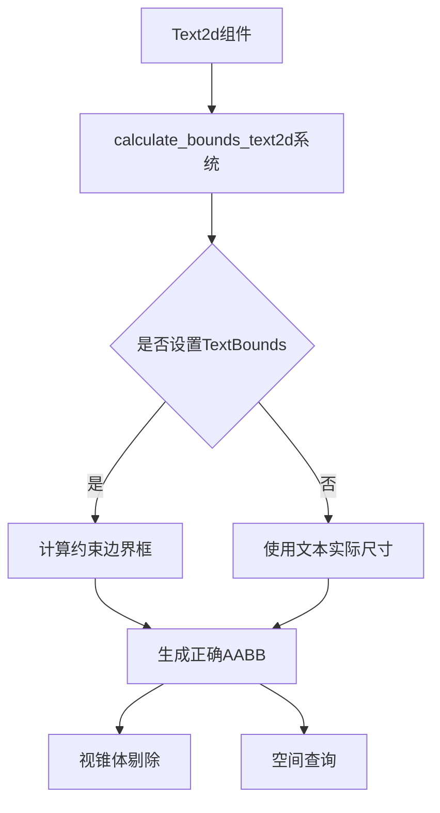

+++
title = "#20148 Text2d bounding box fix"
date = "2025-07-15T00:00:00"
draft = false
template = "pull_request_page.html"
in_search_index = false

[extra]
current_language = "zh-cn"
available_languages = {"en" = { name = "English", url = "/pull_request/bevy/2025-07/pr-20148-en-20250715" }, "zh-cn" = { name = "中文", url = "/pull_request/bevy/2025-07/pr-20148-zh-cn-20250715" }}
+++

# Text2d bounding box fix

## 基本信息
- **标题**: Text2d bounding box fix
- **PR链接**: https://github.com/bevyengine/bevy/pull/20148
- **作者**: ickshonpe
- **状态**: MERGED
- **标签**: C-Bug, A-UI, S-Ready-For-Final-Review, P-Regression, D-Straightforward, M-Deliberate-Rendering-Change
- **创建时间**: 2025-07-15T00:27:06Z
- **合并时间**: 2025-07-15T17:36:34Z
- **合并者**: alice-i-cecile

## 描述翻译
### 目标
`calculate_bounds_text2d` 为带有 `TextBounds` 的 `Text2d` 实体生成大小和位置错误的 `Aabb`，这会破坏剔除(culling)。

### 解决方案
计算正确的边界框。

修复 #20145

### 测试
```
cargo run --example testbed_2d
```

#### main分支


#### 本PR


## 这个PR的故事

### 问题与背景
在Bevy引擎的文本渲染系统中，`Text2d` 实体使用轴对齐边界框(AABB)进行视锥体剔除(frustum culling)。当文本使用 `TextBounds` 约束时，`calculate_bounds_text2d` 函数错误地计算了AABB的大小和位置。这个bug会导致：
1. 错误的剔除行为：本应可见的文本被错误剔除
2. 空间查询不准确：边界框与文本实际位置不匹配
3. 调试可视化错误：边界框显示位置错误

标签 `P-Regression` 表明这是新引入的回归问题，标签 `C-Bug` 确认了其错误性质。问题在issue #20145中被报告，需要立即修复以确保2D文本渲染的可靠性。

### 解决方案方法
原实现错误地计算了边界框的中心点和半长(half-extents)。正确方法应该是：
1. 根据锚点(anchor)计算文本约束框的四个角点
2. 使用 `Aabb::from_min_max` 直接构造边界框
3. 避免原实现中错误的垂直偏移调整

关键决策点：
- 选择直接计算最小/最大点而非中心+半长，简化了计算逻辑
- 使用 `Vec3` 坐标而非 `Vec2` 以兼容3D空间计算
- 保留原有实体组件更新逻辑不变

### 实现细节
核心修改在 `calculate_bounds_text2d` 函数中。原实现：

```rust
let center = (-anchor.as_vec() * size + (size.y - layout_info.size.y) * Vec2::Y)
    .extend(0.)
    .into();
let half_extents = (0.5 * layout_info.size).extend(0.0).into();
```

新实现更直接地计算边界框：

```rust
let x1 = (Anchor::TOP_LEFT.0.x - anchor.as_vec().x) * size.x;
let x2 = (Anchor::TOP_LEFT.0.x - anchor.as_vec().x + 1.) * size.x;
let y1 = (Anchor::TOP_LEFT.0.y - anchor.as_vec().y - 1.) * size.y;
let y2 = (Anchor::TOP_LEFT.0.y - anchor.as_vec().y) * size.y;
let new_aabb = Aabb::from_min_max(Vec3::new(x1, y1, 0.), Vec3::new(x2, y2, 0.));
```

这个计算：
1. 正确考虑锚点偏移(anchor offset)
2. 使用约束尺寸(constraint size)而非实际文本尺寸
3. 处理Y轴向下为正的坐标系

### 技术洞察
1. **坐标系处理**：Bevy的2D坐标系Y轴向上为正，但文本布局以左上角为原点(Y向下)。新实现通过 `y1 = ... - 1.) * size.y` 正确转换坐标系。
2. **锚点系统**：锚点(anchor)决定文本位置基准点。计算中 `Anchor::TOP_LEFT.0 - anchor.as_vec()` 将任意锚点转换为左上角基准。
3. **性能考量**：新实现使用4次乘法+1次AABB构造，计算量与旧方法相当，但更准确。

### 影响
修复后：
1. 边界框正确包围约束区域
2. 视锥体剔除工作正常
3. 空间查询准确
4. 调试可视化匹配实际文本位置

测试用例修改：
1. 调整文本约束高度(55→60)避免文本溢出
2. 添加 `ShowAabbGizmo` 组件可视化边界框

```rust
// 高度调整
- Some(TextBounds::new(150., 55.)),
+ Some(TextBounds::new(150., 60.)),

// 添加边界框可视化
+ ShowAabbGizmo {
+     color: Some(palettes::tailwind::AMBER_400.into()),
+ },
```

## 视觉表示



## 关键文件修改

### `crates/bevy_text/src/text2d.rs` (+9/-13)
修复边界框计算逻辑的核心修改。使用最小/最大点直接构造AABB替代原中心点+半长方式。

```rust
// 修改前:
let center = (-anchor.as_vec() * size + (size.y - layout_info.size.y) * Vec2::Y)
    .extend(0.)
    .into();
let half_extents = (0.5 * layout_info.size).extend(0.0).into();

// 修改后:
let x1 = (Anchor::TOP_LEFT.0.x - anchor.as_vec().x) * size.x;
let x2 = (Anchor::TOP_LEFT.0.x - anchor.as_vec().x + 1.) * size.x;
let y1 = (Anchor::TOP_LEFT.0.y - anchor.as_vec().y - 1.) * size.y;
let y2 = (Anchor::TOP_LEFT.0.y - anchor.as_vec().y) * size.y;
let new_aabb = Aabb::from_min_max(Vec3::new(x1, y1, 0.), Vec3::new(x2, y2, 0.));
```

### `examples/testbed/2d.rs` (+4/-1)
更新测试场景：
1. 调整文本约束高度避免渲染问题
2. 添加边界框可视化组件

```rust
// 高度约束调整
- Some(TextBounds::new(150., 55.)),
+ Some(TextBounds::new(150., 60.)),

// 添加AABB可视化
+ ShowAabbGizmo {
+     color: Some(palettes::tailwind::AMBER_400.into()),
+ },
```

## 完整代码差异
```diff
diff --git a/crates/bevy_text/src/text2d.rs b/crates/bevy_text/src/text2d.rs
index 7fa3202d18b13..edda540a7fd4b 100644
--- a/crates/bevy_text/src/text2d.rs
+++ b/crates/bevy_text/src/text2d.rs
@@ -17,7 +17,7 @@ use bevy_ecs::{
     system::{Commands, Local, Query, Res, ResMut},
 };
 use bevy_image::prelude::*;
-use bevy_math::Vec2;
+use bevy_math::{Vec2, Vec3};
 use bevy_reflect::{prelude::ReflectDefault, Reflect};
 use bevy_render::sync_world::TemporaryRenderEntity;
 use bevy_render::view::{self, Visibility, VisibilityClass};
@@ -186,6 +186,7 @@ pub fn extract_text2d_sprite(
         let top_left = (Anchor::TOP_LEFT.0 - anchor.as_vec()) * size;
         let transform =
             *global_transform * GlobalTransform::from_translation(top_left.extend(0.)) * scaling;
+
         let mut color = LinearRgba::WHITE;
         let mut current_span = usize::MAX;
 
@@ -366,22 +367,17 @@ pub fn calculate_bounds_text2d(
             text_bounds.width.unwrap_or(layout_info.size.x),
             text_bounds.height.unwrap_or(layout_info.size.y),
         );
-        let center = (-anchor.as_vec() * size + (size.y - layout_info.size.y) * Vec2::Y)
-            .extend(0.)
-            .into();
 
-        let half_extents = (0.5 * layout_info.size).extend(0.0).into();
+        let x1 = (Anchor::TOP_LEFT.0.x - anchor.as_vec().x) * size.x;
+        let x2 = (Anchor::TOP_LEFT.0.x - anchor.as_vec().x + 1.) * size.x;
+        let y1 = (Anchor::TOP_LEFT.0.y - anchor.as_vec().y - 1.) * size.y;
+        let y2 = (Anchor::TOP_LEFT.0.y - anchor.as_vec().y) * size.y;
+        let new_aabb = Aabb::from_min_max(Vec3::new(x1, y1, 0.), Vec3::new(x2, y2, 0.));
 
         if let Some(mut aabb) = aabb {
-            *aabb = Aabb {
-                center,
-                half_extents,
-            };
+            *aabb = new_aabb;
         } else {
-            commands.entity(entity).try_insert(Aabb {
-                center,
-                half_extents,
-            });
+            commands.entity(entity).try_insert(new_aabb);
         }
     }
 }
diff --git a/examples/testbed/2d.rs b/examples/testbed/2d.rs
index 4d53daf507fcc..4731277df5b42 100644
--- a/examples/testbed/2d.rs
+++ b/examples/testbed/2d.rs
@@ -165,7 +165,7 @@ mod text {
                 &mut commands,
                 300. * Vec3::X + y * Vec3::Y,
                 justify,
-                Some(TextBounds::new(150., 55.)),
+                Some(TextBounds::new(150., 60.)),
             );
         }
 
@@ -221,6 +221,9 @@ mod text {
                 Transform::from_translation(dest + Vec3::Z),
                 anchor,
                 DespawnOnExitState(super::Scene::Text),
+                ShowAabbGizmo {
+                    color: Some(palettes::tailwind::AMBER_400.into()),
+                },
                 children![
                     (
                         TextSpan::new(format!("{}, {}\n", anchor.x, anchor.y)),
```