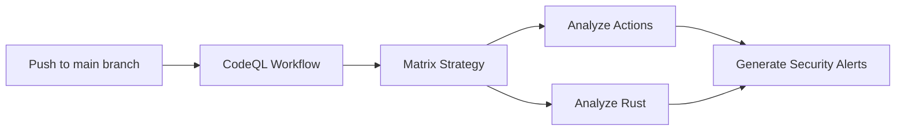

+++
title = "#20153 enable codeql analysis"
date = "2025-07-23T00:00:00"
draft = false
template = "pull_request_page.html"
in_search_index = true

[taxonomies]
list_display = ["show"]

[extra]
current_language = "en"
available_languages = {"en" = { name = "English", url = "/pull_request/bevy/2025-07/pr-20153-en-20250723" }, "zh-cn" = { name = "中文", url = "/pull_request/bevy/2025-07/pr-20153-zh-cn-20250723" }}
labels = ["C-Feature", "A-Build-System", "X-Blessed"]
+++

# Analysis of PR #20153: enable codeql analysis

## Basic Information
- **Title**: enable codeql analysis
- **PR Link**: https://github.com/bevyengine/bevy/pull/20153
- **Author**: mockersf
- **Status**: MERGED
- **Labels**: C-Feature, A-Build-System, S-Ready-For-Final-Review, X-Blessed
- **Created**: 2025-07-15T20:30:22Z
- **Merged**: 2025-07-23T18:20:31Z
- **Merged By**: alice-i-cecile

## Description Translation
# Objective

- CodeQL is now in public preview for Rust:
- https://github.blog/changelog/2025-06-30-codeql-support-for-rust-now-in-public-preview/
- https://github.blog/changelog/2025-07-02-codeql-2-22-1-bring-rust-support-to-public-preview/

## Solution

- Let's try it!

## The Story of This Pull Request

### The Problem and Context
The developer identified that GitHub recently added Rust support to CodeQL's public preview. CodeQL is GitHub's semantic code analysis engine that helps identify security vulnerabilities and code quality issues. Prior to this PR, Bevy lacked automated CodeQL analysis, meaning potential security issues or code quality problems in the Rust codebase weren't being systematically detected.

The timing was significant because Rust support was newly available (launched June-July 2025). Integrating CodeQL would provide an additional layer of automated code quality checking without requiring significant maintenance overhead since it uses GitHub's managed infrastructure.

### The Solution Approach
The solution implemented a minimal viable CodeQL integration using GitHub Actions. The approach was conservative:
1. Start with basic configuration using official GitHub templates
2. Enable only for `main` branch pushes initially (not PRs)
3. Analyze both Rust code and GitHub Actions workflows
4. Use default query sets without customizations
5. Skip build steps since they're unnecessary for Rust analysis

This phased approach allowed testing CodeQL integration with minimal impact on existing workflows. The commented-out sections for PR triggers and scheduled runs show consideration for future expansion once the initial implementation is validated.

### The Implementation
The implementation added a single new GitHub Actions workflow file. The configuration:
- Triggers on `main` branch pushes (with PR/schedule triggers commented out)
- Uses a matrix strategy to analyze both Actions and Rust code
- Sets minimal required permissions
- Uses `build-mode: none` since Rust doesn't require compilation for CodeQL analysis
- Follows GitHub's recommended setup for CodeQL initialization and analysis

The configuration includes clear documentation about:
- Runner size considerations
- Permission requirements
- How to handle manual build modes
- Query customization options

Key technical decisions:
- Using `ubuntu-latest` runners for efficiency
- Setting `fail-fast: false` to ensure both language analyses complete
- Including GitHub Actions workflow analysis to catch CI issues
- Adding detailed comments for future maintainers

### Technical Insights
The implementation demonstrates several sound engineering practices:
1. **Minimal Permissions**: The workflow requests only necessary permissions (`security-events: write`, `packages: read`, etc.)
2. **Failure Isolation**: `fail-fast: false` prevents one language's failure from blocking the other
3. **Commented Future Options**: Clear placeholders show how to enable PR analysis later
4. **Version Pinning**: Uses specific action versions (`@v3`, `@v4`) for stability
5. **Conditional Build Steps**: The manual build step only runs when needed

For Rust projects, the `build-mode: none` is appropriate because CodeQL can analyze Rust source code directly without compilation. This simplifies the configuration and reduces CI resource usage.

### The Impact
This change introduces automated code scanning that will:
1. Detect security vulnerabilities in Rust code
2. Identify common code quality issues
3. Analyze GitHub Actions workflows for best practices
4. Provide ongoing scanning as CodeQL's Rust support matures

The impact is low-risk since:
- It only adds a new workflow file
- Runs are limited to `main` branch pushes initially
- Doesn't affect existing CI pipelines
- Uses battle-tested GitHub Actions

The solution creates a foundation that can be expanded later by uncommenting the PR trigger or scheduled runs once the team verifies its stability.

## Visual Representation



## Key Files Changed

### File: .github/workflows/codeql.yml
Added a new CodeQL analysis workflow. This file didn't exist previously.

Key additions:
```yaml
name: "CodeQL"

on:
  push:
    branches: ["main"]
# Commented for now to test
#  pull_request:
#    branches: [ "main" ]
#  schedule:
#    - cron: '22 14 * * 4'

jobs:
  analyze:
    name: Analyze (${{ matrix.language }})
    runs-on: ${{ (matrix.language == 'swift' && 'macos-latest') || 'ubuntu-latest' }}
    permissions:
      security-events: write
      packages: read
      actions: read
      contents: read

    strategy:
      fail-fast: false
      matrix:
        include:
          - language: actions
            build-mode: none
          - language: rust
            build-mode: none
    steps:
      - name: Checkout repository
        uses: actions/checkout@v4

      - name: Initialize CodeQL
        uses: github/codeql-action/init@v3
        with:
          languages: ${{ matrix.language }}
          build-mode: ${{ matrix.build-mode }}

      - if: matrix.build-mode == 'manual'
        shell: bash
        run: |
          echo 'If you are using a "manual" build mode...'
          exit 1

      - name: Perform CodeQL Analysis
        uses: github/codeql-action/analyze@v3
        with:
          category: "/language:${{matrix.language}}"
```

## Further Reading
1. [CodeQL for Rust documentation](https://codeql.github.com/docs/codeql-language-guides/codeql-for-rust/)
2. [GitHub CodeQL Action documentation](https://github.com/github/codeql-action)
3. [Advanced CodeQL workflow configuration](https://docs.github.com/en/code-security/code-scanning/automatically-scanning-your-code-for-vulnerabilities-and-errors/configuring-code-scanning)
4. [Understanding CodeQL query results](https://codeql.github.com/docs/codeql-overview/about-codeql/)