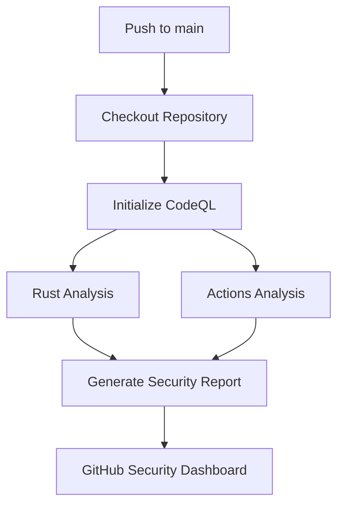

+++
title = "#20153 enable codeql analysis"
date = "2025-07-23T00:00:00"
draft = false
template = "pull_request_page.html"
in_search_index = false

[extra]
current_language = "zh-cn"
available_languages = {"en" = { name = "English", url = "/pull_request/bevy/2025-07/pr-20153-en-20250723" }, "zh-cn" = { name = "中文", url = "/pull_request/bevy/2025-07/pr-20153-zh-cn-20250723" }}
+++

## 技术分析报告：PR #20153 - enable codeql analysis

### 基本信息
- **标题**: enable codeql analysis
- **PR链接**: https://github.com/bevyengine/bevy/pull/20153
- **作者**: mockersf
- **状态**: 已合并
- **标签**: C-Feature, A-Build-System, S-Ready-For-Final-Review, X-Blessed
- **创建时间**: 2025-07-15T20:30:22Z
- **合并时间**: 2025-07-23T18:20:31Z
- **合并人**: alice-i-cecile

### 描述翻译
**目标**  
- CodeQL 现已进入 Rust 的公开预览阶段：  
  - https://github.blog/changelog/2025-06-30-codeql-support-for-rust-now-in-public-preview/  
  - https://github.blog/changelog/2025-07-02-codeql-2-22-1-bring-rust-support-to-public-preview/  

**解决方案**  
- 让我们尝试使用它！

### PR 技术分析

#### 背景与问题
CodeQL 是 GitHub 的静态代码分析工具，用于检测代码中的安全漏洞和代码质量问题。2025年6月，GitHub 正式宣布 CodeQL 支持 Rust 语言并进入公开预览阶段。对于 Bevy 这样的 Rust 游戏引擎项目，集成 CodeQL 可以：
1. 自动识别潜在的安全风险
2. 提高代码质量
3. 符合现代软件开发的最佳实践

项目当前缺乏自动化代码扫描能力，需要手动配置 CI 流程来接入 CodeQL 的新 Rust 支持功能。

#### 解决方案设计
开发者采用 GitHub Actions 工作流实现 CodeQL 集成，主要设计决策包括：
1. **触发策略**：初始阶段仅在 main 分支推送时启用（其他触发条件注释保留）
2. **语言支持**：同时配置 Rust 和 GitHub Actions 工作流扫描
3. **安全权限**：最小化权限集（security-events: write, packages: read）
4. **执行矩阵**：使用策略矩阵支持多语言分析

```yaml
strategy:
  fail-fast: false
  matrix:
    include:
      - language: actions
        build-mode: none
      - language: rust
        build-mode: none
```

#### 技术实现细节
核心实现是创建新的 GitHub Actions 工作流文件：
1. **初始化步骤**：使用 `github/codeql-action/init@v3` 配置扫描环境
2. **构建处理**：针对不同语言设置构建模式（当前均设为 none）
3. **分析执行**：通过 `github/codeql-action/analyze@v3` 执行实际扫描
4. **资源优化**：添加文档链接指导未来资源扩展

```yaml
- name: Perform CodeQL Analysis
  uses: github/codeql-action/analyze@v3
  with:
    category: "/language:${{matrix.language}}"
```

#### 技术考量
1. **渐进式启用**：通过注释掉 PR 触发和定时任务 (`schedule`)，降低初始风险
2. **跨平台支持**：使用条件运行环境确保跨平台兼容性
```yaml
runs-on: ${{ (matrix.language == 'swift' && 'macos-latest') || 'ubuntu-latest' }}
```
3. **扩展性设计**：保留自定义查询接口，便于未来添加特定规则集
4. **文档完整性**：包含官方资源链接，方便后续调优

#### 影响与价值
1. **安全提升**：为 Rust 代码库增加专业级静态分析
2. **质量门禁**：建立自动化代码质量检查机制
3. **维护成本**：接近零维护的自动化工作流
4. **演进基础**：保留的注释部分提供清晰演进路径

### 可视化工作流


### 关键文件变更

**.github/workflows/codeql.yml**  
新增 CodeQL 分析工作流配置

```yaml
name: "CodeQL"

on:
  push:
    branches: ["main"]
# Commented for now to test
#  pull_request:
#    branches: [ "main" ]
#  schedule:
#    - cron: '22 14 * * 4'

jobs:
  analyze:
    name: Analyze (${{ matrix.language }})
    runs-on: ${{ (matrix.language == 'swift' && 'macos-latest') || 'ubuntu-latest' }}
    permissions:
      security-events: write
      packages: read
      actions: read
      contents: read

    strategy:
      fail-fast: false
      matrix:
        include:
          - language: actions
            build-mode: none
          - language: rust
            build-mode: none
    steps:
      - name: Checkout repository
        uses: actions/checkout@v4

      - name: Initialize CodeQL
        uses: github/codeql-action/init@v3
        with:
          languages: ${{ matrix.language }}
          build-mode: ${{ matrix.build-mode }}

      - name: Perform CodeQL Analysis
        uses: github/codeql-action/analyze@v3
        with:
          category: "/language:${{matrix.language}}"
```

### 延伸阅读
1. [CodeQL Rust 分析官方文档](https://codeql.github.com/docs/codeql-language-guides/codeql-for-rust/)
2. [GitHub Actions 工作流语法](https://docs.github.com/en/actions/using-workflows/workflow-syntax-for-github-actions)
3. [代码扫描高级配置](https://docs.github.com/en/code-security/code-scanning/automatically-scanning-your-code-for-vulnerabilities-and-errors/configuring-code-scanning)
4. [Rust 安全编程指南](https://rust-lang.github.io/rust-clippy/master/index.html)