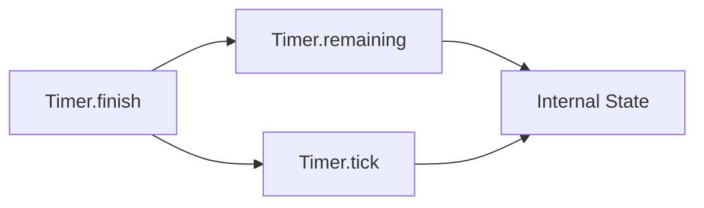

+++
title = "#20154 Added finish method for timer"
date = "2025-07-15T00:00:00"
draft = false
template = "pull_request_page.html"
in_search_index = true

[taxonomies]
list_display = ["show"]

[extra]
current_language = "en"
available_languages = {"en" = { name = "English", url = "/pull_request/bevy/2025-07/pr-20154-en-20250715" }, "zh-cn" = { name = "中文", url = "/pull_request/bevy/2025-07/pr-20154-zh-cn-20250715" }}
labels = ["D-Trivial", "A-Time"]
+++

## Added finish method for timer

### Basic Information
- **Title**: Added finish method for timer
- **PR Link**: https://github.com/bevyengine/bevy/pull/20154
- **Author**: Lenchog
- **Status**: MERGED
- **Labels**: D-Trivial, S-Ready-For-Final-Review, A-Time
- **Created**: 2025-07-15T22:14:11Z
- **Merged**: 2025-07-15T23:18:54Z
- **Merged By**: alice-i-cecile

### Description Translation
# Objective

- Add an easy way to finish a Timer

## Solution

- Tick the timer by the remaining time

## Testing

I have not tested, but it should work

---

## Showcase

```rust
let mut timer = Timer::from_seconds(1.5, TimerMode::Once);
timer.finish();
assert_eq!(timer.remaining(), Duration::from_secs(0))
```

### The Story of This Pull Request

#### Problem and Context
The `Timer` struct in Bevy's time module lacked a direct method to immediately complete its countdown. Previously, developers needed to manually calculate and apply the remaining duration to force completion:

```rust
let mut timer = Timer::from_seconds(1.5, TimerMode::Once);
let remaining = timer.remaining();
timer.tick(remaining);
```

This approach required two separate operations and explicit duration handling, adding unnecessary complexity for a common operation. The absence of a dedicated method made timer completion less intuitive than it could be, especially for developers new to Bevy's API.

#### Solution Approach
The solution implements a straightforward `finish()` method that advances the timer by its exact remaining duration in a single operation. This approach leverages existing `tick()` functionality while maintaining the Timer's internal state consistency. Key engineering decisions include:
- Reusing the battle-tested `tick()` method to ensure state transitions remain correct
- Maintaining the existing panic behavior for overflow scenarios
- Implementing as an `#[inline]` function for zero-cost abstraction

#### Implementation
The implementation adds a concise method that calculates the remaining duration and immediately ticks the timer by that amount:

```rust
#[inline]
pub fn finish(&mut self) {
    let remaining = self.remaining();
    self.tick(remaining);
}
```

This design efficiently combines two existing operations:
1. `remaining()` calculates time left
2. `tick()` advances timer state

The method preserves all existing timer behaviors including:
- Proper handling of `TimerMode` (Once/Repeating)
- Maintaining `finished` state
- Correctly updating `elapsed` and `times_finished_this_tick` values

#### Technical Insights
The implementation demonstrates effective API design by:
1. Building on existing primitives (`tick()` and `remaining()`)
2. Avoiding state duplication
3. Maintaining panic safety boundaries
4. Providing clear documentation with usage examples

The inline directive ensures no performance penalty versus manual implementation. The method handles all timer modes consistently - for repeating timers, `finish()` completes the current cycle without affecting future repetitions.

#### Impact
This change improves developer experience by:
- Reducing completion from two operations to one
- Eliminating manual duration calculations
- Providing self-documenting API semantics
- Maintaining backward compatibility

The change is particularly valuable in game logic scenarios where timers often need immediate completion due to player actions or state transitions.

### Visual Representation



### Key Files Changed

1. `crates/bevy_time/src/timer.rs` (+15/-0)  
   Added `finish()` method to Timer implementation

```rust
// File: crates/bevy_time/src/timer.rs
// Before: No finish method existed

// After:
/// Finishes the timer.
///
/// # Examples
/// ```
/// # use bevy_time::*;
/// let mut timer = Timer::from_seconds(1.5, TimerMode::Once);
/// timer.finish();
/// assert!(timer.finished());
/// ```
#[inline]
pub fn finish(&mut self) {
    let remaining = self.remaining();
    self.tick(remaining);
}
```

### Further Reading
1. [Bevy Time Module Documentation](https://docs.rs/bevy_time/latest/bevy_time/)
2. [Timer Struct Reference](https://docs.rs/bevy_time/latest/bevy_time/struct.Timer.html)
3. [Rust Inline Attribute](https://doc.rust-lang.org/reference/attributes/codegen.html#the-inline-attribute)

### Full Code Diff
```diff
diff --git a/crates/bevy_time/src/timer.rs b/crates/bevy_time/src/timer.rs
index a283511c2000d..2eb48503bda20 100644
--- a/crates/bevy_time/src/timer.rs
+++ b/crates/bevy_time/src/timer.rs
@@ -220,6 +220,21 @@ impl Timer {
         self.duration = duration;
     }
 
+    /// Finishes the timer.
+    ///
+    /// # Examples
+    /// ```
+    /// # use bevy_time::*;
+    /// let mut timer = Timer::from_seconds(1.5, TimerMode::Once);
+    /// timer.finish();
+    /// assert!(timer.finished());
+    /// ```
+    #[inline]
+    pub fn finish(&mut self) {
+        let remaining = self.remaining();
+        self.tick(remaining);
+    }
+
     /// Returns the mode of the timer.
     ///
     /// # Examples
```