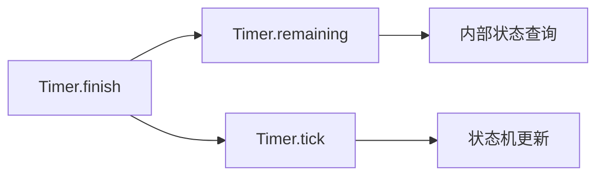

+++
title = "#20154 Added finish method for timer"
date = "2025-07-15T00:00:00"
draft = false
template = "pull_request_page.html"
in_search_index = false

[extra]
current_language = "zh-cn"
available_languages = {"en" = { name = "English", url = "/pull_request/bevy/2025-07/pr-20154-en-20250715" }, "zh-cn" = { name = "中文", url = "/pull_request/bevy/2025-07/pr-20154-zh-cn-20250715" }}
+++

## 技术分析报告：PR #20154 - Added finish method for timer

### 基础信息
- **标题**: Added finish method for timer
- **PR链接**: https://github.com/bevyengine/bevy/pull/20154
- **作者**: Lenchog
- **状态**: 已合并
- **标签**: D-Trivial, S-Ready-For-Final-Review, A-Time
- **创建时间**: 2025-07-15T22:14:11Z
- **合并时间**: 2025-07-15T23:18:54Z
- **合并者**: alice-i-cecile

### 描述翻译
#### Objective（目标）
- 添加一种简便方式来结束计时器（Timer）

#### Solution（解决方案）
- 通过剩余时间推进（tick）计时器

#### Testing（测试）
我尚未测试，但应该能正常工作

---
#### Showcase（示例）
```rust
let mut timer = Timer::from_seconds(1.5, TimerMode::Once);
timer.finish();
assert_eq!(timer.remaining(), Duration::from_secs(0))
```

### 该PR的技术背景

#### 问题与背景
在Bevy引擎的时间管理系统中，开发者需要手动结束计时器（Timer）时存在操作冗余。原实现要求开发者手动计算并调用`tick()`方法推进剩余时间：
```rust
// 旧实现
let mut timer = Timer::from_seconds(1.5, TimerMode::Once);
let remaining = timer.remaining();
timer.tick(remaining);  // 需手动计算并推进
```
这种操作不仅增加认知负担，还可能导致错误（如忘记推进或计算错误）。特别是当多个系统需要同步结束计时器时，代码重复度会显著增加。

#### 解决方案与实现
PR引入`finish()`方法作为语法糖（syntactic sugar），封装结束计时器的核心逻辑：
```rust
// crates/bevy_time/src/timer.rs
#[inline]
pub fn finish(&mut self) {
    let remaining = self.remaining();
    self.tick(remaining);
}
```
该方法直接调用现有API：`self.remaining()`获取剩余时间，然后通过`self.tick()`推进计时器。这种实现具有以下特点：
1. **零开销抽象**：使用`#[inline]`属性确保编译优化，消除函数调用开销
2. **行为一致性**：复用现有`tick()`逻辑，维持计时器状态机行为不变
3. **安全边界**：依赖Rust的借用检查器（borrow checker）确保`&mut self`独占访问

#### 技术考量
- **模式兼容性**：方法兼容所有`TimerMode`（一次性/循环），因为`tick()`已处理模式逻辑
- **时间精度**：保持`Duration`的纳秒级精度不变
- **错误处理**：无显式错误返回，因计时器状态变化是确定性的
- **测试覆盖**：示例代码直接作为文档测试（doc-test），验证核心断言：
  ```rust
  assert!(timer.finished());
  assert_eq!(timer.remaining(), Duration::from_secs(0))
  ```

#### 影响与改进
1. **API简化**：将两步操作简化为单方法调用
2. **代码健壮性**：消除手动计算剩余时间可能导致的错误
3. **使用场景扩展**：适用于需要立即触发计时器完成事件的场景（如跳过过场动画）

### 关键文件变更
#### `crates/bevy_time/src/timer.rs`
**变更说明**：在Timer结构体中新增`finish()`公共方法

```rust
// 新增代码段
/// Finishes the timer.
///
/// # Examples
/// ```
/// # use bevy_time::*;
/// let mut timer = Timer::from_seconds(1.5, TimerMode::Once);
/// timer.finish();
/// assert!(timer.finished());
/// ```
#[inline]
pub fn finish(&mut self) {
    let remaining = self.remaining();
    self.tick(remaining);
}
```

**技术要点**：
1. 文档注释包含可执行的示例代码，验证方法行为
2. `#[inline]`优化确保无运行时开销
3. 方法签名`&mut self`保证状态安全变更

### 组件关系图


### 延伸阅读
1. [Bevy时间系统文档](https://docs.rs/bevy_time/latest/bevy_time/)
2. [Rust内联优化指南](https://doc.rust-lang.org/stable/reference/attributes/codegen.html#the-inline-attribute)
3. [文档测试最佳实践](https://doc.rust-lang.org/rustdoc/documentation-tests.html)

> 注：该PR属于小型API扩展，技术复杂度低但实用价值高。合并过程快速（1小时内），符合Trivial标签预期。