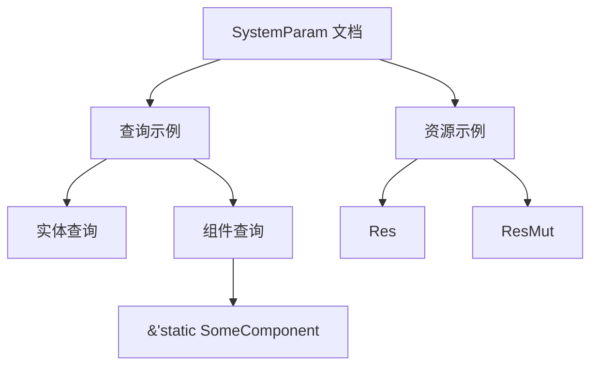

+++
title = "#20157 Documentation improvement system_param.rs"
date = "2025-07-16T00:00:00"
draft = false
template = "pull_request_page.html"
in_search_index = false

[extra]
current_language = "zh-cn"
available_languages = {"en" = { name = "English", url = "/pull_request/bevy/2025-07/pr-20157-en-20250716" }, "zh-cn" = { name = "中文", url = "/pull_request/bevy/2025-07/pr-20157-zh-cn-20250716" }}
labels = ["C-Docs", "D-Trivial", "A-ECS"]
+++

# Documentation improvement system_param.rs

## Basic Information
- **Title**: Documentation improvement system_param.rs
- **PR Link**: https://github.com/bevyengine/bevy/pull/20157
- **Author**: tomaspecl
- **Status**: MERGED
- **Labels**: C-Docs, D-Trivial, A-ECS, S-Ready-For-Final-Review
- **Created**: 2025-07-16T02:19:11Z
- **Merged**: 2025-07-16T18:18:02Z
- **Merged By**: mockersf

## Description Translation
### 目标
改进 SystemParam 派生部分的文档，使其说明如何将 `Query<&SomeComponent>` 作为 SystemParam 用于需要 `#[derive(SystemParam)]` 的结构体。

### 解决方案
添加了相关文档

---

### 展示
原文档：
```rust
Query<'w, 's, Entity>,
Res<'w, SomeResource>,
ResMut<'w, SomeOtherResource>,
Local<'s, u8>,
Commands<'w, 's>,
EventReader<'w, 's, SomeEvent>,
EventWriter<'w, SomeEvent>
```
新文档：
```rust
Query<'w, 's, Entity>,
Query<'w, 's, &'static SomeComponent>,  <================== 新增内容
Res<'w, SomeResource>,
ResMut<'w, SomeOtherResource>,
Local<'s, u8>,
Commands<'w, 's>,
EventReader<'w, 's, SomeEvent>,
EventWriter<'w, SomeEvent>
```

## The Story of This Pull Request

### 问题背景
在 Bevy ECS 中，`SystemParam` trait 是定义系统参数的核心机制。开发者使用 `#[derive(SystemParam)]` 创建自定义参数结构体时，需要参考文档中的示例来正确实现。原始文档中的示例展示了常见参数类型如 `Query<Entity>`、`Res` 和 `Commands`，但缺少了组件查询的关键示例——如何将 `Query<&SomeComponent>` 作为系统参数使用。这种缺失可能导致开发者困惑，不清楚如何在自定义参数结构体中包含组件查询。

### 解决方案
解决方案直接明了：在现有文档示例中添加一行组件查询的用法演示。具体是在示例结构体中新增一个字段：
```rust
Query<'w, 's, &'static SomeComponent>,
```
这个新增行展示了正确的语法和用法模式，与现有示例保持一致的风格。修改保留了所有原始示例内容，只增加了缺失的组件查询用例。

### 技术实现
实现集中在 `system_param.rs` 文件的文档注释中。修改前后对比显示，主要变化是在参数结构体示例中添加了组件查询字段：

```diff
// File: crates/bevy_ecs/src/system/system_param.rs
@@ -55,6 +55,8 @@ use variadics_please::{all_tuples, all_tuples_enumerated};
 ///
 /// ```
 /// # use bevy_ecs::prelude::*;
+/// # #[derive(Component)]
+/// # struct SomeComponent;
 /// # #[derive(Resource)]
 /// # struct SomeResource;
 /// # #[derive(BufferedEvent)]
@@ -66,6 +68,8 @@ use variadics_please::{all_tuples, all_tuples_enumerated};
 /// # struct ParamsExample<'w, 's> {
 /// #    query:
 /// Query<'w, 's, Entity>,
+/// #    query2:
+/// Query<'w, 's, &'static SomeComponent>,
 /// #    res:
 /// Res<'w, SomeResource>,
```

关键修改点：
1. 添加了 `SomeComponent` 的组件派生占位符，使示例完整可编译
2. 新增 `query2` 字段展示 `&'static SomeComponent` 的查询语法
3. 保留了原有文档结构，确保修改无缝集成

### 影响与价值
这个文档改进虽然代码改动量小，但解决了开发者实际使用中的痛点：
1. 明确了组件查询作为系统参数的用法模式
2. 通过具体示例展示了正确的生命周期参数(`'w`, `'s`)和静态引用语法
3. 保持了文档示例的完整性，覆盖了 ECS 核心参数类型
4. 帮助开发者避免因文档缺失而产生的实现错误

对于 Bevy 这样的 ECS 框架，清晰的文档对降低学习曲线至关重要。这类文档改进直接影响开发者的生产力，特别是对新用户理解系统参数的设计模式有帮助。

## Visual Representation



## Key Files Changed

### crates/bevy_ecs/src/system/system_param.rs
**修改说明**：在 SystemParam 的文档示例中添加组件查询用例  
**关键变更**：
```diff
// 修改前
# use bevy_ecs::prelude::*;
# #[derive(Resource)]
# struct SomeResource;

struct ParamsExample<'w, 's> {
   query: Query<'w, 's, Entity>,
   res: Res<'w, SomeResource>,
}

// 修改后
# use bevy_ecs::prelude::*;
# #[derive(Component)]  // 新增
# struct SomeComponent;  // 新增
# #[derive(Resource)]
# struct SomeResource;

struct ParamsExample<'w, 's> {
   query: Query<'w, 's, Entity>,
   query2: Query<'w, 's, &'static SomeComponent>,  // 新增
   res: Res<'w, SomeResource>,
}
```
**关系说明**：这个修改直接实现了 PR 的目标——通过具体示例展示如何在 SystemParam 结构体中使用组件查询。

## Further Reading
1. [Bevy ECS SystemParam 官方文档](https://docs.rs/bevy_ecs/latest/bevy_ecs/system/trait.SystemParam.html)
2. [Bevy 查询系统指南](https://bevy-cheatbook.github.io/programming/queries.html)
3. [Rust 生命周期注解指南](https://doc.rust-lang.org/book/ch10-03-lifetime-syntax.html)