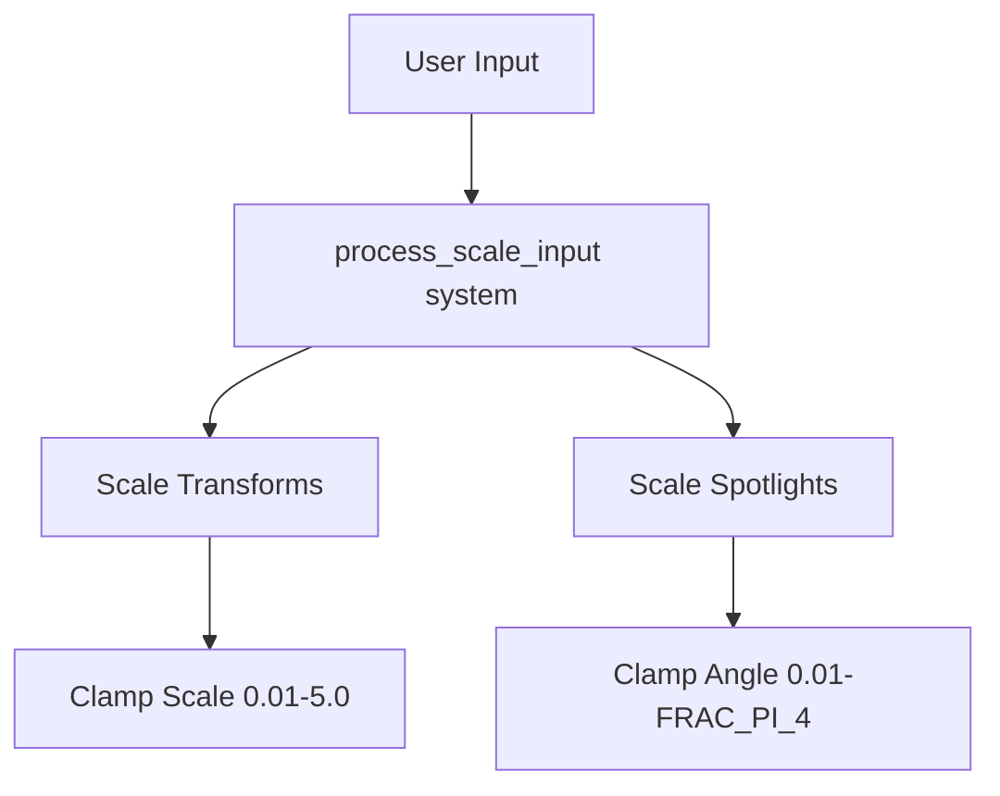

+++
title = "#20161 fix crash in light textures example"
date = "2025-07-16T00:00:00"
draft = false
template = "pull_request_page.html"
in_search_index = true

[taxonomies]
list_display = ["show"]

[extra]
current_language = "en"
available_languages = {"en" = { name = "English", url = "/pull_request/bevy/2025-07/pr-20161-en-20250716" }, "zh-cn" = { name = "中文", url = "/pull_request/bevy/2025-07/pr-20161-zh-cn-20250716" }}
labels = ["C-Bug", "D-Trivial", "A-Rendering", "C-Examples"]
+++

# Pull Request Analysis: fix crash in light textures example

## Basic Information
- **Title**: fix crash in light textures example
- **PR Link**: https://github.com/bevyengine/bevy/pull/20161
- **Author**: robtfm
- **Status**: MERGED
- **Labels**: C-Bug, D-Trivial, A-Rendering, C-Examples, S-Ready-For-Final-Review
- **Created**: 2025-07-16T11:11:50Z
- **Merged**: 2025-07-16T17:05:16Z
- **Merged By**: alice-i-cecile

## Description Translation
# Objective
scaling the point light to zero caused a crash

## Solution
clamp the scale for all the lights

## The Story of This Pull Request

The issue surfaced when users scaled point lights to zero in the `light_textures` example, causing the application to crash. This happened because the rendering system couldn't handle zero-scale lights, which led to invalid mathematical operations like division by zero during light intensity calculations.

The solution required adding bounds checking to prevent lights from reaching invalid scale values. Instead of modifying core engine components, the fix focused on the example code where the crash occurred. This approach maintained the principle of keeping examples robust while avoiding unnecessary complexity in core systems.

For the implementation, we added clamping operations in the input processing system. When scaling lights, we now ensure:
1. Transform scales can't fall below 0.01 or exceed 5.0
2. Spotlight angles stay within 0.01 radians to π/4 (FRAC_PI_4)

These specific thresholds were chosen because:
- 0.01 provides a safe minimum that prevents zero values while remaining visually negligible
- 5.0 sets a reasonable maximum to prevent excessively large lights
- π/4 maintains physically plausible spotlight angles

The changes maintain the original proportional scaling behavior while adding safety checks. This approach fixed the crash without altering the example's core functionality or requiring significant architectural changes. The solution demonstrates good defensive programming practices for handling user input, especially in interactive examples where invalid inputs should be gracefully handled rather than causing crashes.

## Visual Representation



## Key Files Changed

### `examples/3d/light_textures.rs`

**Changes**: Added value clamping to prevent zero-scale lights that caused crashes

**Code Snippets**:

Before (vulnerable to zero scales):
```rust
for (mut transform, selection) in &mut scale_selections {
    if app_status.selection == *selection {
        transform.scale *= 1.0 + mouse_motion.delta.x * SCALE_SPEED;
    }
}

for (mut spotlight, selection) in &mut spotlight_selections {
    if app_status.selection == *selection {
        spotlight.outer_angle =
            (spotlight.outer_angle * (1.0 + mouse_motion.delta.x * SCALE_SPEED)).min(FRAC_PI_4);
        spotlight.inner_angle = spotlight.outer_angle;
    }
}
```

After (with safe clamping):
```rust
for (mut transform, selection) in &mut scale_selections {
    if app_status.selection == *selection {
        transform.scale = (transform.scale * (1.0 + mouse_motion.delta.x * SCALE_SPEED))
            .clamp(Vec3::splat(0.01), Vec3::splat(5.0));
    }
}

for (mut spotlight, selection) in &mut spotlight_selections {
    if app_status.selection == *selection {
        spotlight.outer_angle = (spotlight.outer_angle
            * (1.0 + mouse_motion.delta.x * SCALE_SPEED))
            .clamp(0.01, FRAC_PI_4);
        spotlight.inner_angle = spotlight.outer_angle;
    }
}
```

**Relation to PR**: These changes directly implement the solution by preventing invalid scale values through clamping.

## Further Reading
1. Bevy Transform documentation: https://docs.rs/bevy/latest/bevy/transform/components/struct.Transform.html
2. Bevy Spotlight documentation: https://docs.rs/bevy/latest/bevy/pbr/struct.SpotLight.html
3. Floating-point precision considerations: https://randomascii.wordpress.com/2012/02/25/comparing-floating-point-numbers-2012-edition/

## Full Code Diff
```diff
diff --git a/examples/3d/light_textures.rs b/examples/3d/light_textures.rs
index c7cfb86f88b4e..743f3b152e69a 100644
--- a/examples/3d/light_textures.rs
+++ b/examples/3d/light_textures.rs
@@ -540,14 +540,16 @@ fn process_scale_input(
 
     for (mut transform, selection) in &mut scale_selections {
         if app_status.selection == *selection {
-            transform.scale *= 1.0 + mouse_motion.delta.x * SCALE_SPEED;
+            transform.scale = (transform.scale * (1.0 + mouse_motion.delta.x * SCALE_SPEED))
+                .clamp(Vec3::splat(0.01), Vec3::splat(5.0));
         }
     }
 
     for (mut spotlight, selection) in &mut spotlight_selections {
         if app_status.selection == *selection {
-            spotlight.outer_angle =
-                (spotlight.outer_angle * (1.0 + mouse_motion.delta.x * SCALE_SPEED)).min(FRAC_PI_4);
+            spotlight.outer_angle = (spotlight.outer_angle
+                * (1.0 + mouse_motion.delta.x * SCALE_SPEED))
+                .clamp(0.01, FRAC_PI_4);
             spotlight.inner_angle = spotlight.outer_angle;
         }
     }
```