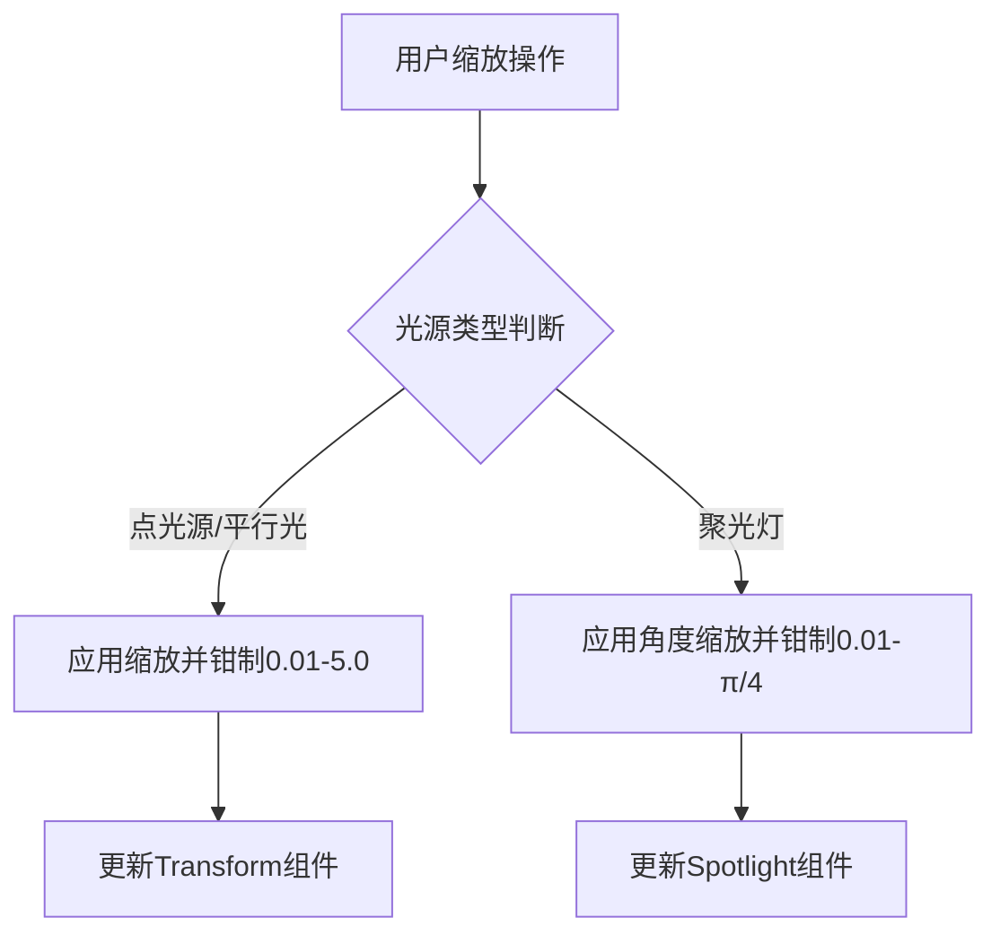

+++
title = "#20161 fix crash in light textures example"
date = "2025-07-16T00:00:00"
draft = false
template = "pull_request_page.html"
in_search_index = false

[extra]
current_language = "zh-cn"
available_languages = {"en" = { name = "English", url = "/pull_request/bevy/2025-07/pr-20161-en-20250716" }, "zh-cn" = { name = "中文", url = "/pull_request/bevy/2025-07/pr-20161-zh-cn-20250716" }}
+++

# 修复光照纹理示例中的崩溃问题

## 基础信息
- **标题**: fix crash in light textures example
- **PR链接**: https://github.com/bevyengine/bevy/pull/20161
- **作者**: robtfm
- **状态**: 已合并
- **标签**: C-Bug, D-Trivial, A-Rendering, C-Examples, S-Ready-For-Final-Review
- **创建时间**: 2025-07-16T11:11:50Z
- **合并时间**: 2025-07-16T17:05:16Z
- **合并人**: alice-i-cecile

## 描述翻译
### 目标
将点光源(point light)缩放至零导致崩溃

### 解决方案
为所有光源的缩放值添加了钳制(clamp)操作

## 这个PR的故事

### 问题背景
在Bevy引擎的`light_textures`示例中，用户可以通过鼠标交互调整光源的缩放比例。但当用户将点光源缩放至零时，程序会发生崩溃。这个问题源于光照系统无法处理零缩放值，导致数学运算错误（如除以零）。虽然这只是示例代码，但它展示了潜在的不健壮实现，可能影响用户的学习体验。

### 解决方案方法
修复方案直接有效：对所有光源类型的缩放操作添加数值钳制(clamp)逻辑。核心思路是：
1. 为点光源/平行光(directional light)的缩放变换(scale transform)设置最小阈值0.01
2. 为聚光灯(spotlight)的外角(outer angle)设置最小阈值0.01弧度
3. 保留原有的上限约束(5.0缩放值和π/4外角)

选择0.01作为下限是因为它足够小以模拟"接近零"的效果，同时避免实际为零的情况。这种处理方式遵循防御性编程(defensive programming)原则，确保数值始终在安全范围内。

### 具体实现
修改集中在`light_textures.rs`文件中的两个函数区块：

1. **点光源/平行光缩放处理**：
   原始实现直接应用缩放因子，可能导致缩放值为零：
   ```rust
   transform.scale *= 1.0 + mouse_motion.delta.x * SCALE_SPEED;
   ```
   修改后使用`clamp`确保缩放值不低于0.01：
   ```rust
   transform.scale = (transform.scale * (1.0 + mouse_motion.delta.x * SCALE_SPEED))
       .clamp(Vec3::splat(0.01), Vec3::splat(5.0));
   ```
   `Vec3::splat(0.01)`创建三维向量，确保所有分量都被约束

2. **聚光灯外角处理**：
   原始代码仅约束上限：
   ```rust
   spotlight.outer_angle =
       (spotlight.outer_angle * (1.0 + mouse_motion.delta.x * SCALE_SPEED)).min(FRAC_PI_4);
   ```
   修改后添加下限约束：
   ```rust
   spotlight.outer_angle = (spotlight.outer_angle
       * (1.0 + mouse_motion.delta.x * SCALE_SPEED))
       .clamp(0.01, FRAC_PI_4);
   ```
   保留`inner_angle = outer_angle`的关联逻辑

### 技术考量
关键决策点：
- **使用`clamp`替代条件判断**：比手动if-check更简洁且避免分支
- **统一处理所有光源类型**：点光源和聚光灯都获得相同保护
- **最小侵入式修改**：保持原有代码结构，仅包装缩放计算
- **合理阈值选择**：0.01在视觉上接近零但数学上安全

### 影响分析
1. 消除缩放至零导致的崩溃
2. 提升示例代码的健壮性(robustness)
3. 展示正确处理用户输入的最佳实践
4. 保持原有交互体验，用户几乎感知不到约束存在

## 可视化表示


## 关键文件变更
- `examples/3d/light_textures.rs` (+5/-3)

### 变更描述
修改光照纹理示例中的缩放处理逻辑，添加数值钳制避免零值

#### 点光源/平行光修改
```rust
// 修改前:
transform.scale *= 1.0 + mouse_motion.delta.x * SCALE_SPEED;

// 修改后:
transform.scale = (transform.scale * (1.0 + mouse_motion.delta.x * SCALE_SPEED))
    .clamp(Vec3::splat(0.01), Vec3::splat(5.0));
```

#### 聚光灯修改
```rust
// 修改前:
spotlight.outer_angle =
    (spotlight.outer_angle * (1.0 + mouse_motion.delta.x * SCALE_SPEED)).min(FRAC_PI_4);

// 修改后:
spotlight.outer_angle = (spotlight.outer_angle
    * (1.0 + mouse_motion.delta.x * SCALE_SPEED))
    .clamp(0.01, FRAC_PI_4);
```

## 延伸阅读
1. Rust数值钳制文档: https://doc.rust-lang.org/std/primitive.f32.html#method.clamp
2. Bevy光照系统指南: https://bevyengine.org/learn/book/introduction/
3. 防御性编程技巧: https://en.wikipedia.org/wiki/Defensive_programming

## 完整代码差异
```diff
diff --git a/examples/3d/light_textures.rs b/examples/3d/light_textures.rs
index c7cfb86f88b4e..743f3b152e69a 100644
--- a/examples/3d/light_textures.rs
+++ b/examples/3d/light_textures.rs
@@ -540,14 +540,16 @@ fn process_scale_input(
 
     for (mut transform, selection) in &mut scale_selections {
         if app_status.selection == *selection {
-            transform.scale *= 1.0 + mouse_motion.delta.x * SCALE_SPEED;
+            transform.scale = (transform.scale * (1.0 + mouse_motion.delta.x * SCALE_SPEED))
+                .clamp(Vec3::splat(0.01), Vec3::splat(5.0));
         }
     }
 
     for (mut spotlight, selection) in &mut spotlight_selections {
         if app_status.selection == *selection {
-            spotlight.outer_angle =
-                (spotlight.outer_angle * (1.0 + mouse_motion.delta.x * SCALE_SPEED)).min(FRAC_PI_4);
+            spotlight.outer_angle = (spotlight.outer_angle
+                * (1.0 + mouse_motion.delta.x * SCALE_SPEED))
+                .clamp(0.01, FRAC_PI_4);
             spotlight.inner_angle = spotlight.outer_angle;
         }
     }
```