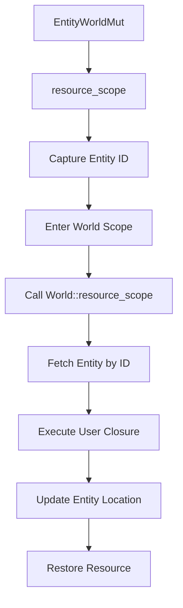

+++
title = "#20162 Add `EntityWorldMut::(try_)resource_scope`"
date = "2025-07-16T00:00:00"
draft = false
template = "pull_request_page.html"
in_search_index = true

[taxonomies]
list_display = ["show"]

[extra]
current_language = "en"
available_languages = {"en" = { name = "English", url = "/pull_request/bevy/2025-07/pr-20162-en-20250716" }, "zh-cn" = { name = "中文", url = "/pull_request/bevy/2025-07/pr-20162-zh-cn-20250716" }}
labels = ["A-ECS", "C-Code-Quality", "C-Usability", "D-Straightforward"]
+++

# Technical Analysis: Add `EntityWorldMut::(try_)resource_scope`

## Basic Information
- **Title**: Add `EntityWorldMut::(try_)resource_scope`
- **PR Link**: https://github.com/bevyengine/bevy/pull/20162
- **Author**: BigWingBeat
- **Status**: MERGED
- **Labels**: A-ECS, C-Code-Quality, C-Usability, S-Ready-For-Final-Review, X-Uncontroversial, D-Straightforward
- **Created**: 2025-07-16T13:44:27Z
- **Merged**: 2025-07-16T17:57:13Z
- **Merged By**: alice-i-cecile

## Description Translation
# Objective

Fixes #20139

## Solution

Implement the methods, and leverage them where applicable

## Testing

Added unit tests

---

## Showcase

```rust
let id = entity_world_mut.id();
let world = entity_world_mut.into_world_mut();
world.resource_scope::<_, _>(|world, res| {
    let entity_world_mut = world.entity_mut(id);
    /* ... */
});
```

becomes

```rust
entity_world_mut.resource_scope::<_, _>(|entity, res| {
    /* ... */
});
```

## The Story of This Pull Request

### The Problem and Context
Working with Bevy's ECS often requires simultaneously accessing an entity and a resource. Previously, developers had to manually:
1. Get the entity's ID
2. Access the world
3. Use `world.resource_scope`
4. Re-fetch the entity inside the closure

This pattern was verbose and error-prone:

```rust
let id = entity_world_mut.id();
let world = entity_world_mut.into_world_mut();
world.resource_scope::<_, _>(|world, res| {
    let entity_world_mut = world.entity_mut(id);  // Manual re-fetch
    /* ... */
});
```

The core challenges were:
1. Boilerplate code for a common operation
2. Potential errors in entity re-fetching
3. Manual handling of entity location updates after structural changes

### The Solution Approach
We introduced `resource_scope` and `try_resource_scope` directly on `EntityWorldMut`. The key design decisions were:
1. Maintain the existing safety guarantees of `world.resource_scope`
2. Automatically handle entity re-fetching after potential archetype moves
3. Provide panic-safe location updates
4. Maintain consistent API patterns with existing methods

The implementation leverages:
1. `world_scope` for safe world access
2. Automatic entity location updating
3. The existing resource scoping mechanism

### The Implementation
The core implementation adds two methods to `EntityWorldMut`:

```rust
// crates/bevy_ecs/src/world/entity_ref.rs
pub fn resource_scope<R: Resource, U>(
    &mut self,
    f: impl FnOnce(&mut EntityWorldMut, Mut<R>) -> U,
) -> U {
    let id = self.id();
    self.world_scope(|world| {
        world.resource_scope(|world, res| {
            let mut this = world.entity_mut(id);
            f(&mut this, res)
        })
    })
}

pub fn try_resource_scope<R: Resource, U>(
    &mut self,
    f: impl FnOnce(&mut EntityWorldMut, Mut<R>) -> U,
) -> Option<U> {
    let id = self.id();
    self.world_scope(|world| {
        world.try_resource_scope(|world, res| {
            let mut this = world.entity_mut(id);
            f(&mut this, res)
        })
    })
}
```

Key aspects:
1. `world_scope` ensures proper change detection and location updating
2. The entity is re-fetched inside the closure to handle potential archetype moves
3. Error handling mirrors `World::try_resource_scope`

### Refactoring Existing Code
The PR updates multiple locations to use the new methods, simplifying complex nested scopes:

```rust
// BEFORE in crates/bevy_ecs/src/reflect/entity_commands.rs
self.world_scope(|world| {
    world.resource_scope(|world, registry: Mut<AppTypeRegistry>| {
        let type_registry = &registry.as_ref().read();
        insert_reflect_with_registry_ref(world, entity_id, type_registry, component);
    });
    world.flush();
});

// AFTER
self.resource_scope(|entity, registry: Mut<AppTypeRegistry>| {
    let type_registry = &registry.as_ref().read();
    insert_reflect_with_registry_ref(entity, type_registry, component);
});
```

### Technical Insights
1. **Entity Location Safety**: The implementation ensures proper entity location updating even during panics through `world_scope`'s drop guard
2. **API Consistency**: Matches existing patterns like `EntityWorldMut::world_scope`
3. **Error Propagation**: `try_resource_scope` cleanly handles missing resources
4. **Helper Function Updates**: Reflection helpers now accept `&mut EntityWorldMut` instead of separate `World` + `Entity` parameters

### The Impact
1. **Reduced Boilerplate**: Common patterns now require fewer lines of code
2. **Improved Readability**: Removes nested scopes and manual ID handling
3. **Safer Entity Access**: Automatic re-fetching prevents stale entity references
4. **Consistent API**: Extends the `EntityWorldMut` interface naturally
5. **Panic Safety**: Maintains entity location consistency even during failures

## Visual Representation



## Key Files Changed

1. **crates/bevy_ecs/src/world/entity_ref.rs** (+106/-3)
   - Added `resource_scope` and `try_resource_scope` methods
   - Implemented panic safety tests

```rust
// Key addition:
pub fn resource_scope<R: Resource, U>(
    &mut self,
    f: impl FnOnce(&mut EntityWorldMut, Mut<R>) -> U,
) -> U {
    let id = self.id();
    self.world_scope(|world| {
        world.resource_scope(|world, res| {
            let mut this = world.entity_mut(id);
            f(&mut this, res)
        })
    })
}

// Panic safety test:
#[test]
fn entity_mut_resource_scope_panic() {
    let mut world = World::new();
    world.insert_resource(R(0));
    let mut entity = world.spawn_empty();
    let result = std::panic::catch_unwind(|| {
        entity.resource_scope(|entity: &mut EntityWorldMut, _: Mut<R>| {
            entity.insert(TestComponent(0));
            panic!("test panic");
        });
    });
    assert!(result.is_err());
    // Verifies location was updated despite panic
}
```

2. **crates/bevy_ecs/src/reflect/entity_commands.rs** (+26/-66)
   - Refactored reflection methods to use `resource_scope`
   - Updated helper functions to use `EntityWorldMut`

```rust
// Before:
world.resource_scope(|world, registry: Mut<AppTypeRegistry>| {
    insert_reflect_with_registry_ref(world, entity_id, type_registry, component);
});

// After:
self.resource_scope(|entity, registry: Mut<AppTypeRegistry>| {
    insert_reflect_with_registry_ref(entity, type_registry, component);
});
```

3. **crates/bevy_transform/src/commands.rs** (+28/-27)
   - Simplified transform command implementations
   - Removed unnecessary world scoping

```rust
// Before:
self.world_scope(|world| {
    world.entity_mut(parent).add_child(child);
    // ...transform update logic...
});

// After:
let parent_global = self.world_scope(|world| {
    world.get_entity_mut(parent)?.add_child(child).get::<GlobalTransform>().copied()
});
```

4. **crates/bevy_ecs/src/event/update.rs** (+9/-13)
   - Simplified event system using `try_resource_scope`

```rust
// Before:
if world.contains_resource::<EventRegistry>() {
    world.resource_scope(|world, mut registry: Mut<EventRegistry>| {
        // update logic
    });
}

// After:
world.try_resource_scope(|world, mut registry: Mut<EventRegistry>| {
    // update logic
});
```

5. **crates/bevy_ecs/src/world/mod.rs** (+5/-2)
   - Improved documentation for `World::resource_scope`

## Further Reading
1. [Bevy ECS World Documentation](https://docs.rs/bevy_ecs/latest/bevy_ecs/world/struct.World.html)
2. [EntityWorldMut API Reference](https://docs.rs/bevy_ecs/latest/bevy_ecs/world/struct.EntityWorldMut.html)
3. [Resource Scoping Patterns in ECS](https://github.com/bevyengine/bevy/discussions/20139)