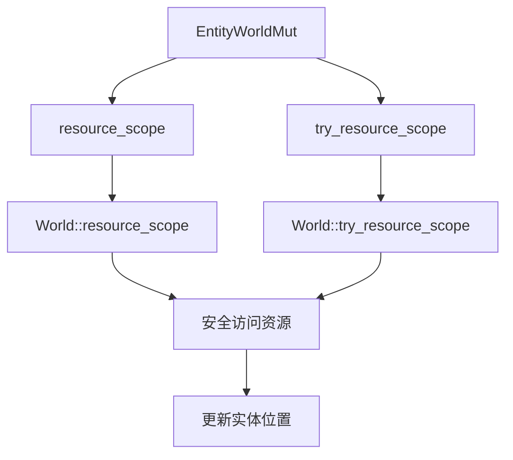

+++
title = "#20162 Add `EntityWorldMut::(try_)resource_scope"
date = "2025-07-16T00:00:00"
draft = false
template = "pull_request_page.html"
in_search_index = false

[extra]
current_language = "zh-cn"
available_languages = {"en" = { name = "English", url = "/pull_request/bevy/2025-07/pr-20162-en-20250716" }, "zh-cn" = { name = "中文", url = "/pull_request/bevy/2025-07/pr-20162-zh-cn-20250716" }}
+++

# 分析报告：PR #20162 - Add `EntityWorldMut::(try_)resource_scope`

## 基础信息
- **标题**: Add `EntityWorldMut::(try_)resource_scope`
- **PR链接**: https://github.com/bevyengine/bevy/pull/20162
- **作者**: BigWingBeat
- **状态**: 已合并
- **标签**: A-ECS, C-Code-Quality, C-Usability, S-Ready-For-Final-Review, X-Uncontroversial, D-Straightforward
- **创建时间**: 2025-07-16T13:44:27Z
- **合并时间**: 2025-07-16T17:57:13Z
- **合并者**: alice-i-cecile

## 描述翻译
### Objective
修复 #20139

### Solution
实现方法，并在适用处利用它们

### Testing
添加了单元测试

---

### Showcase
```rust
let id = entity_world_mut.id();
let world = entity_world_mut.into_world_mut();
world.resource_scope::<_, _>(|world, res| {
    let entity_world_mut = world.entity_mut(id);
    /* ... */
});
```
变为
```rust
entity_world_mut.resource_scope::<_, _>(|entity, res| {
    /* ... */
});
```

## 这个PR的故事

### 问题背景
在Bevy的ECS系统中，开发者在操作实体(entity)时需要同时访问资源(resource)时面临一个常见问题。原始模式需要手动获取实体ID，进入世界作用域(world scope)，再获取资源作用域(resource scope)，最后重新获取实体引用。这个过程不仅冗长，而且容易出错，特别是在需要维护实体位置(location)正确性的场景下。

问题具体表现在：
1. 需要手动保存和传递实体ID
2. 需要嵌套多层作用域(world_scope + resource_scope)
3. 需要显式处理实体位置更新
4. 错误处理复杂，特别是在panic场景下

### 解决方案
这个PR引入了`EntityWorldMut::resource_scope`和`EntityWorldMut::try_resource_scope`方法，封装了资源访问的复杂逻辑。核心思路是：
1. 在实体上下文中直接提供资源访问能力
2. 自动处理实体位置更新
3. 简化错误处理流程
4. 保持原有借用检查规则

技术实现关键点：
- 利用现有`world_scope`机制保证实体位置正确性
- 通过闭包参数传递资源可变引用
- 在资源作用域内重新获取最新实体引用
- 添加充分的单元测试覆盖正常和异常路径

### 实现细节
新方法在`EntityWorldMut`上实现：
```rust
pub fn resource_scope<R: Resource, U>(
    &mut self,
    f: impl FnOnce(&mut EntityWorldMut, Mut<R>) -> U,
) -> U {
    let id = self.id();
    self.world_scope(|world| {
        world.resource_scope(|world, res| {
            let mut this = world.entity_mut(id);
            f(&mut this, res)
        })
    })
}
```
这种方法封装了以下步骤：
1. 获取当前实体ID
2. 进入世界作用域
3. 进入资源作用域
4. 获取最新的实体引用
5. 执行用户代码

### 影响与改进
这个改动带来以下实际改进：
1. **API简化**：减少样板代码，如示例中展示的复杂嵌套简化为单方法调用
2. **错误减少**：自动处理实体位置更新，避免手动调用`update_location`
3. **安全增强**：在panic场景下仍能正确维护实体位置
4. **性能保持**：没有增加额外开销，只是封装现有操作

在代码库中的应用：
1. 反射系统中简化组件操作
2. 变换系统中优化父子关系更新
3. 事件系统中简化资源访问

### 技术洞察
1. **实体位置维护**：通过`world_scope`机制确保即使发生panic，实体位置也能正确更新
2. **作用域嵌套**：合理利用嵌套作用域管理不同资源的生命周期
3. **API设计**：通过闭包参数传递上下文，避免资源借用冲突
4. **错误处理**：`try_resource_scope`提供资源不存在的安全处理路径

## 可视化表示


## 关键文件变更

### crates/bevy_ecs/src/world/entity_ref.rs (+106/-3)
添加了新方法`resource_scope`和`try_resource_scope`及其测试：
```rust
// 添加的方法实现
pub fn resource_scope<R: Resource, U>(
    &mut self,
    f: impl FnOnce(&mut EntityWorldMut, Mut<R>) -> U,
) -> U {
    let id = self.id();
    self.world_scope(|world| {
        world.resource_scope(|world, res| {
            let mut this = world.entity_mut(id);
            f(&mut this, res)
        })
    })
}

// 添加的测试用例
#[test]
fn entity_mut_resource_scope() {
    let mut world = World::new();
    let mut entity = world.spawn_empty();
    
    entity.world_scope(|world| world.insert_resource(R(0)));
    entity.resource_scope(|entity: &mut EntityWorldMut, mut value: Mut<R>| {
        value.0 += 1;
    });
    assert_eq!(entity.resource::<R>().0, 1);
}
```

### crates/bevy_ecs/src/reflect/entity_commands.rs (+26/-66)
简化反射组件操作，使用新API：
```rust
// 修改前
pub fn insert_reflect(&mut self, component: Box<dyn PartialReflect>) -> &mut Self {
    let entity_id = self.id();
    self.world_scope(|world| {
        world.resource_scope(|world, registry: Mut<AppTypeRegistry>| {
            insert_reflect_with_registry_ref(world, entity_id, ...);
        });
    });
}

// 修改后
pub fn insert_reflect(&mut self, component: Box<dyn PartialReflect>) -> &mut Self {
    self.resource_scope(|entity, registry: Mut<AppTypeRegistry>| {
        insert_reflect_with_registry_ref(entity, ...);
    });
}
```

### crates/bevy_transform/src/commands.rs (+28/-27)
优化变换系统命令：
```rust
// 修改前
fn set_parent_in_place(&mut self, parent: Entity) -> &mut Self {
    let child = self.id();
    self.world_scope(|world| {
        world.entity_mut(parent).add_child(child);
        // 复杂的位置更新逻辑
    });
}

// 修改后
fn set_parent_in_place(&mut self, parent: Entity) -> &mut Self {
    let mut update_transform = || {
        let child = self.id();
        let parent_global = self.world_scope(|world| {
            world.get_entity_mut(parent).ok()?.add_child(child)
        })?;
        // 更直接的变换更新
    };
    update_transform();
}
```

### crates/bevy_ecs/src/event/update.rs (+9/-13)
简化事件系统资源访问：
```rust
// 修改前
if world.contains_resource::<EventRegistry>() {
    world.resource_scope(|world, mut registry: Mut<EventRegistry>| {
        // 更新逻辑
    });
}

// 修改后
world.try_resource_scope(|world, mut registry: Mut<EventRegistry>| {
    // 更新逻辑
});
```

### crates/bevy_ecs/src/world/mod.rs (+5/-2)
补充文档说明：
```rust
// 添加的文档说明
/// # Panics
///
/// Panics if the resource does not exist.
/// Use [`try_resource_scope`](Self::try_resource_scope) instead...
```

## 延伸阅读
1. [Bevy ECS实体系统文档](https://bevyengine.org/learn/book/next/features/entities/)
2. [Rust闭包与作用域](https://doc.rust-lang.org/book/ch13-01-closures.html)
3. [资源管理设计模式](https://gameprogrammingpatterns.com/subclass-sandbox.html)