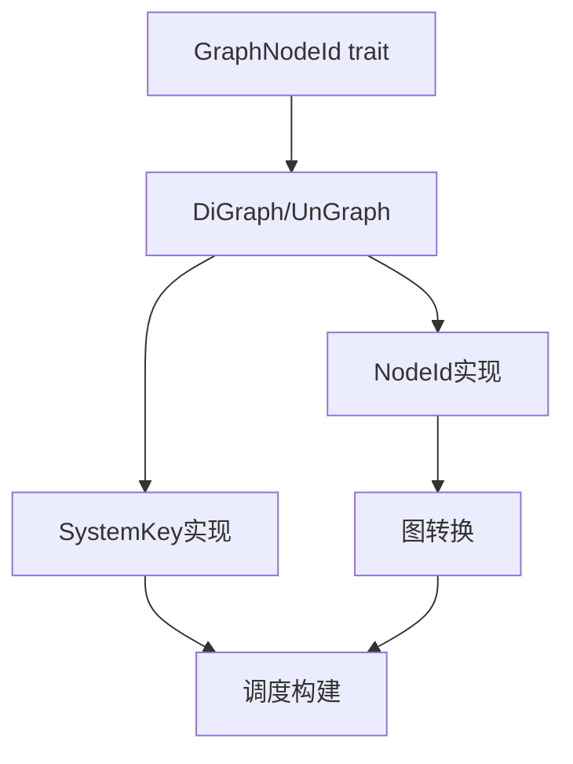

+++
title = "#20172 Change flattened dependency graph from `DiGraph<NodeId>` to `DiGraph<SystemKey>"
date = "2025-07-19T00:00:00"
draft = false
template = "pull_request_page.html"
in_search_index = false

[extra]
current_language = "zh-cn"
available_languages = {"en" = { name = "English", url = "/pull_request/bevy/2025-07/pr-20172-en-20250719" }, "zh-cn" = { name = "中文", url = "/pull_request/bevy/2025-07/pr-20172-zh-cn-20250719" }}
+++

# 分析报告：PR #20172 - 将扁平化依赖图从 `DiGraph<NodeId>` 改为 `DiGraph<SystemKey>`

## 基础信息
- **标题**: Change flattened dependency graph from `DiGraph<NodeId>` to `DiGraph<SystemKey>`
- **PR链接**: https://github.com/bevyengine/bevy/pull/20172
- **作者**: ItsDoot
- **状态**: 已合并
- **标签**: A-ECS, C-Code-Quality, S-Ready-For-Final-Review, D-Modest
- **创建时间**: 2025-07-17T06:48:14Z
- **合并时间**: 2025-07-19T06:24:41Z
- **合并者**: alice-i-cecile

## 描述翻译
### 目标
- 作为 #20115 的一部分

在语义上，完全扁平化的依赖图从不包含 `SystemSetKey`，因此将其编码到类型中。

### 解决方案
- 添加 `GraphNodeId` trait
- 使用新的 `GraphNodeId` `N` 类型参数泛化 `DiGraph` 和 `UnGraph`
- 泛化涉及 `DiGraph`/`UnGraph` 的大部分函数以接受 `GraphNodeId` 类型参数
- 添加 `Graph::try_into` 函数以帮助我们从 `DiGraph<NodeId>` 转换为 `DiGraph<SystemKey>`

### 测试
复用当前测试。

---

## PR 分析

### 问题背景
在 Bevy 的 ECS 调度系统中，依赖图用于管理系统执行顺序。原始实现使用 `DiGraph<NodeId>` 表示扁平化后的依赖图，其中 `NodeId` 可以是系统或系统集。但在实际扁平化完成后，图中应只包含系统节点。这种类型不匹配导致：
1. 运行时需要额外检查节点类型
2. 代码缺乏类型安全性保证
3. 增加了不必要的运行时开销

### 解决方案
核心思路是通过类型系统确保扁平化后的依赖图只包含系统节点：
1. 引入 `GraphNodeId` trait 抽象图节点标识
2. 重构图结构为泛型 `DiGraph<N: GraphNodeId>`
3. 添加类型转换方法 `try_into()` 
4. 将扁平化依赖图类型从 `DiGraph<NodeId>` 改为 `DiGraph<SystemKey>`

### 关键技术实现

#### 1. 定义 `GraphNodeId` trait
```rust
pub trait GraphNodeId: Copy + Eq + Hash + Ord + Debug {
    type Adjacent: Copy + Debug + From<(Self, Direction)> + Into<(Self, Direction)>;
    type Edge: Copy + Eq + Hash + Debug + From<(Self, Self)> + Into<(Self, Self)>;
}
```
该 trait 定义了图节点类型所需的行为，特别是如何紧凑存储相邻节点和边。

#### 2. 重构图结构为泛型
```diff
- pub type DiGraph<S = FixedHasher> = Graph<true, S>;
+ pub type DiGraph<N, S = FixedHasher> = Graph<true, N, S>;

- pub struct Graph<const DIRECTED: bool, S = FixedHasher>
+ pub struct Graph<const DIRECTED: bool, N: GraphNodeId, S = FixedHasher>
{
-    nodes: IndexMap<NodeId, Vec<CompactNodeIdAndDirection>, S>;
-    edges: HashSet<CompactNodeIdPair, S>;
+    nodes: IndexMap<N, Vec<N::Adjacent>, S>;
+    edges: HashSet<N::Edge, S>;
}
```
现在图结构完全泛型化，可处理任何实现 `GraphNodeId` 的节点类型。

#### 3. 添加类型转换方法
```rust
pub fn try_into<T: GraphNodeId + TryFrom<N>>(self) -> Result<Graph<DIRECTED, T, S>, T::Error>
{
    // 转换节点和边
    let nodes = self.nodes.into_iter().map(convert_node).collect()?;
    let edges = self.edges.into_iter().map(convert_edge).collect()?;
    Ok(Graph { nodes, edges })
}
```
该方法允许在不同节点类型间转换图结构，核心用于将 `NodeId` 图转为 `SystemKey` 图。

#### 4. 更新调度构建过程
```diff
- dependency_flattened: &mut DiGraph,
+ dependency_flattened: &mut DiGraph<SystemKey>,
```
在调度构建过程中，扁平化后的依赖图现在明确使用 `DiGraph<SystemKey>` 类型。

### 影响与优势
1. **类型安全**：编译时保证扁平化图中只包含系统节点
2. **减少运行时检查**：消除多余的节点类型检查
3. **代码清晰**：类型签名更准确地反映实际数据结构
4. **性能优化**：减少分支预测失败和虚函数调用

### 关键文件变更

#### `crates/bevy_ecs/src/schedule/graph/graph_map.rs` (+98/-153)
核心变化：
- 将图结构泛型化为 `Graph<const DIRECTED, N: GraphNodeId, S>`
- 添加 `try_into` 转换方法
- 移除硬编码的 `CompactNodeId*` 类型

```diff
+ pub struct Graph<const DIRECTED: bool, N: GraphNodeId, S = FixedHasher> {
+     nodes: IndexMap<N, Vec<N::Adjacent>, S>,
+     edges: HashSet<N::Edge, S>,
+ }

+ pub fn try_into<T: GraphNodeId + TryFrom<N>>(self) -> Result<Graph<DIRECTED, T, S>, T::Error> {
+     // 转换实现
+ }
```

#### `crates/bevy_ecs/src/schedule/node.rs` (+186/-2)
主要变更：
- 定义 `GraphNodeId` 实现
- 为 `SystemKey` 和 `NodeId` 实现 trait

```rust
impl GraphNodeId for SystemKey {
    type Adjacent = (SystemKey, Direction);
    type Edge = (SystemKey, SystemKey);
}

impl GraphNodeId for NodeId {
    type Adjacent = CompactNodeIdAndDirection;
    type Edge = CompactNodeIdPair;
}
```

#### `crates/bevy_ecs/src/schedule/schedule.rs` (+71/-62)
适配调度构建流程：
```diff
- fn get_dependency_flattened(...) -> DiGraph {
+ fn get_dependency_flattened(...) -> DiGraph<SystemKey> {
     ...
+     dependency_flattening.try_into::<SystemKey>().unwrap_or_else(...)
}
```

#### `crates/bevy_ecs/src/schedule/auto_insert_apply_deferred.rs` (+21/-34)
更新自动同步点插入逻辑：
```diff
- auto_sync_node_ids: HashMap<u32, NodeId>,
+ auto_sync_node_ids: HashMap<u32, SystemKey>,

- fn get_sync_point(...) -> NodeId {
+ fn get_sync_point(...) -> SystemKey {
```

## 组件关系图


## 进一步阅读
1. [泛型编程在系统设计中的应用](https://doc.rust-lang.org/book/ch10-00-generics.html)
2. [图论算法在调度系统中的应用](https://en.wikipedia.org/wiki/Tarjan%27s_strongly_connected_components_algorithm)
3. [类型驱动设计模式](https://www.oreilly.com/library/view/domain-modeling-made/9781680505481/)