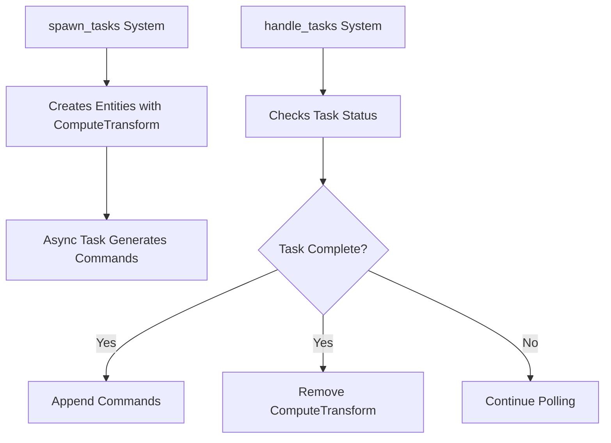

+++
title = "#20175 Refactoring Task Removal in Bevy's Async Compute Example"
date = "2025-07-28T00:00:00"
draft = false
template = "pull_request_page.html"
in_search_index = true

[taxonomies]
list_display = ["show"]

[extra]
current_language = "en"
available_languages = {"en" = { name = "English", url = "/pull_request/bevy/2025-07/pr-20175-en-20250728" }, "zh-cn" = { name = "中文", url = "/pull_request/bevy/2025-07/pr-20175-zh-cn-20250728" }}
+++

## Title: Refactoring Task Removal in Bevy's Async Compute Example

### The Story of This Pull Request

This PR addresses a counterintuitive behavior in Bevy's async_compute example that repeatedly caused implementation errors when developers adapted the code. The core issue was how completed tasks removed themselves, which created unexpected behavior when users modified the example.

The async_compute example demonstrates how to offload heavy computations using Bevy's task system. The original implementation contained this sequence:
1. A task would compute a transform
2. Upon completion, the task would queue commands to add components
3. The task would then immediately remove its own ComputeTransform component

This self-removal pattern caused problems when developers copied the example as a starting point. When users removed the task's internal logic but kept the self-removal, they encountered "task polled after completion" errors because:
- The system continued polling tasks that had already removed themselves
- The task completion state wasn't properly cleaned up
- The removal happened inside the task rather than in the system managing tasks

The solution modifies the task lifecycle management by:
1. Removing the self-removal from the task itself
2. Moving component removal to the handle_tasks system
3. Making the task handling system responsible for cleanup

This change creates clearer separation of concerns:
- Tasks now purely focus on computation and command generation
- The handle_tasks system manages the entire task lifecycle
- Completion cleanup happens in the same system that checks task status

The implementation required two key modifications. First, in the task spawning logic, we removed the self-cleanup code:

```rust
// Before:
commands.spawn((
    // ... components ...
)).remove::<ComputeTransform>(); // Problematic self-removal

// After:
commands.spawn((
    // ... components ...
)); // Pure computation without self-cleanup
```

Second, we refactored the task handling system to include cleanup:

```rust
// Before system signature:
fn handle_tasks(mut commands: Commands, mut transform_tasks: Query<&mut ComputeTransform>)

// After:
fn handle_tasks(
    mut commands: Commands,
    mut transform_tasks: Query<(Entity, &mut ComputeTransform)>,
) {
    for (entity, mut task) in &mut transform_tasks {
        if let Some(mut commands_queue) = block_on(future::poll_once(&mut task.0)) {
            commands.append(&mut commands_queue);
            // New cleanup logic:
            commands.entity(entity).remove::<ComputeTransform>();
        }
    }
}
```

This change improves the example's educational value by:
1. Eliminating a "magic" behavior where tasks remove themselves
2. Creating a clearer task lifecycle (spawn → process → remove)
3. Preventing common errors when extending the example
4. Centralizing task management in one system

The solution maintains identical functionality while making the code more intuitive and less error-prone for developers learning Bevy's async systems. Testing confirmed the example behaves identically to before, but with improved maintainability.

### Visual Representation



### Key Files Changed

**File:** `examples/async_tasks/async_compute.rs`  
**Changes:**  
- Removed self-removal from task completion logic  
- Added task removal to handler system  

```rust
// Before task completion code (removed):
// In spawn_tasks function:
.then_with(|_| async move {
    // ... computation ...
    command_queue.push((
        entity,
        Mesh3d(box_mesh_handle),
        MeshMaterial3d(box_material_handle),
        transform,
    ));
    // Self-removal causing issues:
    .remove::<ComputeTransform>();
});

// After (handler system changes):
fn handle_tasks(
    mut commands: Commands,
    mut transform_tasks: Query<(Entity, &mut ComputeTransform)>,
) {
    for (entity, mut task) in &mut transform_tasks {
        if let Some(mut commands_queue) = block_on(/* ... */) {
            commands.append(&mut commands_queue);
            // Cleanup added here:
            commands.entity(entity).remove::<ComputeTransform>();
        }
    }
}
```

### Further Reading
1. [Bevy Tasks Documentation](https://docs.rs/bevy/latest/bevy/tasks/index.html)
2. [Rust Async/Await Explained](https://rust-lang.github.io/async-book/)
3. [Entity Component System Patterns](https://en.wikipedia.org/wiki/Entity_component_system)
4. [Original Async Compute Example](https://github.com/bevyengine/bevy/blob/main/examples/async_tasks/async_compute.rs)