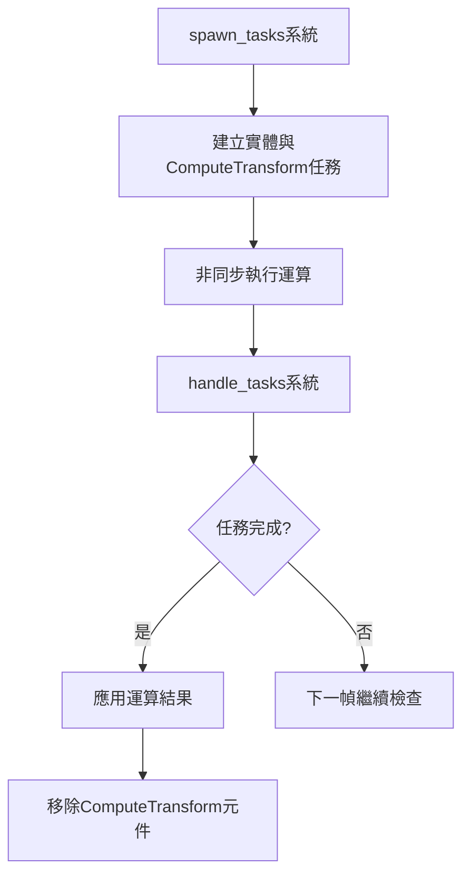

+++
title = "#20175"
date = "2025-07-28T00:00:00"
draft = false
template = "pull_request_page.html"
in_search_index = false

[extra]
current_language = "zh-cn"
available_languages = {"en" = { name = "English", url = "/pull_request/bevy/2025-07/pr-20175-en-20250728" }, "zh-cn" = { name = "中文", url = "/pull_request/bevy/2025-07/pr-20175-zh-cn-20250728" }}
+++

## 技术分析报告：PR #20175

### 基本資訊
- **標題**: Remove task in handle_tasks in async_compute example
- **PR連結**: https://github.com/bevyengine/bevy/pull/20175
- **作者**: IceSentry
- **狀態**: 已合併
- **標籤**: C-Docs, C-Examples, S-Ready-For-Final-Review, A-Tasks, D-Straightforward
- **創建時間**: 2025-07-17T07:37:08Z
- **合併時間**: 2025-07-28T17:47:31Z
- **合併者**: alice-i-cecile

### PR描述翻譯
#### 目標
- 任務自行移除自身的設計違反直覺
- 多次嘗試複製此範例程式碼時，當替換任務內容後忘記移除任務元件，導致任務完成後仍被輪詢(polled)而產生錯誤

#### 解決方案
- 在任務被"處理"完成後，於handle_tasks系統中移除任務元件

#### 測試
- 執行範例後確認功能正常運作

---

## PR技術敘事分析

### 問題背景與情境
在Bevy引擎的`async_compute`範例中，存在一個非同步任務處理的設計瑕疵。原實作中，`ComputeTransform`任務在完成運算後，會透過命令佇列(command queue)自行移除所屬元件。這種"自我移除"機制導致兩個主要問題：

1. **違反直覺**：任務執行過程中修改自身狀態，這種反模式(self-modifying pattern)增加理解難度
2. **複用陷阱**：開發者複製此範例修改時，若未保留自我移除邏輯，會導致任務完成後仍被持續輪詢，產生`Future`已結束卻仍被`poll`的錯誤

這種設計尤其影響範例程式碼的教學價值，因其無法清晰展示任務生命週期的標準管理方式。

### 解決方案設計
核心解決方案是重構任務生命週期管理，將元件移除責任從任務內部轉移到專責處理系統：
1. **職責分離**：任務僅負責運算與生成實體組件，不再處理自身狀態清理
2. **集中管理**：由`handle_tasks`系統統一檢測任務完成狀態並執行清理
3. **查詢擴展**：為獲取實體參照，擴展`Query`包含`Entity`識別符

此修改遵循ECS架構的最佳實踐——系統應負責管理其所屬領域的元件狀態變化。

### 實作細節分析
關鍵修改集中在兩個函式：

**1. `spawn_tasks` 函式修改**
```rust
// 修改前:
commands.spawn((
    Mesh3d(box_mesh_handle),
    MeshMaterial3d(box_material_handle),
    transform,
))
.remove::<ComputeTransform>(); // 任務自移除

// 修改後:
commands.spawn((
    Mesh3d(box_mesh_handle),
    MeshMaterial3d(box_material_handle),
    transform,
)); // 移除自清除邏輯
```
移除了任務內部的`remove::<ComputeTransform>`命令，使任務專注於產生實體組件。

**2. `handle_tasks` 系統重構**
```rust
// 修改前:
fn handle_tasks(mut commands: Commands, mut transform_tasks: Query<&mut ComputeTransform>) {
    for mut task in &mut transform_tasks {
        if let Some(mut commands_queue) = block_on(...) {
            commands.append(&mut commands_queue);
        }
    }
}

// 修改後:
fn handle_tasks(mut commands: Commands, mut transform_tasks: Query<(Entity, &mut ComputeTransform)>) {
    for (entity, mut task) in &mut transform_tasks {
        if let Some(mut commands_queue) = block_on(...) {
            commands.append(&mut commands_queue);
            // 新增清理邏輯
            commands.entity(entity).remove::<ComputeTransform>();
        }
    }
}
```
主要改動點：
- 查詢新增`Entity`獲取實體識別
- 任務完成後透過`commands.entity(entity).remove`明確移除元件
- 使用`block_on`同步檢測`Future`完成狀態

### 技術影響與優勢
此修改帶來三方面實質改進：
1. **錯誤預防**：消除任務完成後被重複輪詢的`Future`狀態錯誤
2. **範例清晰度**：展示標準的任務生命週期管理模式（產生→執行→清理）
3. **擴展性提升**：集中處理邏輯使新增任務類型或清理邏輯更簡單

修改後的行為流程更符合開發者直覺：


### 潛在改進方向
雖然當前方案已解決核心問題，未來可考慮：
1. 增加任務逾時機制防止卡死
2. 實現批次處理優化效能
3. 添加更詳細的狀態追蹤組件

## 關鍵文件變更

### `examples/async_tasks/async_compute.rs`
**修改原因**：修復任務生命週期管理缺陷，提升範例程式碼的健壯性和可複用性

```diff
@@ -89,9 +89,7 @@ fn spawn_tasks(mut commands: Commands) {
                                 Mesh3d(box_mesh_handle),
                                 MeshMaterial3d(box_material_handle),
                                 transform,
-                            ))
-                            // Task is complete, so remove task component from entity
-                            .remove::<ComputeTransform>();
+                            ));
                     });
 
                     command_queue
@@ -108,11 +106,16 @@ fn spawn_tasks(mut commands: Commands) {
 /// tasks to see if they're complete. If the task is complete it takes the result, adds a
 /// new [`Mesh3d`] and [`MeshMaterial3d`] to the entity using the result from the task's work, and
 /// removes the task component from the entity.
-fn handle_tasks(mut commands: Commands, mut transform_tasks: Query<&mut ComputeTransform>) {
-    for mut task in &mut transform_tasks {
+fn handle_tasks(
+    mut commands: Commands,
+    mut transform_tasks: Query<(Entity, &mut ComputeTransform)>,
+) {
+    for (entity, mut task) in &mut transform_tasks {
         if let Some(mut commands_queue) = block_on(future::poll_once(&mut task.0)) {
             // append the returned command queue to have it execute later
             commands.append(&mut commands_queue);
+            // Task is complete, so remove task component from entity
+            commands.entity(entity).remove::<ComputeTransform>();
         }
     }
 }
```

## 延伸閱讀
1. [Bevy Tasks 官方文件](https://docs.rs/bevy/latest/bevy/tasks/index.html)
2. [Future 輪詢機制說明](https://doc.rust-lang.org/std/future/trait.Future.html)
3. [ECS 命令緩衝模式](https://bevy-cheatbook.github.io/programming/commands.html)
4. [系統排序與依賴管理](https://bevy-cheatbook.github.io/programming/system-order.html)