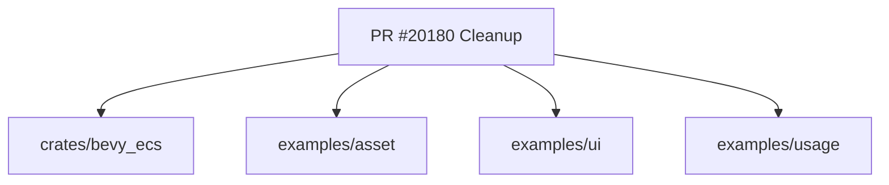

+++
title = "#20180 Remove unnecessary + `use<>`"
date = "2025-07-17T00:00:00"
draft = false
template = "pull_request_page.html"
in_search_index = true

[taxonomies]
list_display = ["show"]

[extra]
current_language = "en"
available_languages = {"en" = { name = "English", url = "/pull_request/bevy/2025-07/pr-20180-en-20250717" }, "zh-cn" = { name = "中文", url = "/pull_request/bevy/2025-07/pr-20180-zh-cn-20250717" }}
labels = ["D-Trivial", "C-Code-Quality", "P-High"]
+++

## Analysis of PR #20180: Remove unnecessary + `use<>`

### Basic Information
- **Title**: Remove unnecessary + `use<>`
- **PR Link**: https://github.com/bevyengine/bevy/pull/20180
- **Author**: cart
- **Status**: MERGED
- **Labels**: D-Trivial, C-Code-Quality, P-High, S-Ready-For-Final-Review, X-Uncontroversial
- **Created**: 2025-07-17T21:16:28Z
- **Merged**: 2025-07-17T21:57:27Z
- **Merged By**: cart

### Description Translation
# Objective

Including `use<>` where it is not needed is abhorrent to my sensibilities

## Solution

Begone foul demon!

### The Story of This Pull Request

This PR addresses a minor but consistent code quality issue across several Bevy modules. The core problem was unnecessary trait bound syntax (`+ use<>` or `+ use<'_>`) appearing in function return type declarations. These redundant bounds didn't affect functionality but added visual noise and violated Rust's principle of minimal explicit typing.

The author identified four instances where `impl Trait` return types included superfluous `use` bounds. The changes are purely syntactic - removing these unnecessary specifiers makes the code cleaner and more idiomatic. Each modification follows the same pattern: stripping the `+ use` clause while preserving the actual return type semantics.

The changes demonstrate a key Rust principle: only specify necessary trait bounds. Since `use` wasn't required for these return types, including it was misleading and added maintenance overhead. The PR required no architectural changes or new tests since it only affected type declarations, not runtime behavior.

These changes improve code readability and maintainability by:
1. Removing visual clutter from type signatures
2. Making trait bounds more intentional
3. Aligning with Rust's type inference capabilities
4. Establishing consistent patterns across the codebase

### Visual Representation



### Key Files Changed

1. **crates/bevy_ecs/src/entity_disabling.rs**  
   Removed unnecessary lifetime-bound `use` from iterator return type:
   
   ```rust
   // Before:
   pub fn disabling_ids(&self) -> impl Iterator<Item = ComponentId> + use<'_>
   
   // After:
   pub fn disabling_ids(&self) -> impl Iterator<Item = ComponentId>
   ```

2. **examples/asset/multi_asset_sync.rs**  
   Simplified future return type declaration:
   
   ```rust
   // Before:
   pub fn wait_async(&self) -> impl Future<Output = ()> + 'static + use<>
   
   // After:
   pub fn wait_async(&self) -> impl Future<Output = ()> + 'static
   ```

3. **examples/ui/button.rs**  
   Cleaned up UI bundle constructor signature:
   
   ```rust
   // Before:
   fn button(asset_server: &AssetServer) -> impl Bundle + use<>
   
   // After:
   fn button(asset_server: &AssetServer) -> impl Bundle
   ```

4. **examples/usage/context_menu.rs** (2 instances)  
   Removed redundant bounds from UI component builders:
   
   ```rust
   // Before:
   fn context_item(text: &str, col: Srgba) -> impl Bundle + use<>
   fn background_and_button() -> impl Bundle + use<>
   
   // After:
   fn context_item(text: &str, col: Srgba) -> impl Bundle
   fn background_and_button() -> impl Bundle
   ```

### Further Reading
1. [Rust RFC 1522: `impl Trait`](https://rust-lang.github.io/rfcs/1522-conservative-impl-trait.html)
2. [Rust Book: Trait Bounds](https://doc.rust-lang.org/book/ch10-02-traits.html#trait-bounds)
3. [Bevy Coding Conventions](https://github.com/bevyengine/bevy/blob/main/docs/CODE_CONVENTIONS.md)
4. [Rust Clippy Lints](https://rust-lang.github.io/rust-clippy/master/) (particularly bounds-related lints)

### Full Code Diff
```diff
diff --git a/crates/bevy_ecs/src/entity_disabling.rs b/crates/bevy_ecs/src/entity_disabling.rs
index 41a461b77e498..39d2aa27e8837 100644
--- a/crates/bevy_ecs/src/entity_disabling.rs
+++ b/crates/bevy_ecs/src/entity_disabling.rs
@@ -178,7 +178,7 @@ impl DefaultQueryFilters {
     }
 
     /// Get an iterator over all of the components which disable entities when present.
-    pub fn disabling_ids(&self) -> impl Iterator<Item = ComponentId> + use<'_> {
+    pub fn disabling_ids(&self) -> impl Iterator<Item = ComponentId> {
         self.disabling.iter().copied()
     }
 
diff --git a/examples/asset/multi_asset_sync.rs b/examples/asset/multi_asset_sync.rs
index cc233eb5fd4db..83add4ba3c016 100644
--- a/examples/asset/multi_asset_sync.rs
+++ b/examples/asset/multi_asset_sync.rs
@@ -105,7 +105,7 @@ impl AssetBarrier {
     }
 
     /// Wait for all [`AssetBarrierGuard`]s to be dropped asynchronously.
-    pub fn wait_async(&self) -> impl Future<Output = ()> + 'static + use<> {
+    pub fn wait_async(&self) -> impl Future<Output = ()> + 'static {
         let shared = self.0.clone();
         async move {
             loop {
diff --git a/examples/ui/button.rs b/examples/ui/button.rs
index a402b5e7da098..aefa96918bc5f 100644
--- a/examples/ui/button.rs
+++ b/examples/ui/button.rs
@@ -72,7 +72,7 @@ fn setup(mut commands: Commands, assets: Res<AssetServer>) {
     commands.spawn(button(&assets));
 }
 
-fn button(asset_server: &AssetServer) -> impl Bundle + use<> {
+fn button(asset_server: &AssetServer) -> impl Bundle {
     (
         Node {
             width: Val::Percent(100.0),
diff --git a/examples/usage/context_menu.rs b/examples/usage/context_menu.rs
index a50e5cdabbae7..9ccd3e4b4b7e3 100644
--- a/examples/usage/context_menu.rs
+++ b/examples/usage/context_menu.rs
@@ -122,7 +122,7 @@ fn on_trigger_menu(trigger: On<OpenContextMenu>, mut commands: Commands) {
         );
 }
 
-fn context_item(text: &str, col: Srgba) -> impl Bundle + use<> {
+fn context_item(text: &str, col: Srgba) -> impl Bundle {
     (
         Name::new(format!("item-{text}")),
         ContextMenuItem(col),
@@ -143,7 +143,7 @@ fn context_item(text: &str, col: Srgba) -> impl Bundle + use<> {
     )
 }
 
-fn background_and_button() -> impl Bundle + use<> {
+fn background_and_button() -> impl Bundle {
     (
         Name::new("background"),
         Node {
```