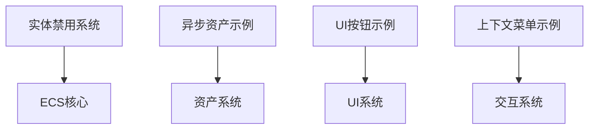

+++
title = "#20180 Remove unnecessary + `use<>"
date = "2025-07-17T00:00:00"
draft = false
template = "pull_request_page.html"
in_search_index = false

[extra]
current_language = "zh-cn"
available_languages = {"en" = { name = "English", url = "/pull_request/bevy/2025-07/pr-20180-en-20250717" }, "zh-cn" = { name = "中文", url = "/pull_request/bevy/2025-07/pr-20180-zh-cn-20250717" }}
+++

# 分析报告：移除不必要的 `+ use<>` 语法

## 基本信息
- **标题**: Remove unnecessary + `use<>`
- **PR链接**: https://github.com/bevyengine/bevy/pull/20180
- **作者**: cart
- **状态**: 已合并
- **标签**: D-Trivial, C-Code-Quality, P-High, S-Ready-For-Final-Review, X-Uncontroversial
- **创建时间**: 2025-07-17T21:16:28Z
- **合并时间**: 2025-07-17T21:57:27Z
- **合并人**: cart

## 问题描述
在 Rust 编程中，trait 约束的语法需要精确表达。本 PR 解决的问题是在多个函数返回类型声明中出现了冗余的 `+ use<>` 语法。这种写法：
1. 不符合 Rust 的惯用语法
2. 增加了不必要的视觉干扰
3. 可能使其他开发者困惑其实际含义

这些实例分布在核心引擎代码和示例文件中：
- `bevy_ecs` 实体禁用系统
- 异步资产加载示例
- UI 按钮示例
- 上下文菜单示例

## 解决方案
直接移除所有冗余的 `+ use<>` 语法，保持 trait 约束声明简洁规范：
```rust
// 修改前
pub fn disabling_ids(&self) -> impl Iterator<Item = ComponentId> + use<'_>

// 修改后
pub fn disabling_ids(&self) -> impl Iterator<Item = ComponentId>
```

## 具体变更分析

### 1. 实体禁用系统 (`crates/bevy_ecs/src/entity_disabling.rs`)
**变更原因**：`disabling_ids()` 方法的返回类型声明存在冗余语法  
**代码对比**：
```rust
// 修改前
pub fn disabling_ids(&self) -> impl Iterator<Item = ComponentId> + use<'_> {
    self.disabling.iter().copied()
}

// 修改后
pub fn disabling_ids(&self) -> impl Iterator<Item = ComponentId> {
    self.disabling.iter().copied()
}
```
**影响**：保持核心 ECS 模块代码的简洁性和可读性

### 2. 异步资产屏障 (`examples/asset/multi_asset_sync.rs`)
**变更原因**：异步等待函数的返回类型声明存在多余语法  
**代码对比**：
```rust
// 修改前
pub fn wait_async(&self) -> impl Future<Output = ()> + 'static + use<> 

// 修改后
pub fn wait_async(&self) -> impl Future<Output = ()> + 'static 
```
**影响**：示例代码更清晰，避免初学者误解特殊语法

### 3. UI 按钮构建器 (`examples/ui/button.rs`)
**变更原因**：UI 组件构建函数存在非标准语法  
**代码对比**：
```rust
// 修改前
fn button(asset_server: &AssetServer) -> impl Bundle + use<> 

// 修改后
fn button(asset_server: &AssetServer) -> impl Bundle 
```
**影响**：UI 示例代码符合标准 Rust 语法

### 4. 上下文菜单项 (`examples/usage/context_menu.rs`)
**变更原因**：两个菜单构建函数存在相同问题  
**代码对比**：
```rust
// 修改前
fn context_item(text: &str, col: Srgba) -> impl Bundle + use<>
fn background_and_button() -> impl Bundle + use<>

// 修改后
fn context_item(text: &str, col: Srgba) -> impl Bundle
fn background_and_button() -> impl Bundle
```
**影响**：交互示例代码保持语法一致性

## 技术见解
1. `impl Trait` 返回类型已自带生命周期约束能力，无需额外语法
2. `use<>` 不是 Rust 标准语法，可能是历史残留或宏展开产物
3. 保持 trait 约束声明的最小化原则：
   - 必需的生命期标记：`+ 'static`
   - 必需的 trait 约束：`+ Send + Sync`
   - 非必需语法一律移除

## 影响评估
1. **代码质量提升**：消除4个文件中的冗余语法
2. **认知负荷降低**：避免开发者研究不存在的语法特性
3. **无功能变更**：纯语法清理，不影响运行时行为
4. **贡献模式示范**：展示如何保持代码库整洁

## 组件关系图



## 关键文件变更
1. `crates/bevy_ecs/src/entity_disabling.rs` (+1/-1)
2. `examples/asset/multi_asset_sync.rs` (+1/-1)
3. `examples/ui/button.rs` (+1/-1)
4. `examples/usage/context_menu.rs` (+2/-2)

## 延伸阅读
1. [Rust 语言：impl Trait 使用指南](https://doc.rust-lang.org/rust-by-example/trait/impl_trait.html)
2. [Bevy ECS 设计理念](https://bevyengine.org/learn/book/getting-started/ecs/)
3. [Rust API 设计准则](https://rust-lang.github.io/api-guidelines/)