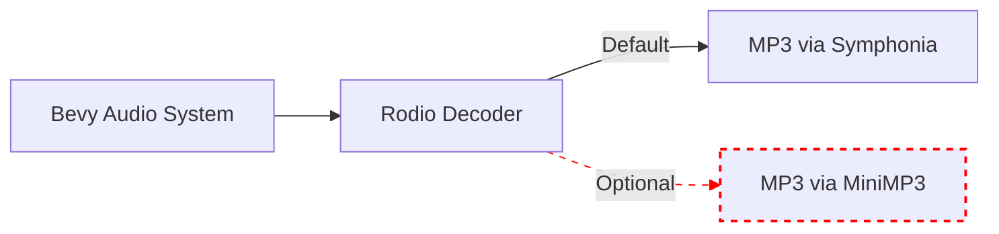

+++
title = "#20183 stop exposing minimp3"
date = "2025-07-20T00:00:00"
draft = false
template = "pull_request_page.html"
in_search_index = true

[taxonomies]
list_display = ["show"]

[extra]
current_language = "en"
available_languages = {"en" = { name = "English", url = "/pull_request/bevy/2025-07/pr-20183-en-20250720" }, "zh-cn" = { name = "中文", url = "/pull_request/bevy/2025-07/pr-20183-zh-cn-20250720" }}
labels = ["A-Audio", "C-Dependencies"]
+++

# Technical Analysis: stop exposing minimp3

## Basic Information
- **Title**: stop exposing minimp3
- **PR Link**: https://github.com/bevyengine/bevy/pull/20183
- **Author**: mockersf
- **Status**: MERGED
- **Labels**: A-Audio, C-Dependencies, S-Ready-For-Final-Review, M-Needs-Migration-Guide
- **Created**: 2025-07-17T22:00:07Z
- **Merged**: 2025-07-20T18:30:37Z
- **Merged By**: alice-i-cecile

## Description Translation
# Objective

- Fixes #20181

## Solution

- Stop exposing rodio support of mp3 through minimp3. rodio defaults to symphonia for mp3 now. People who really want an unsecured way to play mp3 that doesn't work in wasm and will get their app rejected from the iOS App Store can still enable it manually by adding a dependency on rodio

## The Story of This Pull Request

The core issue addressed in this PR (#20181) centered around Bevy's continued exposure of the `minimp3` feature for MP3 audio decoding. This dependency had several significant drawbacks that made it unsuitable as a default option. The minimp3 library is no longer actively maintained, contains known security vulnerabilities, doesn't function in WebAssembly environments, and has been known to cause application rejections from the Apple App Store due to its security flaws.

Historically, Bevy's audio system used rodio for audio decoding, which previously relied on minimp3 for MP3 support. However, rodio has since transitioned to using symphonia as its default MP3 decoder. This shift meant that Bevy's continued exposure of minimp3 was redundant and potentially harmful, as it encouraged use of an inferior and insecure decoding option when a better alternative was already available through the same dependency.

The solution implemented was straightforward: completely remove the `minimp3` feature flag from Bevy's public interface. This involved deleting:
1. The feature declaration from Bevy's top-level Cargo.toml
2. The feature mapping in bevy_audio's Cargo.toml
3. The feature exposure in bevy_internal's Cargo.toml
4. The documentation reference in cargo_features.md

Crucially, the standard `mp3` feature remains available and now transparently uses rodio's symphonia backend instead of minimp3. This change maintains MP3 support while removing the problematic minimp3 pathway. For developers who specifically require minimp3 despite its drawbacks (perhaps for compatibility with existing assets or specialized use cases), the PR includes a migration guide explaining how to manually add rodio with minimp3 support:

```toml
[dependencies]
rodio = { version = "0.20", features = ["minimp3"] }
```

This approach balances several technical considerations:
1. Security: Eliminates exposure of a library with known vulnerabilities
2. Maintenance: Reduces Bevy's maintenance surface by removing a deprecated code path
3. Compatibility: Maintains MP3 support through the more robust symphonia backend
4. Flexibility: Allows specialized use cases through direct dependency management

The technical impact is a cleaner dependency tree and more secure defaults. The `minimp3` feature was completely removed from Bevy's public API, meaning projects relying on it will need to either migrate to the standard `mp3` feature or explicitly add rodio with minimp3 support. The migration guide provides clear steps for both paths.

## Visual Representation



The diagram shows how Bevy's audio system interacts with Rodio. The solid line represents the default MP3 decoding path via Symphonia, while the dashed red line shows the now-removed MiniMP3 pathway that requires explicit opt-in.

## Key Files Changed

### release-content/migration-guides/stop-exposing-minimp3.md
```markdown
---
title: Stop exposing mp3 support through minimp3
pull_requests: [20183]
---

The `minimp3` feature is no longer exposed from Bevy. Bevy still supports mp3 through the `mp3` feature.

If you were relying on something specific to `minimp3`, you can still enable it by adding a dependency to `rodio` with the `minimp3` feature:

```toml
[dependencies]
rodio = { version = "0.20", features = ["minimp3"] }
```

This is best to avoid though, as `minimp3` is not actively maintained, doesn't work in wasm, has been known to cause application rejection from the Apple App Store, and has a few security vulnerabilities.
```

**Purpose**: Provides migration instructions for users affected by the removal. Explains how to manually enable minimp3 if absolutely necessary while strongly recommending against it due to security and compatibility concerns.

### Cargo.toml
```diff
diff --git a/Cargo.toml b/Cargo.toml
index 0b64a82ed330a..c7a03998db982 100644
--- a/Cargo.toml
+++ b/Cargo.toml
@@ -407,9 +407,6 @@ vorbis = ["bevy_internal/vorbis"]
 # WAV audio format support
 wav = ["bevy_internal/wav"]
 
-# MP3 audio format support (through minimp3)
-minimp3 = ["bevy_internal/minimp3"]
-
 # AAC audio format support (through symphonia)
 symphonia-aac = ["bevy_internal/symphonia-aac"]
```

**Purpose**: Removes the top-level minimp3 feature declaration from Bevy's main manifest. This eliminates the feature from Bevy's public API.

### crates/bevy_audio/Cargo.toml
```diff
diff --git a/crates/bevy_audio/Cargo.toml b/crates/bevy_audio/Cargo.toml
index 8beba77c0dfa7..d8a72c1a7b38f 100644
--- a/crates/bevy_audio/Cargo.toml
+++ b/crates/bevy_audio/Cargo.toml
@@ -47,7 +47,6 @@ mp3 = ["rodio/mp3"]
 flac = ["rodio/flac"]
 wav = ["rodio/wav"]
 vorbis = ["rodio/vorbis"]
-minimp3 = ["rodio/minimp3"]
 symphonia-aac = ["rodio/symphonia-aac"]
 symphonia-all = ["rodio/symphonia-all"]
 symphonia-flac = ["rodio/symphonia-flac"]
```

**Purpose**: Removes the minimp3 feature mapping in the audio crate. This severs the connection between Bevy's feature flags and rodio's minimp3 implementation.

### crates/bevy_internal/Cargo.toml
```diff
diff --git a/crates/bevy_internal/Cargo.toml b/crates/bevy_internal/Cargo.toml
index e591803751f7d..5f2bddb602a1e 100644
--- a/crates/bevy_internal/Cargo.toml
+++ b/crates/bevy_internal/Cargo.toml
@@ -78,7 +78,6 @@ flac = ["bevy_audio/flac"]
 mp3 = ["bevy_audio/mp3"]
 vorbis = ["bevy_audio/vorbis"]
 wav = ["bevy_audio/wav"]
-minimp3 = ["bevy_audio/minimp3"]
 symphonia-aac = ["bevy_audio/symphonia-aac"]
 symphonia-all = ["bevy_audio/symphonia-all"]
 symphonia-flac = ["bevy_audio/symphonia-flac"]
```

**Purpose**: Removes the internal feature mapping that connected the top-level minimp3 feature to the audio crate's implementation.

### docs/cargo_features.md
```diff
diff --git a/docs/cargo_features.md b/docs/cargo_features.md
index 120c461efe378..96edd47522c1c 100644
--- a/docs/cargo_features.md
+++ b/docs/cargo_features.md
@@ -98,7 +98,6 @@ The default feature set enables most of the expected features of a game engine,
 |libm|Uses the `libm` maths library instead of the one provided in `std` and `core`.|
 |meshlet|Enables the meshlet renderer for dense high-poly scenes (experimental)|
 |meshlet_processor|Enables processing meshes into meshlet meshes for bevy_pbr|
-|minimp3|MP3 audio format support (through minimp3)|
 |mp3|MP3 audio format support|
 |pbr_anisotropy_texture|Enable support for anisotropy texture in the `StandardMaterial`, at the risk of blowing past the global, per-shader texture limit on older/lower-end GPUs|
 |pbr_clustered_decals|Enable support for Clustered Decals|
```

**Purpose**: Updates the feature documentation to reflect the removal of minimp3, preventing confusion about available audio features.

## Further Reading

1. [Rodio documentation](https://docs.rs/rodio/latest/rodio/): Understanding Bevy's underlying audio library
2. [Symphonia documentation](https://docs.rs/symphonia/latest/symphonia/): The modern audio decoding library used by Rodio
3. [Cargo Features documentation](https://doc.rust-lang.org/cargo/reference/features.html): How feature flags work in Rust
4. [Issue #20181](https://github.com/bevyengine/bevy/issues/20181): Original issue detailing problems with minimp3
5. [Apple App Store Review Guidelines](https://developer.apple.com/app-store/review/guidelines/): Security requirements that minimp3 fails to meet