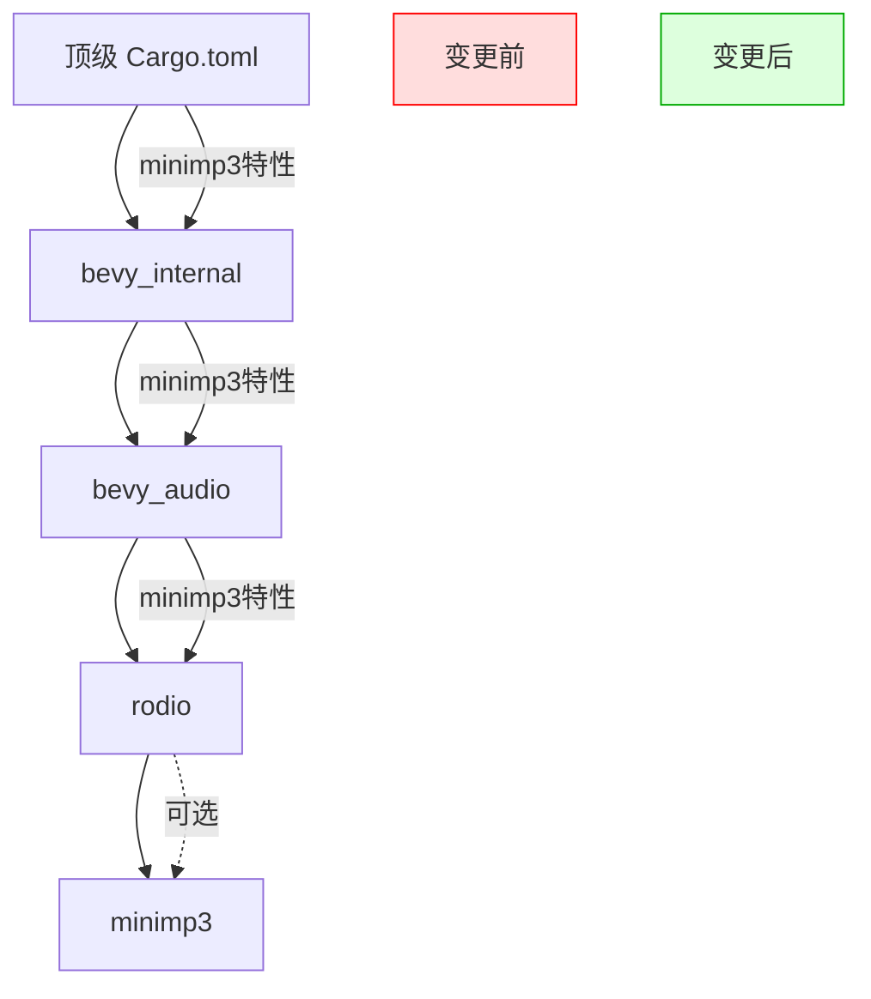

+++
title = "#20183 stop exposing minimp3"
date = "2025-07-20T00:00:00"
draft = false
template = "pull_request_page.html"
in_search_index = false

[extra]
current_language = "zh-cn"
available_languages = {"en" = { name = "English", url = "/pull_request/bevy/2025-07/pr-20183-en-20250720" }, "zh-cn" = { name = "中文", url = "/pull_request/bevy/2025-07/pr-20183-zh-cn-20250720" }}
+++

# 停止暴露 minimp3 特性

## 基本信息
- **标题**: stop exposing minimp3
- **PR 链接**: https://github.com/bevyengine/bevy/pull/20183
- **作者**: mockersf
- **状态**: 已合并
- **标签**: A-Audio, C-Dependencies, S-Ready-For-Final-Review, M-Needs-Migration-Guide
- **创建时间**: 2025-07-17T22:00:07Z
- **合并时间**: 2025-07-20T18:30:37Z
- **合并者**: alice-i-cecile

## 描述翻译
### 目标
- 修复 #20181

### 解决方案
- 停止通过 minimp3 暴露 rodio 对 mp3 的支持。rodio 现在默认使用 symphonia 处理 mp3。确实需要不安全方式播放 mp3（在 wasm 中无法工作且可能导致应用被 iOS App Store 拒绝）的用户，仍可通过手动添加 rodio 依赖来启用该功能。

## PR 技术分析

### 问题背景
音频处理依赖 minimp3 存在多个实际问题：该库已不再积极维护，存在已知安全漏洞，在 WebAssembly 环境中无法工作，且使用它可能导致应用被 Apple App Store 拒绝。随着 rodio 音频后端默认切换到 symphonia 作为 MP3 解码方案，继续暴露 minimp3 作为可选特性已无必要，反而可能误导开发者使用不推荐的方案。

### 解决方案设计
核心方案是彻底移除与 minimp3 相关的特性暴露，同时提供明确的迁移路径：
1. 从 Cargo.toml 特性列表中移除 minimp3
2. 清理音频子系统中的特性传递链
3. 更新文档反映变更
4. 提供显式的迁移指南

工程决策基于最小化破坏性原则：虽然移除了默认支持，但保留了开发者手动启用 minimp3 的能力，通过直接依赖 rodio 实现。

### 具体实现
实现集中在依赖管理和文档更新：
1. **特性移除**：从所有 Cargo.toml 文件中删除 minimp3 特性声明
2. **依赖链清理**：断开 bevy_audio 和 bevy_internal 中与 minimp3 的特性传递
3. **文档同步**：更新特性文档移除 minimp3 条目
4. **迁移指南**：新增指南说明替代方案

关键变化体现在 Cargo 特性定义的修改：

```toml
# 文件: Cargo.toml
# 修改前:
# MP3 audio format support (through minimp3)
minimp3 = ["bevy_internal/minimp3"]

# 修改后:
# [minimp3 特性已完全移除]
```

```toml
# 文件: crates/bevy_audio/Cargo.toml
# 修改前:
minimp3 = ["rodio/minimp3"]

# 修改后:
# [minimp3 特性已移除]
```

这些修改切断了 minimp3 在整个构建系统中的暴露路径，但保留了 rodio 的直接使用可能性。

### 技术影响
1. **依赖简化**：减少维护负担，移除存在安全风险的依赖
2. **Wasm 兼容性**：消除因 minimp3 导致的 wasm 构建失败
3. **App Store 合规**：降低应用被拒绝的风险
4. **迁移成本**：需要依赖 minimp3 的开发者需显式添加 rodio 依赖：

```toml
[dependencies]
rodio = { version = "0.20", features = ["minimp3"] }
```

### 架构意义
此变更符合 Bevy 的模块化设计理念：
- 核心引擎仅维护推荐/安全的依赖
- 特殊需求通过显式依赖解决
- 保持核心依赖图的简洁性

## 组件关系图



## 关键文件变更

### 1. 迁移指南
**文件**: `release-content/migration-guides/stop-exposing-minimp3.md` (+15/-0)  
新增迁移指南文档，明确替代方案：

```markdown
---
title: Stop exposing mp3 support through minimp3
pull_requests: [20183]
---

The `minimp3` feature is no longer exposed from Bevy. Bevy still supports mp3 through the `mp3` feature.

If you were relying on something specific to `minimp3`, you can still enable it by adding a dependency to `rodio` with the `minimp3` feature:

```toml
[dependencies]
rodio = { version = "0.20", features = ["minimp3"] }
```

This is best to avoid though, as `minimp3` is not actively maintained, doesn't work in wasm, has been known to cause application rejection from the Apple App Store, and has a few security vulnerabilities.
```

### 2. 顶级 Cargo.toml
**文件**: `Cargo.toml` (+0/-3)  
移除 minimp3 特性定义：

```toml
# 修改前:
# MP3 audio format support (through minimp3)
minimp3 = ["bevy_internal/minimp3"]

# 修改后:
# [整个区块被移除]
```

### 3. 音频 crate 配置
**文件**: `crates/bevy_audio/Cargo.toml` (+0/-1)  
清理音频 crate 的特性传递：

```toml
# 修改前:
minimp3 = ["rodio/minimp3"]

# 修改后:
# [该行被移除]
```

### 4. 内部 crate 配置
**文件**: `crates/bevy_internal/Cargo.toml` (+0/-1)  
断开内部 crate 的特性链接：

```toml
# 修改前:
minimp3 = ["bevy_audio/minimp3"]

# 修改后:
# [该行被移除]
```

### 5. 特性文档
**文件**: `docs/cargo_features.md` (+0/-1)  
更新特性文档：

```markdown
# 修改前:
|minimp3|MP3 audio format support (through minimp3)|

# 修改后:
# [该行被移除]
```

## 延伸阅读
1. [Rodio 的 MP3 支持文档](https://github.com/RustAudio/rodio#supported-formats)
2. [Symphonia 音频解码框架](https://github.com/pdeljanov/Symphonia)
3. [Apple App Store 审核指南 - 安全要求](https://developer.apple.com/app-store/review/guidelines/#security)
4. [WebAssembly 兼容性最佳实践](https://rustwasm.github.io/docs/book/reference/add-wasm-support-to-crate.html)