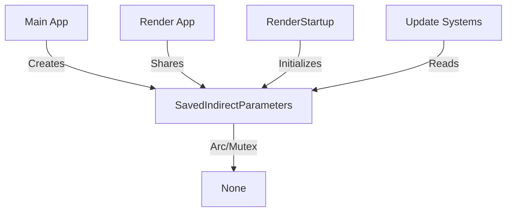

+++
title = "#20184 RenderStartup for occlusion_culling example"
date = "2025-07-22T00:00:00"
draft = false
template = "pull_request_page.html"
in_search_index = true

[taxonomies]
list_display = ["show"]

[extra]
current_language = "en"
available_languages = {"en" = { name = "English", url = "/pull_request/bevy/2025-07/pr-20184-en-20250722" }, "zh-cn" = { name = "中文", url = "/pull_request/bevy/2025-07/pr-20184-zh-cn-20250722" }}
labels = ["A-Rendering", "C-Code-Quality", "D-Straightforward"]
+++

## RenderStartup for occlusion_culling example

### Basic Information
- **Title**: RenderStartup for occlusion_culling example
- **PR Link**: https://github.com/bevyengine/bevy/pull/20184
- **Author**: andriyDev
- **Status**: MERGED
- **Labels**: A-Rendering, C-Code-Quality, S-Ready-For-Final-Review, D-Straightforward
- **Created**: 2025-07-18T07:22:12Z
- **Merged**: 2025-07-21T23:17:30Z
- **Merged By**: alice-i-cecile

### Description
**Objective**
- Progress towards #19887
- This example was non-trivial to port so was done as a separate PR

**Solution**
- This situation is very weird. We are trying to get features of the renderer back into the main world. We use an ArcMutex to communicate between the two worlds
- We now insert the resource into both worlds, but only with Option::None
- The `RenderStartup` init system initializes the resource with the feature values populated

This does result in a "regression" where there is a single frame where the `update_status_text` system doesn't react properly, since it doesn't have the features from the render world yet

**Testing**
- Ran the `occlusion_culling` example and it worked!

### The Story of This Pull Request

The occlusion culling example needed to synchronize renderer feature detection between Bevy's main world and render world. Previously, it used `FromWorld` to initialize `SavedIndirectParameters` during app building, but this caused issues because render device features weren't available yet. 

The core problem was that GPU feature detection (like occlusion culling support) happens in the render world during startup, but the main world needed this information to display status text. The original implementation tried to initialize too early, before the renderer had determined which features were supported.

The solution involves three key changes:
1. **Resource initialization**: Instead of using `FromWorld`, we create `SavedIndirectParameters` as an `Option::None` in both worlds during plugin setup
2. **Deferred initialization**: A new `init_saved_indirect_parameters` system runs in `RenderStartup` to populate the resource with actual feature detection results
3. **Safe handling**: Systems that use the resource now check for `Option::None` and bail early if data isn't available

This approach ensures feature detection occurs at the proper time in the render pipeline. The trade-off is a one-frame delay where status text might be inaccurate, but this is acceptable for an example.

```rust
// Before: Resource initialization via FromWorld
impl FromWorld for SavedIndirectParameters {
    fn from_world(world: &mut World) -> SavedIndirectParameters {
        let render_device = world.resource::<RenderDevice>();
        SavedIndirectParameters(Arc::new(Mutex::new(SavedIndirectParametersData {
            // ... initialization that requires render device features
        })))
    }
}

// After: Simple constructor and deferred initialization
impl SavedIndirectParameters {
    fn new() -> Self {
        Self(Arc::new(Mutex::new(None)))
    }
}

fn init_saved_indirect_parameters(
    render_device: Res<RenderDevice>,
    saved_indirect_parameters: Res<SavedIndirectParameters>,
) {
    let mut saved_indirect_parameters = saved_indirect_parameters.0.lock().unwrap();
    *saved_indirect_parameters = Some(SavedIndirectParametersData {
        // Proper initialization using render device features
    });
}
```

The resource usage was also updated to handle the new `Option` wrapper:

```rust
// Usage site update
let saved_indirect_parameters = saved_indirect_parameters.lock().unwrap();
let Some(saved_indirect_parameters) = saved_indirect_parameters.as_ref() else {
    return; // Bail out if not initialized
};
```

The PR also cleaned up unnecessary dependencies by removing:
- Redundant `GpuPreprocessingSupport` parameter in `readback_indirect_parameters`
- Outdated `finish()` method in the plugin
- Unused imports like `GpuPreprocessingMode`

These changes make the example more robust and demonstrate proper pattern for synchronizing render-world data to the main world.

### Visual Representation


### Key Files Changed

**examples/3d/occlusion_culling.rs (+62/-51)**
The occlusion culling example was refactored to use RenderStartup for proper resource initialization:

1. **Resource initialization changed from FromWorld to explicit constructor**  
   Before:
   ```rust
   impl FromWorld for SavedIndirectParameters {
       fn from_world(world: &mut World) -> SavedIndirectParameters {
           let render_device = world.resource::<RenderDevice>();
           SavedIndirectParameters(Arc::new(Mutex::new(SavedIndirectParametersData {
               data: vec![],
               count: 0,
               occlusion_culling_supported: true,
               occlusion_culling_introspection_supported: render_device
                   .features()
                   .contains(WgpuFeatures::MULTI_DRAW_INDIRECT_COUNT),
           })))
       }
   }
   ```
   After:
   ```rust
   impl SavedIndirectParameters {
       fn new() -> Self {
           Self(Arc::new(Mutex::new(None)))
       }
   }
   ```

2. **Added RenderStartup initialization system**  
   New system that populates the resource when render features are available:
   ```rust
   fn init_saved_indirect_parameters(
       render_device: Res<RenderDevice>,
       gpu_preprocessing_support: Res<GpuPreprocessingSupport>,
       saved_indirect_parameters: Res<SavedIndirectParameters>,
   ) {
       let mut saved_indirect_parameters = saved_indirect_parameters.0.lock().unwrap();
       *saved_indirect_parameters = Some(SavedIndirectParametersData {
           data: vec![],
           count: 0,
           occlusion_culling_supported: gpu_preprocessing_support.is_culling_supported(),
           occlusion_culling_introspection_supported: render_device
               .features()
               .contains(WgpuFeatures::MULTI_DRAW_INDIRECT_COUNT),
       });
   }
   ```

3. **Plugin initialization flow simplified**  
   Before:
   ```rust
   fn finish(&self, app: &mut App) {
       let saved_indirect_parameters = SavedIndirectParameters::from_world(app.world_mut());
       app.insert_resource(saved_indirect_parameters.clone());
       // ... render app setup
   }
   ```
   After:
   ```rust
   fn build(&self, app: &mut App) {
       let saved_indirect_parameters = SavedIndirectParameters::new();
       app.insert_resource(saved_indirect_parameters.clone());
       // ... render app setup
       render_app
           .insert_resource(saved_indirect_parameters)
           .add_systems(RenderStartup, init_saved_indirect_parameters)
   }
   ```

4. **Usage sites updated to handle Option**  
   Before:
   ```rust
   let saved_indirect_parameters = saved_indirect_parameters.lock().unwrap();
   ```
   After:
   ```rust
   let saved_indirect_parameters = saved_indirect_parameters.lock().unwrap();
   let Some(saved_indirect_parameters) = saved_indirect_parameters.as_ref() else {
       return;
   };
   ```

### Further Reading
- [Bevy Render Stages Documentation](https://bevyengine.org/learn/book/getting-started/rendering/)
- [ECS Resource Management Patterns](https://bevy-cheatbook.github.io/programming/res.html)
- [Arc/Mutex Synchronization Techniques](https://doc.rust-lang.org/book/ch16-03-shared-state.html)