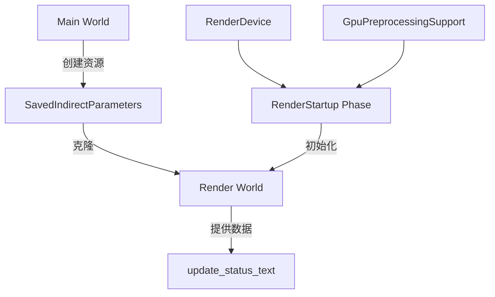

+++
title = "#20184 Use `RenderStartup` for `occlusion_culling` example"
date = "2025-07-22T00:00:00"
draft = false
template = "pull_request_page.html"
in_search_index = false

[extra]
current_language = "zh-cn"
available_languages = {"en" = { name = "English", url = "/pull_request/bevy/2025-07/pr-20184-en-20250722" }, "zh-cn" = { name = "中文", url = "/pull_request/bevy/2025-07/pr-20184-zh-cn-20250722" }}
+++

## 分析报告：PR #20184 - Use `RenderStartup` for `occlusion_culling` example

### 基础信息
- **标题**: Use `RenderStartup` for `occlusion_culling` example
- **PR链接**: https://github.com/bevyengine/bevy/pull/20184
- **作者**: andriyDev
- **状态**: 已合并
- **标签**: A-Rendering, C-Code-Quality, S-Ready-For-Final-Review, D-Straightforward
- **创建时间**: 2025-07-18T07:22:12Z
- **合并时间**: 2025-07-21T23:17:30Z
- **合并人**: alice-i-cecile

### 描述翻译
#### 目标
- 为 #19887 的进展做准备
- 此示例移植工作较为复杂，因此单独提交 PR

#### 解决方案
- 当前情况较为特殊：我们需要将渲染器的特性传回主世界，使用 ArcMutex 在双世界间通信
- 现在将资源插入两个世界，但初始值设为 Option::None
- `RenderStartup` 初始化系统用特性值填充资源

这会导致一个退化现象：在某一帧期间，`update_status_text` 系统无法正确响应，因为它尚未从渲染世界获取特性值

#### 测试
- 运行 `occlusion_culling` 示例验证功能正常

---

### PR技术分析

#### 问题背景
在 `occlusion_culling` 示例中，需要从渲染世界(Render World)向主世界(Main World)传递 GPU 预处理特性支持状态。原始实现使用 `FromWorld` trait 在资源初始化时设置默认值：

```rust
impl FromWorld for SavedIndirectParameters {
    fn from_world(world: &mut World) -> SavedIndirectParameters {
        let render_device = world.resource::<RenderDevice>();
        // ...初始化逻辑
    }
}
```

这种方法存在关键缺陷：当 `SavedIndirectParameters` 在主世界初始化时，渲染世界尚未构建完成，导致无法访问 `RenderDevice` 等关键渲染资源。这会造成：
1. 特性检测逻辑过早执行
2. 无法获取实际的 `GpuPreprocessingSupport` 状态
3. 需要跨世界通信时出现初始化顺序问题

#### 解决方案设计
PR 采用分阶段初始化策略解决该问题：
1. **资源重构**：将 `SavedIndirectParameters` 改为持有 `Option<SavedIndirectParametersData>`
2. **双阶段初始化**：
   - 第一阶段：在插件构建时创建资源（值为 `None`）
   - 第二阶段：在渲染世界就绪后填充实际数据
3. **通信机制**：使用 `Arc<Mutex<Option<T>>>` 实现跨线程安全访问

核心工程决策：
- 选择 `RenderStartup` 阶段而非 `Render` 阶段进行初始化，确保渲染资源可用
- 保留原始数据格式但增加 `Option` 包装层，简化空状态处理
- 维持原有的线程安全模型（`Arc<Mutex>`）

#### 实现细节
关键修改在 `SavedIndirectParameters` 资源和其初始化流程：

**1. 资源结构变更**
```diff
#[derive(Clone, Resource, Deref, DerefMut)]
-struct SavedIndirectParameters(Arc<Mutex<SavedIndirectParametersData>>);
+struct SavedIndirectParameters(Arc<Mutex<Option<SavedIndirectParametersData>>>);
```

**2. 新增初始化系统**
```rust
fn init_saved_indirect_parameters(
    render_device: Res<RenderDevice>,
    gpu_preprocessing_support: Res<GpuPreprocessingSupport>,
    saved_indirect_parameters: Res<SavedIndirectParameters>,
) {
    let mut saved_indirect_parameters = saved_indirect_parameters.0.lock().unwrap();
    *saved_indirect_parameters = Some(SavedIndirectParametersData {
        data: vec![],
        count: 0,
        occlusion_culling_supported: gpu_preprocessing_support.is_culling_supported(),
        occlusion_culling_introspection_supported: render_device
            .features()
            .contains(WgpuFeatures::MULTI_DRAW_INDIRECT_COUNT),
    });
}
```

**3. 插件初始化流程重构**
```rust
fn build(&self, app: &mut App) {
    // 提前创建资源（值为None）
    let saved_indirect_parameters = SavedIndirectParameters::new();
    app.insert_resource(saved_indirect_parameters.clone());
    
    render_app
        .insert_resource(saved_indirect_parameters)
        .add_systems(RenderStartup, init_saved_indirect_parameters) // 关键变更
        // ...其他系统注册
}

// 移除原来的finish()方法
```

**4. 消费端空值处理**
```rust
fn update_status_text(
    saved_indirect_parameters: Res<SavedIndirectParameters>,
    // ...
) {
    let saved_indirect_parameters = saved_indirect_parameters.lock().unwrap();
    let Some(saved_indirect_parameters) = saved_indirect_parameters.as_ref() else {
        return; // 处理未初始化状态
    };
    // ...后续逻辑
}
```

#### 技术权衡
1. **初始化时机**：选择 `RenderStartup` 而非 `PreUpdate`，确保渲染资源可用
2. **空状态处理**：引入 `Option` 包装增加一层安全检查
3. **退化现象**：接受首帧数据缺失，因统计数据非关键实时数据
4. **架构影响**：符合 Bevy 的 ECS 阶段设计原则，避免 "阶段渗透" 反模式

#### 影响分析
- **正确性**：修复了跨世界通信时的资源初始化顺序错误
- **可维护性**：移除 `finish()` 生命周期方法，简化插件结构
- **性能**：无显著性能影响（单次初始化+原子引用计数）
- **鲁棒性**：消费端显式处理未初始化状态，避免运行时 panic

### 关键文件变更
#### `examples/3d/occlusion_culling.rs`
**变更原因**：重构资源初始化流程以正确处理跨世界通信

**核心修改点**：
```diff
@@ -138,27 +137,31 @@ struct SavedIndirectParametersData {
     occlusion_culling_introspection_supported: bool,
 }
 
-impl FromWorld for SavedIndirectParameters {
-    fn from_world(world: &mut World) -> SavedIndirectParameters {
-        let render_device = world.resource::<RenderDevice>();
-        SavedIndirectParameters(Arc::new(Mutex::new(SavedIndirectParametersData {
-            data: vec![],
-            count: 0,
-            occlusion_culling_supported: true,
-            occlusion_culling_introspection_supported: render_device
-                .features()
-                .contains(WgpuFeatures::MULTI_DRAW_INDIRECT_COUNT),
-        })))
+impl SavedIndirectParameters {
+    fn new() -> Self {
+        Self(Arc::new(Mutex::new(None)))
     }
 }
 
+fn init_saved_indirect_parameters(
+    render_device: Res<RenderDevice>,
+    gpu_preprocessing_support: Res<GpuPreprocessingSupport>,
+    saved_indirect_parameters: Res<SavedIndirectParameters>,
+) {
+    let mut saved_indirect_parameters = saved_indirect_parameters.0.lock().unwrap();
+    *saved_indirect_parameters = Some(SavedIndirectParametersData {
+        data: vec![],
+        count: 0,
+        occlusion_culling_supported: gpu_preprocessing_support.is_culling_supported(),
+        occlusion_culling_introspection_supported: render_device
+            .features()
+            .contains(WgpuFeatures::MULTI_DRAW_INDIRECT_COUNT),
+    });
+}
```

**插件注册流程变更**：
```diff
@@ -210,12 +213,25 @@ fn main() {
 
 impl Plugin for ReadbackIndirectParametersPlugin {
     fn build(&self, app: &mut App) {
+        let saved_indirect_parameters = SavedIndirectParameters::new();
+        app.insert_resource(saved_indirect_parameters.clone());
+
         let Some(render_app) = app.get_sub_app_mut(RenderApp) else {
             return;
         };
 
         render_app
+            .insert_resource(saved_indirect_parameters)
+            .add_systems(RenderStartup, init_saved_indirect_parameters)
             .init_resource::<IndirectParametersStagingBuffers>()
             .add_systems(ExtractSchedule, readback_indirect_parameters)
@@ -245,26 +261,6 @@ impl Plugin for ReadbackIndirectParametersPlugin {
                 ),
             );
     }
-
-    fn finish(&self, app: &mut App) {
-        let saved_indirect_parameters = SavedIndirectParameters::from_world(app.world_mut());
-        app.insert_resource(saved_indirect_parameters.clone());
-
-        let Some(render_app) = app.get_sub_app_mut(RenderApp) else {
-            return;
-        };
-
-        render_app
-            .insert_resource(saved_indirect_parameters);
-    }
 }
```

### 技术示意图


### 延伸阅读
1. [Bevy ECS 阶段文档](https://bevyengine.org/learn/book/getting-started/ecs/#ecs-schedule)
2. [跨世界通信模式](https://github.com/bevyengine/bevy/discussions/19887)
3. [Arc<Mutex<T>>线程安全模型](https://doc.rust-lang.org/book/ch16-03-shared-state.html)
4. [RenderStartup阶段说明](https://github.com/bevyengine/bevy/blob/main/crates/bevy_render/src/lib.rs#L112)